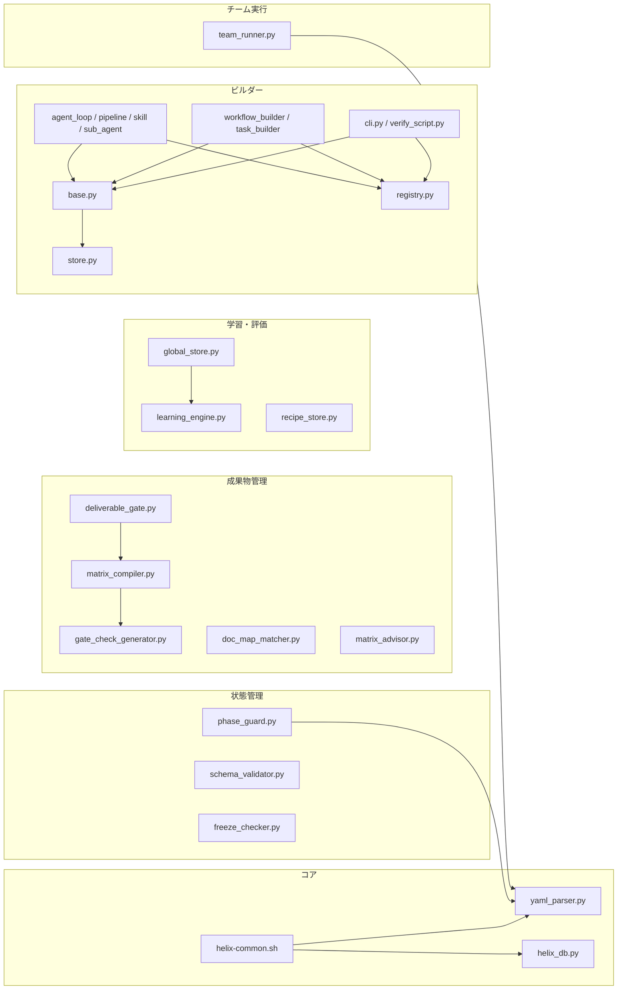
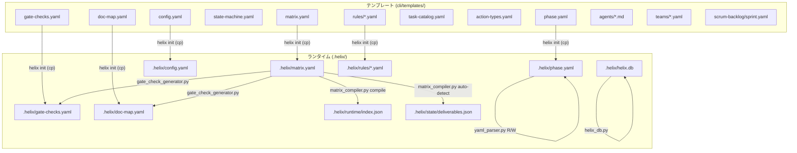

# R2 As-Is Design: HELIX CLI フレームワーク

> 生成日: 2026-04-05
> 対象: ~/ai-dev-kit-vscode (HELIX CLI v3)
> 手法: コード精読による設計復元（Reverse HELIX R2）

---

## 1. アーキテクチャ概要

### 1.1 レイヤー構造

HELIX CLI は 5 層のレイヤー構造をとる。

```
Layer 5: Skills (55 スキル SKILL.md — AI エージェントの専門知識)
Layer 4: Templates & Schemas (YAML テンプレート + JSON Schema)
Layer 3: Lib (Python モジュール群 — 状態管理・DB・検証・学習)
Layer 2: CLI Commands (Bash スクリプト群 — ユーザーインターフェース)
Layer 1: Entry Point (helix — 統一ディスパッチャー)
```

| レイヤー | パス | 言語 | ファイル数 | 行数 |
|---------|------|------|-----------|------|
| Entry Point | `cli/helix` | Bash | 1 | ~94 |
| CLI Commands | `cli/helix-*` | Bash | 30 | ~11,900 |
| Lib | `cli/lib/*.py`, `cli/lib/*.sh` | Python/Bash | 14 | ~8,400 |
| Builders | `cli/lib/builders/*.py` | Python | 14 | ~2,700 |
| Templates | `cli/templates/` | YAML/Markdown | ~25 | — |
| Schemas | `cli/schemas/` | JSON Schema | 5 | — |
| Roles | `cli/roles/*.conf` | INI-like | 12 | — |
| Skills | `skills/**` | Markdown | 55+ | — |
| Verify | `verify/*.sh` | Bash | 32 | — |

### 1.2 データフロー

```
ユーザー入力
    │
    ▼
helix <subcommand>          ← Layer 1: exec で子コマンドに委譲
    │
    ▼
helix-<cmd>                 ← Layer 2: 引数パース → lib 呼び出し
    │
    ├──→ yaml_parser.py     ← Layer 3: phase.yaml R/W（排他ロック付き）
    ├──→ helix_db.py        ← Layer 3: SQLite R/W（WAL モード）
    ├──→ matrix_compiler.py ← Layer 3: matrix.yaml → index.json / deliverables.json
    ├──→ phase_guard.py     ← Layer 3: フェーズ違反チェック（pre-commit hook 経由）
    ├──→ schema_validator.py← Layer 3: JSON Schema バリデーション
    ├──→ deliverable_gate.py← Layer 3: 成果物状態ゲート判定
    │
    ▼
出力（stdout / phase.yaml 更新 / SQLite 記録）
```

Codex CLI との連携フロー:

```
helix-codex --role <role> --task "..."
    │
    ├── roles/<role>.conf      読み込み（model, skills, system_prompt）
    ├── skills/***/SKILL.md    スキル注入
    ├── prompts/*.md           共通ドキュメント注入
    │
    ▼
codex exec "<prompt>" -m <model> -s <sandbox>
    │
    ▼
Codex (GPT-5.x) 実行 → 結果 → cost_log 記録
```

### 1.3 3つの開発モード

HELIX は `phase.yaml` の `current_mode` で 3 つのモードを切り替える。

| モード | フロー | 用途 |
|--------|--------|------|
| **Forward** | L1→G0.5→G1→L2→G2→L3→G3→L4→G4→L5→G5→L6→G6→L7→G7→L8 | 通常の新規開発 |
| **Reverse** | R0→RG0→R1→RG1→R2→RG2→R3→RG3→R4→Forward 接続 | 既存コードの設計復元 |
| **Scrum** | init→backlog→plan→poc→verify→decide→review→(next sprint) | 検証駆動開発（PoC） |

モード切替は自動。`helix reverse R0` を実行すると `forward→reverse` に、`helix scrum init` で `forward→scrum` に切り替わる。

---

## 2. コンポーネント図

### 2.1 CLI コマンドグループ

```mermaid
graph TB
    subgraph EntryPoint["Entry Point"]
        helix["helix (dispatcher)"]
    end

    subgraph ProjectMgmt["プロジェクト管理"]
        init["helix init"]
        status["helix status"]
        mode["helix mode"]
        matrix["helix matrix"]
        doctor["helix doctor"]
        debug["helix debug"]
    end

    subgraph Workflow["ワークフロー"]
        gate["helix gate"]
        size["helix size"]
        sprint["helix sprint"]
        plan["helix plan"]
        reverse["helix reverse"]
        scrum["helix scrum"]
        interrupt["helix interrupt"]
    end

    subgraph Execution["実行・委譲"]
        codex["helix codex"]
        task["helix task"]
        team["helix team"]
        builder["helix builder"]
        pr["helix pr"]
    end

    subgraph DataLearning["データ・学習"]
        log["helix log"]
        bench["helix bench"]
        debt["helix debt"]
        retro["helix retro"]
        learn["helix learn"]
        promote["helix promote"]
        discover["helix discover"]
    end

    subgraph Verification["検証"]
        test["helix test"]
        verifyall["helix verify-all"]
    end

    helix --> init & status & mode & matrix & doctor & debug
    helix --> gate & size & sprint & plan & reverse & scrum & interrupt
    helix --> codex & task & team & builder & pr
    helix --> log & bench & debt & retro & learn & promote & discover
    helix --> test & verifyall
```



### 2.2 lib モジュール間の依存関係



### 2.3 テンプレート→ランタイム変換フロー



---

## 3. 状態管理モデル

### 3.1 phase.yaml（状態機械）

プロジェクトのフェーズとゲート状態を保持する中心的な状態ファイル。

```yaml
project: "project-name"
current_mode: forward | reverse | scrum
current_phase: L1 | L2 | ... | L8

gates:
  G0.5: { status: pending | passed | failed | skipped | invalidated, date: "..." }
  G1:   { status: ... }
  ...
  G7:   { status: ... }

sprint:
  current_step: null | .1a | .1b | .2 | .3 | .4 | .5 | completed
  status: active
  drive: null | be | fe | db | fullstack | agent
  tracks:                    # fullstack 専用
    be:  { stage: .1a, status: active }
    fe:  { stage: .1a, status: active }
    contract: { ci: pending | pass }
  phase: null | A | B        # fullstack: A=並行実装, B=結合

reverse_gates:
  RG0: { status: pending | passed | failed }
  ...
  RG3: { status: ... }

reverse:
  status: null | completed
  completed_at: null | "2026-04-05"
```

**読み書き**: `yaml_parser.py` 経由。排他ロック（`fcntl.flock`）+ atomic rename で安全に更新。PyYAML 不使用。

### 3.2 state-machine.yaml（遷移ルール）

ゲート間の前提条件、通過時のフェーズ遷移、invalidation カスケードを定義。

```yaml
gate_statuses: [pending, passed, failed, skipped, invalidated]
gates:
  G0.5: { prereqs: [],   on_pass_phase: L1, on_invalidate: [] }
  G1:   { prereqs: [],   on_pass_phase: L2, on_invalidate: [] }
  G2:   { prereqs: [G1], on_pass_phase: L3, on_invalidate: [G3,G4,G5,G6,G7] }
  G3:   { prereqs: [G2], on_pass_phase: L4, on_invalidate: [G4,G5,G6,G7] }
  G4:   { prereqs: [G3], on_pass_phase: L5, on_invalidate: [G5,G6,G7] }
  G5:   { prereqs: [G4], on_pass_phase: L6, on_invalidate: [G6,G7] }
  G6:   { prereqs: [G5], on_pass_phase: L7, on_invalidate: [G7] }
  G7:   { prereqs: [G6], on_pass_phase: L8, on_invalidate: [] }
valid_transitions:
  pending: [passed, failed, skipped]
  passed: [invalidated]
  failed: [pending]
  skipped: [pending]
  invalidated: [pending]
```

**設計判断**: 前方参照のみ。後方への遷移は `invalidated` 経由で間接的に行う。`helix gate --undo` で手動リセット可能。

### 3.3 SQLite helix.db（ログ/評価）

19 テーブル、WAL モード、スキーマバージョン管理（v1→v4）。

| テーブル | 役割 | 主な FK |
|---------|------|---------|
| `task_runs` | タスク実行ログ | — |
| `action_logs` | アクション実行ログ | `task_runs.id` |
| `observations` | オブザーバー結果（keyword 照合） | `task_runs.id`, `action_logs.id` |
| `feedback` | ユーザーフィードバック | `task_runs.id` |
| `task_evaluations` | タスク品質評価 | — |
| `task_selections` | PM タスク選択ログ + TL レビュー | — |
| `gate_runs` | ゲート実行ログ | `task_runs.id` |
| `plan_reviews` | 設計レビュー記録 | — |
| `interrupts` | 中断・復帰記録 | `task_runs.id` |
| `retro_items` | レトロアクションアイテム | `gate_runs.id` |
| `debt_items` | 技術負債台帳 | — |
| `hook_events` | Git hook イベント | — |
| `cost_log` | Codex コスト記録 | — |
| `bench_snapshots` | ベンチマークスナップショット | — |
| `requirements` | 要件定義 | — |
| `req_impl_map` | 要件→実装マッピング | `requirements.req_id` |
| `req_test_map` | 要件→テストマッピング | `requirements.req_id` |
| `req_changes` | 要件変更履歴 | `requirements.req_id` |
| `schema_version` | マイグレーション管理 | — |

**グローバル DB** (`~/.helix/global.db`): `global_store.py` が管理。`recipe_index` + `promotion_records` の 2 テーブルで、プロジェクト横断のパターン蓄積・昇格を行う。

### 3.4 config.yaml（プロジェクト設定）

```yaml
gate_skip: []           # スキップするゲート（例: [G1.5, G1R, G5]）
sprint_skip_steps: []   # スキップするスプリントステップ
ai_review: true         # AI レビュー有効/無効
default_drive: be       # デフォルト駆動タイプ
lang: ja                # 言語設定
```

### 3.5 matrix.yaml と派生ファイル

```
matrix.yaml (成果物対照表の定義)
  │
  ├── matrix_compiler.py compile
  │     ├── .helix/runtime/index.json  (全成果物のカタログ + path_mapping)
  │     ├── .helix/state/deliverables.json (各成果物の状態)
  │     ├── .helix/doc-map.yaml (文書マッピング)
  │     └── .helix/gate-checks.yaml (ゲートチェック定義)
  │
  └── matrix_compiler.py auto-detect
        └── .helix/state/deliverables.json (ファイル存在検知で状態更新)
```

---

## 4. 設計判断の推定（ADR 推定）

### ADR-001: PyYAML 依存の排除

- **決定**: 独自の簡易 YAML パーサー（`yaml_parser.py`）を実装
- **理由推定**: 外部依存を最小化し、Python 標準ライブラリのみで動作させるため。HELIX の YAML はインデントベースの key-value + インラインdict のサブセットで十分
- **結果**: `gate-checks.yaml` の AI セクション読み取りでは `import yaml` を使用しており、完全な排除は達成されていない（1 箇所残存）
- **状態**: ほぼ達成。`helix-gate` の 1 箇所のみ例外

### ADR-002: Bash + Python のハイブリッドアーキテクチャ

- **決定**: CLI コマンドは Bash、状態管理・DB・検証ロジックは Python
- **理由推定**: (1) CLI のオーケストレーションは Bash のパイプライン・exec が適する。(2) 状態管理とDB操作はPythonの方が安全かつテストしやすい。(3) 開発者がシェルスクリプトで直接操作できる透明性
- **トレードオフ**: Bash-Python の境界でデータ受け渡しが環境変数や heredoc Python に頼る場面がある

### ADR-003: fail-close ゲートシステム

- **決定**: ゲートは前提ゲートの通過を必須とし、mandatory チェック 1 つでも失敗すれば FAIL（fail-close）
- **理由推定**: 品質ゲートの形骸化を防ぐ。advisory は警告のみで通過を妨げない
- **結果**: `state-machine.yaml` の `prereqs` と `on_invalidate` で前方依存・後方 invalidation を実装。`helix gate --undo` で手動リセットが可能

### ADR-004: Codex CLI をスキル注入付きラッパーで呼ぶ

- **決定**: `helix-codex` が `codex exec` をラップし、ロール別の model/skills/system_prompt を自動注入
- **理由推定**: (1) ロール別に適切なモデル（5.4=TL, 5.3=SE, 5.3-spark=PG）を選択。(2) スキルファイルの読み込み指示をプロンプトに注入。(3) リトライ・コスト記録の一元化
- **結果**: 12 ロール対応。`roles/*.conf` でモデル・スキル・プロンプトを宣言的に管理

### ADR-005: SQLite WAL モードでのログ永続化

- **決定**: 実行ログ・フィードバック・評価を SQLite に永続化。コンテキストウィンドウを消費しない
- **理由推定**: (1) LLM のコンテキストは有限。ログを DB に退避することで長時間セッションに耐える。(2) 集計クエリ（report）が SQL で書ける。(3) WAL モードで並行読み書きに対応
- **結果**: 19 テーブル、スキーママイグレーション（v1→v4）、インデックス最適化済み

### ADR-006: 成果物対照表（Deliverable Matrix）による可視化

- **決定**: `matrix.yaml` で成果物の網羅性をフェーズ横断で管理。`auto-detect` でファイル存在から状態を自動更新
- **理由推定**: (1) ゲート判定を成果物ベースにすることで客観性を確保。(2) 空ファイル検知（10バイト未満）で形式的な通過を防止。(3) 駆動タイプ別に必要成果物を自動算出
- **結果**: 5 駆動タイプ（be/fe/db/fullstack/agent）対応。fullstack は D-CONTRACT 必須チェック付き

### ADR-007: 3 モード統合（Forward / Reverse / Scrum）

- **決定**: 1 つの `phase.yaml` で 3 モードの状態を共存管理
- **理由推定**: プロジェクトのライフサイクルに応じてモードを切り替えるが、状態ファイルを分散させない。Reverse 完了→Forward 接続、Scrum の confirmed 仮説→Forward 接続がスムーズに行える
- **結果**: `current_mode` で切り替え。Reverse gates（RG0-RG3）と Forward gates（G0.5-G7）が共存

### ADR-008: ビルダーシステムによる成果物生成の抽象化

- **決定**: `BuilderBase` + `BuilderRegistry` でテンプレートメソッドパターン。validate_input → generate → validate_output のパイプライン
- **理由推定**: タスク実行の再現性と品質追跡を自動化。execution_id で履歴管理し、seed（過去の実行結果）から再生成可能
- **結果**: 14 のビルダーモジュール（agent_loop, agent_pipeline, agent_skill, sub_agent, workflow_builder, task_builder, cli, verify_script, json_converter, history, store 等）

### ADR-009: pre-commit hook によるフェーズガード

- **決定**: `phase_guard.py` を Git pre-commit hook として実行し、現在フェーズで許可されないレイヤーのファイル変更をブロック
- **理由推定**: L1（要件定義）フェーズで `src/` を変更する、L2 フェーズで L4 の実装ファイルを書くなどの「飛び越え」を自動防止
- **結果**: 3 層ガードレールアーキテクチャ（Input Guard 実装済み、Process/Output Guard は将来拡張）

### ADR-010: Task OS（63タスク/27アクション型/295アクション）

- **決定**: `task-catalog.yaml` + `action-types.yaml` による 2 層タスク体系。PM がカタログからタスクを選択→自動で TL レビュー→順次実行
- **理由推定**: AI エージェントのタスク粒度を標準化し、observe（keyword 照合）で実行品質を定量評価可能にする

---

## 5. 品質属性

### 5.1 テスト体系

| カテゴリ | テスト数 | パス |
|---------|---------|------|
| Python unit tests | 43 | `cli/lib/tests/test_*.py` |
| Verify scripts (unit) | 10 | `verify/001-010*.sh` |
| Verify scripts (integration) | 11 | `verify/h101-h105, h201-h206*.sh` |
| Verify scripts (edge case) | 10 | `verify/h301-h310*.sh` |
| Verify scripts (E2E) | 1 | `verify/h401*.sh` |
| **合計** | **75** | — |

Python unit tests の内訳:
- `test_helix_db.py`: 15 テスト（DB 初期化・CRUD・マイグレーション）
- `test_learning_engine.py`: 12 テスト（成功パターン分析・recipe 生成）
- `test_yaml_parser.py`: 12 テスト（パース・書き込み・ドットパス解決）
- `test_schema_validator.py`: 4 テスト（JSON Schema バリデーション）

### 5.2 ゲートチェック体系

| ゲート | mandatory | advisory | AI チェック | 役割 |
|--------|-----------|----------|------------|------|
| G0.5 | 4 | 4 | 3 (TL+QA+Security) | 企画突合 |
| G2 | 4 | 5 | 2 (TL+Security) | 設計凍結 |
| G3 | 5 | 4 | 1 (TL) | 実装着手 |
| G4 | 8 | 9 | 2 (TL+Security) | 実装凍結 |
| G5 | 0 | 2 | 1 (FE) | デザイン凍結 |
| G6 | 2 | 2 | 2 (QA+Security) | RC判定 |
| G7 | 1 | 2 | 1 (DevOps) | 安定性 |

ゲート判定は fail-close。mandatory 1 件でも失敗 → FAIL。advisory は警告のみ。

### 5.3 セキュリティチェック（OWASP 対応）

G4 ゲートの mandatory チェックに含まれる:

| チェック | 内容 |
|---------|------|
| SQL インジェクション検出 | f-string/format で SQL 構築するパターンを rg で検出 |
| XSS 検出 | innerHTML/dangerouslySetInnerHTML/v-html の使用検出 |
| 秘密情報ハードコード | api_key/secret/token/password のハードコード検出 |
| Bearer/秘密鍵混入 | Bearer トークン、sk-、ghp_、xoxb-、-----BEGIN の検出 |
| .env git 追跡防止 | .env ファイルが git 管理されていないことを確認 |

セキュリティチェックは G2（脅威分析）、G4（OWASP）、G6（最終セキュリティ）、G7（デプロイ前）の 4 段階。

### 5.4 Deliverable Gate（成果物ゲート）

`deliverable_gate.py` がゲートごとに必要な成果物の状態を評価:

- **done**: ファイルが存在し、10 バイト以上
- **waived**: 明示的に免除（waivers 定義）
- **not_applicable**: 該当なし（UI なしの場合の L5 等）
- **pending/in_progress**: 未完了 → FAIL

空ファイル検知（10 バイト未満）で形式的な成果物通過を防止。

---

## 6. 技術負債

### TD-001: gate-checks.yaml のパースに PyYAML が残存

- **箇所**: `cli/helix-gate` L428 (`import yaml`)
- **問題**: `yaml_parser.py` で PyYAML 排除を方針としているが、gate-checks.yaml の static チェック配列パースに `yaml.safe_load` を使用。AI セクションの Bash パースとも不統一
- **影響**: PyYAML がインストールされていない環境で gate の static チェックが動作しない
- **推奨**: gate-checks.yaml の static セクション抽出も yaml_parser.py ベースに統一するか、専用パーサーを用意する

### TD-002: helix-gate の AI セクション Bash パースの脆弱性

- **箇所**: `cli/helix-gate` L522-550（行ベースの YAML パース）
- **問題**: AI チェックセクションを正規表現ベースの行パースで処理しているため、task 内にインデントが崩れた場合や特殊文字を含む場合に誤動作の可能性
- **影響**: AI チェックが実行されない、または不完全なプロンプトが送信される
- **推奨**: Python 側でパースしてから Bash に渡す方式に統一

### TD-003: helix-task の sed による YAML 更新

- **箇所**: `cli/helix-task` L352, L521
- **問題**: `sed -i` でタスクプランの status を直接書き換えている。同一パターンが複数マッチした場合に誤更新のリスク
- **推奨**: `yaml_parser.py write` に統一する

### TD-004: テストカバレッジの偏り

- **問題**: Python lib のユニットテストは 43 件あるが、`matrix_compiler.py`（最も複雑なモジュールの 1 つ）、`phase_guard.py`、`deliverable_gate.py`、`global_store.py`、`team_runner.py` にユニットテストがない
- **影響**: これらのモジュールの変更時にリグレッションを検知できない
- **推奨**: 複雑度の高い matrix_compiler.py と deliverable_gate.py を優先的にテスト追加

### TD-005: Bash コマンド間のエラーハンドリング不統一

- **問題**: `set -eo pipefail` と `set -euo pipefail` が混在。`set +e` で一時的に無効化した後の復帰が `set -e` のコマンドと `set -eo pipefail` のコマンドで異なる
- **影響**: 予期しないエラー伝搬または無視
- **推奨**: `helix-common.sh` で統一的なエラーハンドリングポリシーを定義し、全コマンドが準拠する

### TD-006: exit code の定義が活用されていない場面がある

- **問題**: `helix-common.sh` で `EXIT_SUCCESS/EXIT_CHECK_FAILED/EXIT_INPUT_ERROR/EXIT_PREREQ_ERROR/EXIT_INTERNAL_ERROR` を定義しているが、一部のコマンドが `exit 1` をハードコードしている（特に helix-scrum, helix-task）
- **推奨**: 全コマンドで定義済み exit code を使用する

### TD-007: ビルダーシステムの未接続

- **問題**: `cli/lib/builders/` に 14 モジュールが存在するが、CLI コマンド（`helix-builder`）からの接続状況と実際の使用状況が設計構想段階に見える
- **影響**: ビルダーが提供する再現性・追跡性の恩恵がまだフレームワーク全体に行き渡っていない可能性
- **推奨**: ビルダーの段階的統合を計画する

### TD-008: fullstack 駆動の Phase B（結合）の自動化が薄い

- **問題**: fullstack 駆動で Phase A（BE/FE 並行）→ Phase B（結合）の切り替えは `sprint.phase` の更新のみ。結合テスト（D-CONTRACT CI）の自動実行は Codex に委譲する前提で、フレームワーク側の自動化はない
- **推奨**: Phase B への昇格時に contract CI の自動実行を helix sprint next に組み込む

### TD-009: __pycache__ が git tracking に残存

- **問題**: `cli/lib/builders/__pycache__/` 配下の `.cpython-312.pyc` ファイルが git status に modified として表示されている
- **推奨**: `.gitignore` に `__pycache__/` を追加し、git から除外する
