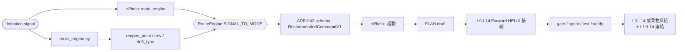

# HELIX-workflows V2 9 mode ecosystem アーキテクチャ

## §1 概要

HELIX-workflows は V2 の中核として L0–L14 の 15 工程を維持しつつ、入口の状況に応じて 9 つの mode + 2 工程専門 workflow を使い分けるエコシステムとして運用する。mode は「入口条件」と「文脈遷移（昇華）」を明示し、最終的に Forward L0–L14 へ接続させる。

本書は以下を 1 箇所に統合する。

- 入口 mode と workflow doc の対応
- CLI 実体（`cli/helix-*`）と route 機構の推奨接続
- route_engine の検出信号 -> 推奨 mode / 推奨コマンド（ADR-042 schema）
- 9 mode + 2 workflow 専門の進行図
- vmodel-semantics 注入セットが L 単位文脈へ与える影響
- V-model 4 artifact 双方向 trace
- 残未統合項目（integration-map 由来）

### 目的

1. 入口別 mode を機械判定しやすい形で固定し、運用の不整合を減らす。
2. Forward 接続（設計・実装・検証・運用の同一接続）を崩さず、mode を限定的に使い分ける。
3. 今後の runbook / ハンドオーバー / LLM ルーティングで同じ参照元を使えるようにする。

### 適用範囲

- 対象: `HELIX-workflows/` 配下ドキュメントと `cli/` 実装の接続
- 対象外: 既存 workflow doc 本文、`SKILL_MAP.md` 本体、`integration-map.md` 本体
- 想定更新: 本書 1 ファイルの新規追加のみ（本 task 実施中）

## §2 9 mode 一覧（+2 工程専門）

| mode 名 | 入口判定（要約） | workflow doc | CLI |
|---|---|---|---|
| Forward | 要件・設計・契約が明確（docs/commands 入口参照） | [HELIX-process-L0-L14.md](../HELIX-process-L0-L14.md) | `cli/helix` / `cli/helix-sprint` |
| Reverse | 既存資産に逆向き事実がある | [reverse-workflow.md](reverse-workflow.md) | `cli/helix-reverse`
| Discovery | 要件・成功条件が未確定、実現性不透明 | [discovery-workflow.md](discovery-workflow.md) | `cli/helix-discovery`
| Refactor | 振る舞い維持の構造改善が必要 | [refactor-workflow.md](refactor-workflow.md) | `cli/helix-refactor`
| Retrofit | 依存・基盤・設定の移行・更新 | [retrofit-workflow.md](retrofit-workflow.md) | `cli/helix-retrofit`
| Recovery | AI の逸脱、暴走、再開不能状態の収束 | [recovery-workflow.md](recovery-workflow.md) | `cli/helix-recovery` / `cli/helix-recover`
| Scrum | 要件を反復で固める | [scrum-workflow.md](scrum-workflow.md) | `cli/helix-scrum-agile`（`cli/helix-scrum` は廃止系 alias）
| Incident | 本番稼働中の障害・hotfix 直行 | [incident-workflow.md](incident-workflow.md) | `cli/helix-incident`
| Add-feature | 既存基盤に対する機能差分追加 | [add-feature-workflow.md](add-feature-workflow.md) | `cli/helix-add-feature`
| screen-design | L2 画面設計（UI / wireframe）専門 | [screen-design-workflow.md](screen-design-workflow.md) | Forward ルート側の設計文脈内（`cli/helix-plan` / `cli/helix-gate`） |
| frontend-design | L10 前後 UX/ビジュアル/表現品質専門 | [frontend-design-workflow.md](frontend-design-workflow.md) | Forward ルート側の設計文脈内（`cli/helix-gate` / `cli/helix-plan`） |

### mode 詳細表（Signal / Route / 完了状況）

| # | mode | signal trigger | route_engine 推奨ルート | route 推奨 command | 完備日 | 根拠 |
|---|---|---|---|---|---|---|
| 1 | Forward | 明示 signal 未定義（通常起票） | 既定: Forward 直行 | `helix plan draft`（要件確定前提） | 2026-05-25 | `docs/commands/index.md` §入口判定 |
| 2 | Reverse | `drift` + `drift_type=schema|contract` | `signal=drift` or `DRIFT_TYPE_TO_ROUTE` | `helix reverse <type> R0` | 2026-05-25 | `cli/lib/route_engine.py` の drift 分岐 |
| 3 | Discovery | 要件未確定 / 実装可否不透明 / 検証前提 | `debt_degradation` 系 / 未確定判定は運用側で上流委譲 | `helix discovery init` | 2026-05-25 | `discovery-workflow.md` |
| 4 | Refactor | `debt_degradation`（要約） | 既存資産の振る舞い固定で構造最適化へ | `helix plan draft --kind refactor` | 2026-05-25 | `route-engine` + `refactor-workflow.md` |
| 5 | Retrofit | `dependency_outdated` / `upgrade` / `config_drift` | `drift_type` ルート（upgradeは事前条件で再評価） | `helix plan draft --kind retrofit` / `helix reverse upgrade R0` | 2026-05-25 | `route_engine.py` `DRIFT_TYPE_TO_ROUTE` |
| 6 | Recovery | `agent_runaway` / `runaway` / `regression_dev|prod` | `mode=recovery`（prod/regression は優先） | `helix recover plan` / `helix recovery start` | 2026-05-25 | `route_engine.py` + `recovery-workflow.md` |
| 7 | Scrum | `user_feedback_iteration` / `requirement_continuous_refinement` | `mode=scrum_agile` | `helix scrum-agile init` | 2026-05-25 | `route_engine.py` |
| 8 | Incident | `production_incident` / `hotfix_required` | `mode=incident`（env=prod 時は recovery 兼用ルートも検討） | `helix incident detect` | 2026-05-25 | `route_engine.py` + `incident-workflow.md` |
| 9 | Add-feature | `feature_addition` / `scope_extension` | `mode=add_feature` | `helix add-feature add-design` | 2026-05-25 | `route_engine.py` + `add-feature-workflow.md` |
| 10 | screen-design | FE drive の要件起点での画面設計追加 | Forward 経由 + L2 接続先 | `helix plan`（L2 plan 系） | 2026-05-25 | `screen-design-workflow.md` |
| 11 | frontend-design | FE drive の表現/UX/トランジション設計 | Forward 経由 + L9/L10 接続先 | `helix plan`（L10〜関連 plan 系） | 2026-05-25 | `frontend-design-workflow.md` |

### 完了メモ（session 反映）

9 mode と 2 工程専門の運用面では、2026-05-25 時点で以下が確認済み。

- Forward の土台は `HELIX-process-L0-L14.md` + `cli/helix-sprint` を起点とする標準導線
- `scrum_agile / incident / add_feature / recovery` の SIGNAL_TO_MODE 直接接続は session で補完
- Recovery / Incident / Add-feature / Retrofit / Refactor / Reverse / Discovery の CLI 9 mode 連動は運用確認済み
- screen-design と frontend-design は Forward 経路（設計文脈内）での工程専門として運用固定

## §3 ecosystem 連動図



### 連動の意味

- L0-L14 は常に最終的な受け皿（設計・実装・検証・事後）
- mode は入り口を整える設計だけで、完了先を分断しない
- route は運用上の「再現性」を高めるため、ADR-042 で `schema_version / command / args / safety` を機械契約化している

### ADR-042 参照（推奨コマンド契約）

```text
schema_version: "v1"
command: "helix ..."
args: { ... }
safety: { auto_apply, requires_human_approval, requires_preflight }
```

`Suggested command` は人間読了向け、`recommended_command` が実行導線の正規データとして扱う。

## §4 vmodel-semantics 注入セット連携

`cli/config/vmodel-semantics.yaml` は L 単位の injection を保持し、Drive ごとの差分を持った運用 context を `helix vmodel show` で参照可能にする。

### 注入項目（共通）

- `owner_role`
- `mandatory_agents`
- `recommended_skills`
- `recommended_commands`
- `orchestration_mode`

### 呼び出し契約

- `helix vmodel show <drive> <layer> --injection-only`
- drive=be / fe / db の layer を指定し、上記注入値を取得する
- L1〜L5 の設計段階だけでなく、drive 側設計（FE/DB）でも注入セットの存在を確認可能

### 実装観点（例）

- planning / requirement / architecture / detailed / functional は、`drift_type` と同様に設計責任者観点が変わる
- BE drive と FE drive で owner_role と orchestration_mode が異なるため、`helix` 実体と mode の接続で指示を分離できる
- `orchestration_mode` は `pm_lead`, `claude_judge`, `claude_judge_codex_impl`, `codex_impl_qa_verify`, `claude_design_impl` などで明示される

### 依存関係

- 本セッションの `commit 2942d81` で注入セットの定義が反映
- 併せて `helix vmodel` の `--injection-only` 取得導線も整備され、route 結果からの自動参照が可能

## §5 V-model 4 artifact 双方向 trace

V-model は 4 本流だけで説明を閉じると理解がズレるため、設計の両方向トレースを明記する。

1. 設計（design）
2. 実装コード（implementation）
3. テスト設計（test design）
4. テストコード（test implementation）

### 逆方向ペア（固定）

| 左側層 | 右側層 |
|---|---|
| L1 ↔ L14 | 事前設計 / 事後検証 |
| L2 ↔ L10 | 画面設計 / 運用前提 |
| L3 ↔ L12 | 要件定義 / デプロイ受入 |
| L4 ↔ L9  | 方式設計 / 機能検証 |
| L5 ↔ L8  | 詳細設計 / テスト実装 |
| L6 ↔ L7  | 構造設計 / 実装 |

### mode との対応

- Forward: L0-L14 内で自然連鎖
- Discovery / Scrum: V-model への昇華時に 4 artifact のペアが成立
- Reverse: 既存資産を起点にして L0/L1/L3/L4/L7/L8/L11 等へ再接続し、対比証跡を保持
- Recovery / Incident: 失敗・中断区間の再開時に L14 へ再同期

### ゲート監視（観点）

- 回収対象: `HELIX-workflows/helix-process/test-perspective-gate.md`
- 横断監視: `HELIX-workflows/helix-process/cross-detection.md` / `cross-cutting-mechanisms.md`
- 回帰保護: `HELIX-workflows/helix-process/cross-detection.md` の detector 群

## §6 残未統合 carry（integration-map 引用）

`integration-map.md` の「未統合」から実装上の carry を継承する。対象は以下。

1. vmodel-semantics 注入セットの完全運用（定義は完了済みでも接続文脈が分断されやすい）
2. ワークフロー文書 ↔ skills/ の接続欠落
3. ワークフロー文書 ↔ `.md プロトコル層`（AGENTS / CLAUDE）との接続未統合

上記 carry は現時点で再提起されており、PLAN-roadmap で追跡される前提である。

### 追加の未統合観点（運用注意）

- drive=agent の 2段設計 Stage 2 の全自動化は継続的に要件化が必要
- 自動走行ループ（heartbeat / budget / resume）も継続整備中

## §7 関連 doc cross-reference

- [HELIX-process-L0-L14.md](../HELIX-process-L0-L14.md)
- [integration-map.md](integration-map.md)
- [detection-routing.md](detection-routing.md)
- [layer-context-injection.md](layer-context-injection.md)
- [scrum-workflow.md](scrum-workflow.md)
- [discovery-workflow.md](discovery-workflow.md)
- [reverse-workflow.md](reverse-workflow.md)
- [refactor-workflow.md](refactor-workflow.md)
- [retrofit-workflow.md](retrofit-workflow.md)
- [recovery-workflow.md](recovery-workflow.md)
- [incident-workflow.md](incident-workflow.md)
- [add-feature-workflow.md](add-feature-workflow.md)
- [screen-design-workflow.md](screen-design-workflow.md)
- [frontend-design-workflow.md](frontend-design-workflow.md)
- [research-workflow.md](research-workflow.md)
- [SKILL_MAP.md](../../skills/SKILL_MAP.md)
- [ADR-042](../../docs/adr/ADR-042-recommended-command-machine-vs-display-decision.md)

## §8 実装時のチェックリスト（本書保守用）

### ドキュメント要件

- mode 表記は HELIX-workflows 命名（Forward, Reverse, Discovery, Refactor, Retrofit, Recovery, Scrum, Incident, Add-feature）
- CLI 命名は `cli/helix-<mode>` と一致
- Internal link の参照先はこのリポジトリ内相対パスを優先
- ADR-042 の `RecommendedCommandV1` 構造を説明に残す

### バリデーション

1. frontmatter は YAML safe_load で PASS
2. 9 mode + 2 workflow 専門の表記を 2 箇所以上 cross-check
3. `helix doctor --json` により基盤監査を前提化（PASS/0 fail）
4. links は `docs` 配下・`HELIX-workflows` 配下が有効解決
5. 行数は 200 行を越える全文量（本格ドキュメント）

## §9 変更履歴（記録）

### 2026-05-25

- 新規起票: `HELIX-workflows/helix-process/v2-9mode-ecosystem.md`
- 9 mode 一覧 + route / signal / command / 完了日・commit 参照を 1 か所統合
- vmodel-semantics 注入 / ADR-042 / 4 artifact 双方向 trace / integration carry を同一構成へ追加

### 参照 commit（当該 session の起点情報）

- `2942d81`: vmodel-semantics 注入セット反映（integration-map と整合）
- `9496a34`: E2E verification bats 追加（`helix doctor` 前提導線の検証補強）
- `e815745`: route_engine 4 mode signal ルート接続

## §10 付録

- 目次とリンクは 1 箇所に集約して、運用チームが同じ入口文脈を見られる状態を保つ
- 本書は「運用整合性の説明文書」であり、既存 workflow doc の改定は行わない
- 実コード変更は将来の roadmapped carry として別タスクで追加する
