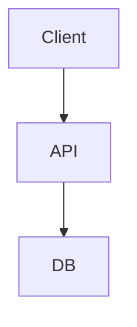
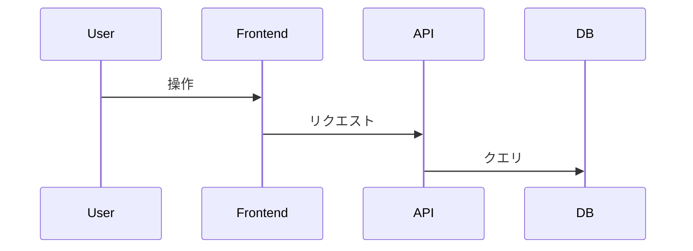
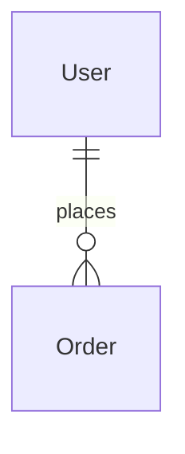

# 基本設計書

## 1. 概要
### 1.1 目的
<!-- 要件定義書 §1 から転記 -->

### 1.2 スコープ
- 対象範囲:
- 対象外:

### 1.3 前提条件・制約
<!-- 要件定義書 §6 から転記 -->

## 2. アーキテクチャ
### 2.1 システム構成図

### 2.2 技術スタック
| レイヤー | 技術 | バージョン | 選定理由 |
|---------|------|-----------|---------|
| Frontend | | | |
| Backend | | | |
| Database | | | |
| Infrastructure | | | |
| 監視 | | | |

### 2.3 ADR (Architecture Decision Records)
- [ADR-001](../adr/ADR-001.md): 

## 3. 機能設計
### 3.1 機能一覧
| ID | 機能名 | 概要 | 対応要件 | 優先度 |
|----|--------|------|---------|--------|
| F-001 | | | REQ-F-001 | |

### 3.2 ユーザーフロー

## 4. データモデル
### 4.1 ER図

### 4.2 主要エンティティ
| エンティティ | 概要 | 主要属性 | 概算レコード数 |
|-------------|------|---------|-------------|
| | | | |

## 5. API 概要設計
| ID | メソッド | パス | 概要 | 認証 | 対応機能 |
|----|---------|------|------|------|---------|
| A-001 | GET | /api/v1/ | | 要 | F-001 |

## 6. 画面一覧
| ID | 画面名 | 概要 | 対応機能 | 備考 |
|----|--------|------|---------|------|
| S-001 | | | F-001 | |

## 7. セキュリティ設計
### 7.1 脅威分析（STRIDE）
| 脅威カテゴリ | 脅威シナリオ | 影響度 | 対策 |
|-------------|------------|--------|------|
| Spoofing | | | |
| Tampering | | | |
| Repudiation | | | |
| Information Disclosure | | | |
| Denial of Service | | | |
| Elevation of Privilege | | | |

### 7.2 認証・認可設計
- 認証フロー:
- 認可モデル (RBAC/ABAC):
- トークン管理:

## 8. 非機能設計
### 8.1 性能設計
- キャッシュ戦略:
- DB インデックス戦略:
- CDN:

### 8.2 監視・ログ設計
| メトリクス | 閾値 | アラート先 |
|-----------|------|-----------|
| レスポンスタイム p95 | | |
| エラー率 | | |

### 8.3 バックアップ・DR
- バックアップ頻度:
- リストア手順:

## 9. 外部依存
| 依存先 | 用途 | SLA | フォールバック |
|--------|------|-----|-------------|
| | | | |

## 10. リスクと対策
| ID | リスク | 影響度 | 発生確率 | 対策 |
|----|--------|--------|---------|------|
| R-001 | | 高/中/低 | | |
