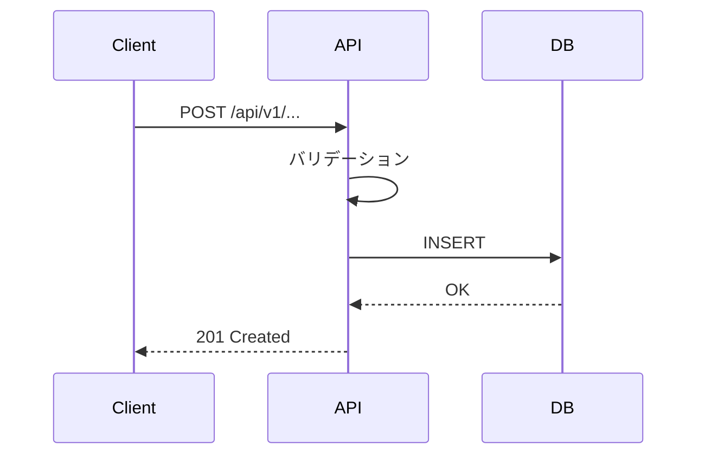

# 詳細設計書

## 1. API 詳細仕様 (D-API)

### A-001: [エンドポイント名]
- **Method**: POST
- **Path**: /api/v1/...
- **認証**: Bearer token (required)
- **対応機能**: F-001

#### Request
| フィールド | 型 | 必須 | 説明 | バリデーション |
|-----------|------|------|------|-------------|
| field1 | string | YES | | max: 255 |

#### Response (200)
| フィールド | 型 | 説明 |
|-----------|------|------|
| id | string (UUID) | |
| created_at | string (ISO8601) | |

#### Errors
| Status | Code | 条件 | レスポンス例 |
|--------|------|------|------------|
| 400 | VALIDATION_ERROR | 必須フィールド欠損 | |
| 401 | UNAUTHORIZED | トークン無効 | |
| 404 | NOT_FOUND | リソース不在 | |
| 409 | CONFLICT | 重複 | |
| 429 | RATE_LIMITED | レート超過 | |

---

## 2. DB スキーマ詳細 (D-DB)

### テーブル: [テーブル名]
| カラム | 型 | NULL | デフォルト | 説明 |
|--------|------|------|-----------|------|
| id | UUID | NO | gen_random_uuid() | PK |
| created_at | TIMESTAMPTZ | NO | NOW() | 作成日時 |

### インデックス
| 名前 | カラム | 種別 | 理由 |
|------|--------|------|------|
| idx_xxx_yyy | xxx, yyy | BTREE | クエリパターン: ... |

### マイグレーション計画 (D-MIG-PLAN)
| Step | 内容 | ロールバック |
|------|------|------------|
| 1 | CREATE TABLE ... | DROP TABLE |
| 2 | ADD INDEX ... | DROP INDEX |

---

## 3. 画面仕様 (D-UI)

### S-001: [画面名]
- **目的**:
- **対応機能**: F-001
- **コンポーネント構成**:
- **状態管理**:
- **バリデーション**:
| フィールド | ルール | エラーメッセージ |
|-----------|--------|---------------|
| | | |

---

## 4. 処理フロー

### F-001: [機能名]

---

## 5. テスト設計

### 5.1 テスト戦略
| レベル | 対象 | ツール | カバレッジ目標 |
|--------|------|--------|-------------|
| Unit | ロジック | Jest/pytest | ≥80% |
| Integration | API | supertest | 全エンドポイント |
| E2E | ユーザーフロー | Playwright | クリティカルパス |

### 5.2 テストケース
| ID | 対象 | 種別 | 条件 | 期待結果 | 優先度 |
|----|------|------|------|---------|--------|
| TC-001 | A-001 | 正常系 | 有効なリクエスト | 201 + リソース作成 | P0 |
| TC-002 | A-001 | 異常系 | 必須フィールド欠損 | 400 + エラー詳細 | P0 |
| TC-003 | A-001 | 境界値 | field1 = 256文字 | 400 | P1 |

---

## 6. 工程表
| ID | タスク | 見積(h) | 担当 | 依存 | 状態 |
|----|--------|---------|------|------|------|
| T-001 | DB マイグレーション | | | - | |
| T-002 | API 実装 | | | T-001 | |
| T-003 | フロント実装 | | | T-002 | |
| T-004 | テスト実装 | | | T-002 | |

### クリティカルパス
T-001 → T-002 → T-003

### バッファ
- 不確実性係数: ×1.3
- 合計見積: h × 1.3 = h
