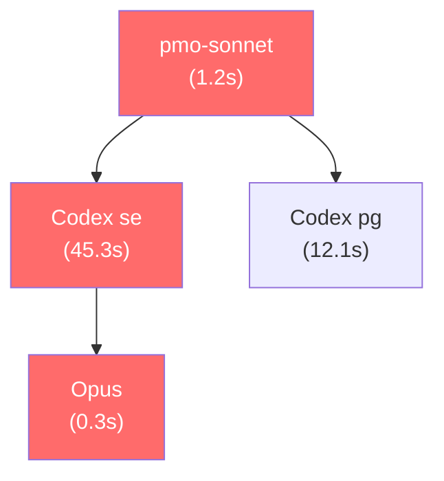

# PLAN-219: agent dispatch trace visualization (subagent 呼び出し chain の可視化)

## L2 凍結 (ADR snapshot)

本 PLAN tree は dispatch chain の DAG 記録方式と Mermaid グラフ出力、および bottleneck (最長パス) の自動検出アルゴリズム採用判断を含む。これらは L2 大局判断に該当するため、ADR snapshot を併設する。

| ADR | 凍結対象 | Status |
|---|---|---|
| ADR-058 (起票予定) | dispatch chain 記録方式 (DAG / parent_span + child_span) + bottleneck 検出アルゴリズム選択 | Proposed |

双方向 trace:
- 本 PLAN → ADR-058: frontmatter `related_adr` + 本 section
- ADR-058 → 本 PLAN: ADR-058 `## Related` に「PLAN-219 (実装 PLAN)」を記載

> ADR-058 は L4 着手前に起票する。WebSearch 3 query 必須 (OpenTelemetry trace span DAG 設計 / directed acyclic graph longest path algorithm / Mermaid flowchart auto-generation from Python)。

---

## §0. 背景・問題設定

HELIX では並列 wave で大量の subagent (pmo-sonnet / Codex se / Codex pg 等) を dispatch するが、各 dispatch chain の構造は会話ログにのみ存在し、以下の問題がある。

| 課題 | 影響 |
|---|---|
| どの subagent が最も時間を消費したか不明 | wave 設計の bottleneck が特定できない |
| pmo-sonnet → Codex se の呼び出し連鎖が追えない | 重複タスクの検出が困難 |
| session をまたいだ dispatch パターンが不可視 | 並列化改善のためのデータがない |
| wave 内の dependency 違反が事後検出できない | 衝突 commit の根本原因分析が遅延 |
本 PLAN は `helix agent trace` CLI を新設し、agent_slots dispatch chain を DAG として helix.db に記録、Mermaid フォーマットで可視化し、bottleneck path を自動検出する。

---

## §1. 目的

1. PostToolUse / agent_slots 発火時に dispatch chain (parent_span → child_span) を helix.db に記録する
2. `helix agent trace --session <id> --format mermaid` で session 内の dispatch chain を Mermaid graph として出力する
3. `--bottleneck` フラグで最長パス (critical path) を自動検出し強調表示する
4. PLAN-178 edit history および PLAN-171 hook profiling との join クエリで因果連鎖を分析できる

---

## §2. 設計方針

### 2.1 アーキテクチャ

```
PostToolUse hook / agent_slots fire
  └── cli/lib/dispatch_trace.py
        ├── DispatchTraceStore     helix.db v41 への span 記録
        ├── ChainBuilder           parent_span_id / child_span_id で DAG 構築
        ├── BottleneckDetector     DAG 上の最長パス (critical path) 検出
        └── MermaidRenderer        Mermaid flowchart 文字列生成

cli/helix-agent-trace              bash dispatcher
  └── trace subcommand
        ├── --session <id>         セッション別 chain 出力
        ├── --plan <plan_id>       PLAN 別 chain 出力
        ├── --format mermaid|json|text
        └── --bottleneck           critical path 強調表示
```

### 2.2 helix.db v41 schema

主要カラム: `span_id TEXT PK` / `parent_span_id TEXT` (NULL=root) / `session_id TEXT` / `agent_role TEXT` / `plan_id TEXT DEFAULT 'unknown'` / `started_at TEXT` (ISO 8601) / `finished_at TEXT` / `duration_ms INTEGER` / `status TEXT` (running/done/failed) / `metadata_json TEXT`.

インデックス: `(session_id, started_at)` / `(plan_id, started_at)`。

### 2.3 bottleneck 検出アルゴリズム

DAG の最長パスを検出する。アルゴリズムは Kahn's topological sort ベースの DP を採用する。

```
longest_path(DAG) =
  1. トポロジカルソート (Kahn's algorithm)
  2. 各ノードの累積 duration を DP で計算
  3. 最大累積 duration を持つパスを critical path として返す
```

cycles が検出された場合は WARN を出力し、cycle を含む subgraph を除外して処理継続する。

### 2.4 Mermaid 出力例



critical path ノードは `classDef critical` で赤色強調。

---

## §3. CLI インターフェース

```bash
helix agent trace --session <id> --format mermaid [--bottleneck]
helix agent trace --session <id> --format json|text
helix agent trace --plan <plan_id> --format text
helix agent trace stats [--since YYYY-MM-DD]
```

---

## §4. 実装 Sprint 計画

### Sprint .1: pmo-sonnet — 棚卸し + 境界確認

担当: pmo-sonnet。確認: 既存 agent_slots schema / PLAN-178 との join 可能性 / helix.db 現行 max version (v41 競合有無)。出力: schema 競合チェックメモ。

### Sprint .2: tl-advisor — 設計凍結 + ADR-058 起票

担当: tl-advisor。設計: span_id UUID 生成方式 / BottleneckDetector アルゴリズム (Kahn's DP vs DFS) / MermaidRenderer 出力仕様 / ADR-058 起票。

### Sprint .3: se — 実装

担当: se。`cli/lib/dispatch_trace.py` (DispatchTraceStore / ChainBuilder / BottleneckDetector / MermaidRenderer) + `cli/lib/migrations/v41_dispatch_trace.py` + `cli/helix-agent-trace` bash dispatcher + `cli/helix` routing 登録。

### Sprint .4: qa — テスト + レビュー

担当: qa。fixture: 3-node linear / 4-node DAG fork / cycle detection case。`helix agent trace --format mermaid` snapshot テスト / bottleneck critical path 一致確認 / `pytest test_dispatch_trace.py` 全 PASS。

---

## §5. DoD (Definition of Done)

1. `helix agent trace --session <id> --format mermaid` が Mermaid graph を stdout に出力する
2. `--bottleneck` で critical path ノードが `:::critical` classDef で強調される
3. cycle が含まれる場合は WARN を出力し処理継続する (fail-open)
4. `python3 -m py_compile cli/lib/dispatch_trace.py` PASS
5. `pytest cli/lib/tests/test_dispatch_trace.py` 全 PASS
6. `helix commands` に `agent-trace` が表示される
7. `python3 cli/lib/plan_validator.py docs/plans/PLAN-219-*.md` PASS
8. ADR-058 起票済 (L2 凍結)

---

## §6. V-model 4 artifact trace

| Artifact | 状態 | ファイル |
|---|---|---|
| ① 設計 (本 PLAN) | 存在 | docs/plans/PLAN-219-*.md |
| ② 実装コード | Sprint .3 で生成 | cli/lib/dispatch_trace.py / cli/helix-agent-trace |
| ③ テスト設計 | Sprint .4 で起票 | docs/v2/L4-test-design/PLAN-219-test-design.md |
| ④ テストコード | Sprint .4 実装 | cli/lib/tests/test_dispatch_trace.py |

---

## §7. リスク

| リスク | 影響 | 緩和策 |
|---|---|---|
| span_id が未設定の既存 dispatch には記録が残らない | 過去 session の trace が空になる | 新規 session からの記録のみ対象とし、既存記録への遡及は別 PLAN |
| helix.db v41 が PLAN-178 v40 と番号競合 | DB 破損 | Sprint .1 で現行 max version を確認し、競合時は v42 に繰り上げ |
| Mermaid node が大量 span で読みにくくなる | 可視化が実用に耐えない | `--depth N` オプションで表示階層を制限 (デフォルト 3 層) |
| BottleneckDetector が大規模 DAG で遅延 | `helix agent trace` のレスポンス劣化 | span 数 > 500 の場合は sampling モード (最大 500 node) に切り替え |
