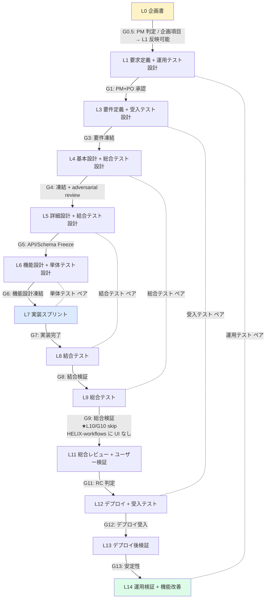
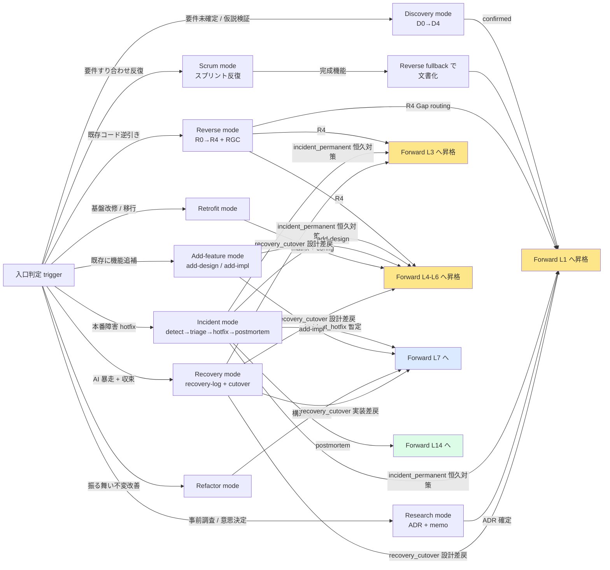
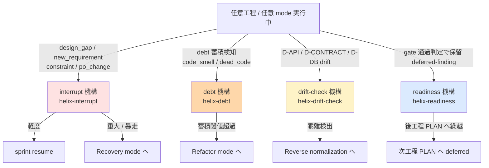
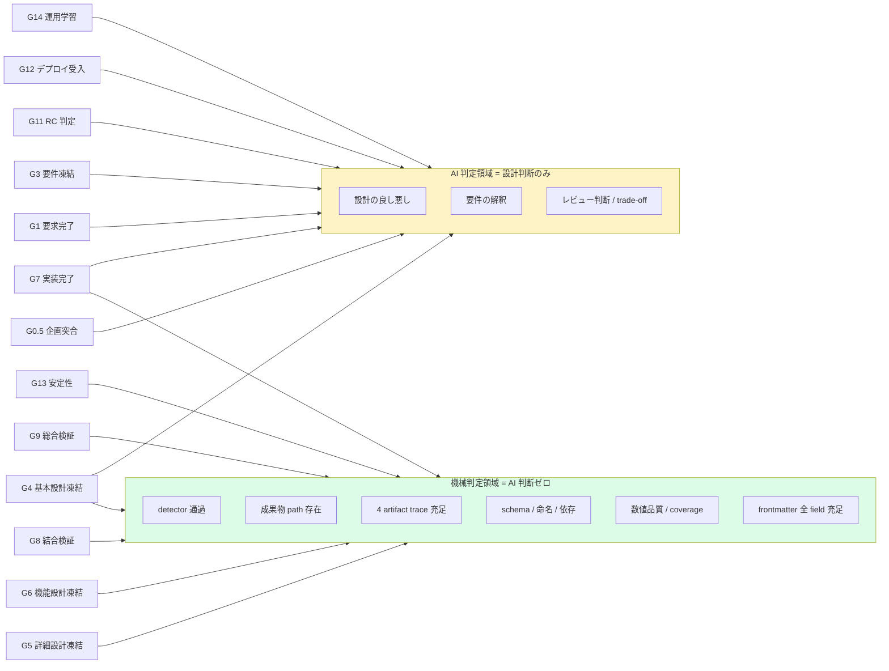
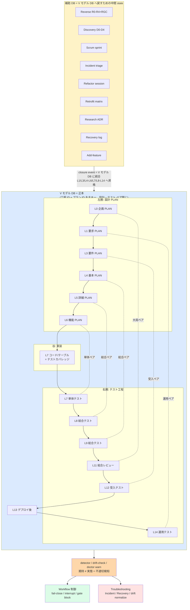
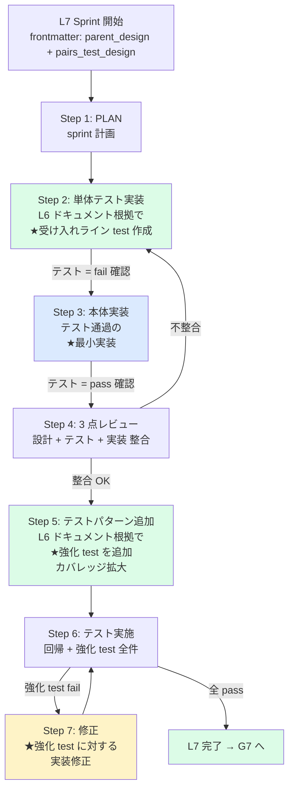

# HELIX-workflows 見直し企画書

> 本 doc は `docs/plans/L0/L0-helix-workflows-conceptplan.md` (PLAN) の製本対象。既存の HELIX-workflows (2026-05-24 V2 完全移行で正本宣言された「道」) を素材として、現状到達点 / 残課題 / 次工程 (L1 要求定義) への接続方針を整理する見直し企画書。

---

## §1 背景・目的

### §1.1 背景 — HELIX-workflows の現状

HELIX-workflows は 2026-05-24 V2 完全移行 (commit `35a901c` / `ee1a13a`) で **正本宣言された「道」**。構成は以下:

- **HELIX-workflows/HELIX-process-L0-L14.md**: 全体構造正本 (220 行)、TDD 全 mode 共通絶対原則 + V-model ペア凍結 (L1↔L14, L2↔L10, L3↔L12, L4↔L9, L5↔L8, L6↔L7)
- **HELIX-workflows/helix-process/ 47 doc**:
  - Forward 工程別 15 doc (L0-concept.md 〜 L14-operation-verification.md)
  - 入口モード 9 doc (scrum / discovery / reverse / incident / add-feature / refactor / retrofit / research / recovery-workflow.md)
  - 工程専門 2 doc (screen-design / frontend-design-workflow.md)
  - 管理・自動化基盤 21 doc (automation-gate-map / deviation-plan-map / db-integration / db-auto-registration / detection-routing / fe-detector-spec / cross-cutting-mechanisms / test-perspective-gate / ci-pr-workflow / layer-context-injection / learning-engine / observability-metrics / continuous-run-context-management / cross-detection / infra-readiness / integration-map / folder-structure-review / asset-mapping / two-stage-agent-design / v2-9mode-ecosystem / README)
- **cli/helix-* (約 60 CLI)** + **skill 118 種** + **helix.db schema v35+** + **runtime (.helix/)**
- **PLAN**: V1 (PLAN-NNN) 224 件 (`is_reference: true` 参考扱い) + V2 (L<NN>-○○○plan) 100 件

HELIX-workflows = AI エージェント (Codex / Claude) を主力とする **process layer framework**。Forward V-model + 9 mode + 横断機構 (interrupt/debt/drift-check/readiness) で構成。

### §1.2 メイン目的 — TDD 駆動 + ワークフロー配線の機械判定化 + helix.db = 資産保全 backbone

HELIX-workflows は **TDD (テスト駆動) を基本原則** とし、V モデル左腕で設計と同時にテスト設計を凍結、L6→L7 で「テスト → 実装」順序を固定する ([HELIX-process-L0-L14.md §基本原則](../../../HELIX-workflows/HELIX-process-L0-L14.md))。やり方が異なる 9 mode (Scrum/Discovery/Reverse/Incident/Add-feature/Refactor/Retrofit/Research/Recovery) も **最終的に V モデルへ回帰** し、見える化・引き継ぎ可能性・資産保全を確保する。helix.db はこの **資産保全 backbone** + 状態管理 + フィードバック機構として機能する。

以下 6 つを同時達成する:

1. **TDD 駆動の強制 (受け入れラインが先、強化はあと)**:
   - **L1-L6 設計⇔テスト設計ペア凍結** (運用 / 受入 / 総合 / 結合 / 単体テスト設計をドキュメント根拠で同時凍結)
   - **L7 sprint 7 step を厳守** (HELIX-workflows L7-implementation.md 正本):
     1. PLAN (sprint 計画、parent_design + pairs_test_design 参照)
     2. **単体テスト実装** (L6 ドキュメント根拠で **受け入れライン test** を作る = 最小通過セット)
     3. **本体実装** (受け入れライン test を通す **最小実装**、テストアフター禁止)
     4. **3 点レビュー** (設計 + テスト + 実装 の整合)
     5. **テストパターン追加** (QA 観点で L6 ドキュメント根拠の **強化 test** を追加、カバレッジ拡大)
     6. **テスト実施** (回帰、強化 test 含む全件)
     7. **修正 / 実装完了** (強化 test に対する実装修正、ここで初めて実装強化)
   - **順序原則**: 「ドキュメント → テスト → 実装 → レビュー → ドキュメント根拠でテスト追加 → 修正」。**受け入れラインが先、強化はあと**。実装の強化は受け入れライン通過後にしか着手しない
   - 全 mode 共通絶対原則 (Forward / Scrum / Discovery / Reverse / Incident / Add-feature / Refactor / Retrofit / Research / Recovery)
   - Refactor では変更前の保護網テスト (既存テスト or ゴールデンマスター) 存在を前提
2. **9 mode から V モデル回帰**: Scrum/Discovery/Reverse/Incident/Add-feature/Refactor/Retrofit/Research/Recovery の各 mode 完了後、Forward L0-L14 体系へ昇格・統合 (Reverse fullback / R4 routing / Add-feature 追補 等)
3. **helix.db を決定する (V モデル DB = 正本 + 補助 DB = 中間 state)**: helix.db は **V モデル DB (正本)** + **補助 DB (9 mode 別、中間 state)** の二層構造。V モデル DB は設計工程 (L0/L4/L5/L6) × 実装 (L7) × テスト工程 (L7単体/L8/L9/L12/L14) を設計⇔テストペアで閉じ、工程 ID (L<NN>) + プラン ID (L<NN>-○○○plan) を主キーとする。補助 DB は Reverse/Discovery/Scrum/Incident/Refactor/Retrofit/Research/Recovery/Add-feature の中間 state を保持、closure event で V モデル DB に統合される。ワークフローの state / event / transition / 変更履歴 / 設計判断 / 実装内容 / コード&DB の変更 trace が schema で正本化される
4. **AI による独自判断を厳格に減らす**: 配線が決まれば AI は配線に従うだけ (Opus PM の都度判断を排除)
5. **ワークフロー分岐を機械判定する**: どの mode に行くか / どの gate を通すか / どの state に置くか / どの工程へ進むか を AI 判断ゼロで決定
6. **影響範囲分析の可用性向上 (helix.db の最終目標)**: 機能改善・改修時に「設計はこうだった」「実装はこうだった」「コード/DB/画面はこう変わった」が即座に追跡可能。「ここだけ直せばいいか / 影響範囲が広いから広めに直すか」を判断できる

#### 正サイクル (データ駆動の自己回帰 framework + 資産保全)

```
[1] TDD 駆動でワークフローに従う (設計⇔テスト ペア凍結、テスト → 実装)
   ↓
[2] 9 mode 経由なら最終的に Forward V モデルに回帰 (見える化、引き継ぎ可能、資産保全)
   ↓
[3] helix.db に適切に登録 (state / event / transition / 変更履歴 / trace が正しく蓄積)
   ↓
[4] 適切登録だから不適切を検知できる (期待 ≠ 実態 = 異常検知)
   ↓
[5] 不適切から
   ├─ ワークフロー制御 (次の遷移 / fail-close / interrupt 発火)
   ├─ トラブルシューティング起点 (incident detect / drift detect / recovery trigger)
   └─ 影響範囲分析 (機能改修時、過去 trace から「ここだけ / 広めに」を判断)
```

これが達成されると、AI が判断するのは **「設計の良し悪し / 要件の解釈 / レビュー判断」のみ** に絞られる。それ以外 (遷移 / 状態管理 / 異常検知 / 制御 / troubleshooting 起点 / 影響範囲分析) は全部 helix.db 駆動で機械化される。

#### V モデルの本質的価値: 量が対称ペアで閉じる

V モデル左腕 (設計工程) と右腕 (テスト工程) は **量・粒度・抽象度で対称ペア凍結** される。これにより:

1. **量保証**: 設計工程の量 = テスト工程の量 (1:1 ペア、量が機械的に予測可能)
   - L4 ADR 数 ⇔ L9 総合テスト数
   - L5 D-API endpoint 数 ⇔ L8 結合テスト数
   - L6 機能関数数 ⇔ L7 単体テスト数
   - L3 受入条件数 ⇔ L12 受入テスト数
   - L1 運用シナリオ数 ⇔ L14 運用テスト数
2. **量の偏り検知**: 設計量 vs テスト量 の差分 = **異常検知 signal** (例: L4 ADR 10 個 vs L9 総合 test 2 個 = カバレッジ不足を機械検知)
3. **キャパシティ予測**: 上流工程の量から下流工程の量を予測 (L4 ADR 数決まる → L9 総合 test の必要数が決まる)
4. **量の暴走防止**: 各工程の量が機械的に律される、設計だけ無限膨張 / テストだけ膨張 の事故防止

この「量閉じ性」が V モデル DB の正本性を担保する。補助 DB (mode 別、量不定) は closure event で V モデル DB に統合された時点で量が閉じる。

#### 資産保全の意義 (helix.db の最終目標)

機能改善・改修時に新規参加者 / AI session 跨ぎ / 別チーム引き継ぎが起きても、helix.db を見れば:

- 「こういう設計したのね～」(L4-L6 設計 doc の trace)
- 「こういう実装したのね～」(L7 sprint の commit / change set)
- 「コード/DB/画面はこう変わっているのか」(file change history + schema migration + UI state diff)
- 「ここだけ直せばいいか / 影響範囲が結構あるから広めに直すか」(dependency graph + trace_link)

がワンクエリで分かる。これが knowledge for decision の可用性向上 = HELIX の真の価値。

### §1.3 HELIX-workflows の位置付け — 要求に近い性質

HELIX-workflows は単なる framework 仕様ではなく、**要求 (= 何を作るか) に近い性質** を持つ。L0-L14 の各工程定義 / 9 mode workflow / V-model ペア / 横断機構 は、HELIX framework が満たすべき機能 (FR) + 非機能 (NFR) の上位概念。

そのため本見直し PLAN では:
- **L0 (本 PLAN)**: 配線図の大局確定 + 機械判定化方針確定 (薄い企画書)
- **L1 (次工程)**: 配線の詳細仕様 + 各 transition の機械判定条件 + 機能/非機能要求 (厚い要求定義)
- 既存 HELIX-workflows 47 doc は L1 要求定義の **直接素材** (V2 を踏襲しつつ機械判定化の観点で再整理)

### §1.4 適用工程 (L2 / L10 skip)

HELIX-workflows 自体は **画面 / UI を持たない** (CLI + workflow + skill + schema の framework) ため、Forward L0-L14 から以下を skip:

- **L2 画面設計 + フロント UI**: 対象外 (HELIX-workflows に画面はない)
- **L10 フロント UX 磨き上げ**: 対象外 (L2 の対の右腕、skip 対応)

適用工程: **L0 → L1 → L3 → L4 → L5 → L6 → L7 → L8 → L9 → L11 → L12 → L13 → L14** (計 13 工程)

V-model ペア凍結も対応:
- L1 ↔ L14 (運用テスト) ✓
- ~~L2 ↔ L10~~ (画面 ↔ UX、skip)
- L3 ↔ L12 (受入テスト) ✓
- L4 ↔ L9 (総合テスト) ✓
- L5 ↔ L8 (結合テスト) ✓
- L6 ↔ L7 単体 (単体テスト) ✓

### §1.5 見直しの必要性 (なぜ今)

2026-05-25 session3 (63 commit / 10 framework 強化) 完遂後、本 session で HELIX 自身を HELIX-workflows で自己適用 (dogfooding) しようとして以下が発覚:

1. **ワークフロー配線が機械判定不能**: 各工程 / mode の遷移条件が doc 仕様止まり、AI Opus PM が都度判断
2. **PLAN dir が L7 / L12 / L14 のみ実体 (L0/L1-L6/L8-L11/L13 不在)** → V2 命名規則の全工程起票が機能していない
3. **helix doctor warn 109 件** (4 artifact 86 / pair freeze 11 / skill frontmatter 116 / etc) → V2 規約の機械強制が advisory 止まり
4. **dogfooding 不在** → HELIX 自身が HELIX-workflows で開発されていない
5. **9 mode 接続 trace 薄い** → 各 mode の Forward 接続が doc 仕様止まり、実走行 event が helix.db に登録されない
6. **専門エージェント / team 構造の累積議論** (memory carry §9 P1.5) → L7+ で再燃するが本 L0 では扱わない

---

## §2 解決する課題

### §2.1 課題 10 軸 (TDD 軸追加、§3.1 対応施策列付き)

| # | 軸 | 課題 | 見直しで解決する方向 | → §3.1 対応施策 | → §8 L1-IN |
|---|---|---|---|---|---|
| 1 | PLAN 全工程起票 | L0/L1-L6/L8-L11/L13 dir 不在、V2 命名規則の全工程化が未完 | L1+ で L0-L14 全工程 dir 整備 + 各工程 skeleton PLAN 起票を要件化 (L2/L10 skip 適用後 13 工程) | L0-L14 全工程 PLAN dir の整備計画 | L1-IN-03 |
| 2 | 4 artifact 双方向 trace | warn 86 件、設計 ↔ 実装 ↔ テスト設計 ↔ テストコード の trace が advisory | L1 NFR で fail-close 昇格、L7 既存 65 PLAN の retrofit を必須化 | HELIX-workflows 本体の見直し / helix.db schema 整合確認 | L1-IN-04 |
| 3 | V-model pair freeze | warn 11 件、parent_design / pairs_test_design 未指定 PLAN | L1 NFR で必須化、L7 PLAN frontmatter validator を強制 | HELIX-workflows 本体の見直し / helix.db schema 整合確認 | L1-IN-04 |
| 4 | mode 接続 trace | 9 mode の Forward 接続が doc 仕様止まり、実走行 event 不在 | helix.db に mode_transition table 新設、各 mode の confirmed → L1/L3/L4-L6 昇格を event 化 | V モデル逸脱モード回帰ワークフローの設計 / helix.db schema 整合確認 | L1-IN-08, L1-IN-10 |
| 5 | dogfooding | HELIX 自身が HELIX-workflows で開発されていない | 本 L0 起票が起点、L1+ で HELIX 自身の全工程 PLAN を起票する | dogfooding 計画 | L1-IN-03 |
| 6 | 既存資産インベントリ | skill 118 / cli/helix-* 60 / helix.db table 30+ / PLAN 324 / docs が flat で工程未割当 | L0-L14 工程別に資産 inventory を作成、helix.db に双方向 mapping 登録 | 既存資産の工程別 inventory 作成 | L1-IN-06 |
| 7 | 工程別 skill 注入機構 | `layer-context-injection.md` で設計済の L 別注入セットが実装不完全、helix-context が各 L で「ここで使う skill」を機械注入できていない | helix-context 強化 + `vmodel-semantics.yaml` L 別注入セット正本化 + helix doctor audit | 工程別 skill 注入機構の実装 | L1-IN-07 |
| 8 | V モデル逸脱モードの Forward 回帰ワークフロー | 9 mode の closure 後に Forward 昇格手順が個別ばらつき | リバースワークフロー (R0-R4 + RGC) を 9 mode 共通基盤化、Forward 接続 event helix.db 登録 | V モデル逸脱モード回帰ワークフローの設計 | L1-IN-08 |
| 9 | PLAN 内部の手順書化 | PLAN の §0-§5 構造はあるが、各 step の agent_slot 割当 + workflow trace が template に組込まれていない | template 拡張: 各 step に `agent_slot` + `workflow_ref` field 追加、cli/templates/plan/v2/L<NN>-template.md 全 13 件 (L2/L10 skip) を整備 | PLAN template の手順書化 | L1-IN-09 |
| **10** | **TDD 順序 fail-close 未強制** | L7 sprint 7 step の **受け入れライン先 / 強化あと** が advisory 止まり、機械強制なし。テストアフター / 受け入れ test 不在 / 強化 test 不在 の事故防止が不完全 | L1 NFR で L7 sprint 7 step の順序 fail-close 機械強制契約を確立 (S2 test 存在前に S3 着手 = block / S5 強化 test pass 前に S7 修正 = block 等) | HELIX-workflows 本体の見直し / cli/helix-* (sprint 機械チェック) | L1-IN-11 |

### §2.2 解決後の到達点

HELIX-workflows の道に沿って HELIX 自身を L0-L14 で開発できる状態 (= 自己充足する framework)。同様に、HELIX-workflows を採用した任意の project (具体例: マーケティングツール SaaS / Indie SaaS / 業務システム 等、L1 要求定義以降で個別 use case として扱う) が L0-L14 を歩ける。

---

## §3 スコープ

### §3.1 対象 (10 領域)

- **HELIX-workflows 本体の見直し**: 47 doc の現状到達把握 + drift 検出 + retrofit 方針確定
- **cli/helix-* の整合確認**: HELIX-workflows と CLI 実装の drift 解消方針
- **skill 118 種の整合確認**: SKILL_MAP.md と HELIX-workflows の対応関係明示
- **helix.db schema の整合確認**: V2 規約 (kind / process_layer / parent_design / pairs_test_design / generates / dependencies) と DB schema の対応関係
- **L0-L14 全工程 PLAN dir の整備計画**: L1 で実施する全工程 skeleton PLAN 起票の方針
- **dogfooding 計画**: HELIX 自身を HELIX-workflows で開発する具体手順 (L0 → L1 → L2 → ... → L14) の見取り図
- **既存資産の工程別 inventory 作成**: skill 118 / cli/helix-* 60 / helix.db table 30+ / PLAN 324 / docs を L0-L14 工程別に分類、資産 ↔ 工程の双方向 mapping を helix.db に登録、現状の工程別密度 (どの工程に資産集中 / どの工程が空白か) を可視化
- **工程別 skill 注入機構の実装**: `helix-context` 強化、`vmodel-semantics.yaml` に L 別注入セット (skill / command / mandatory agent / orchestration) 正本化、helix doctor で audit。L に入った瞬間に AI の選択空間が「その工程で使うもの」に自動絞り込みされる機構 (`layer-context-injection.md` の実装層)
- **V モデル逸脱モード回帰ワークフローの設計**: 9 mode (Scrum/Discovery/Reverse/Incident/Refactor/Retrofit/Research/Recovery/Add-feature) から Forward L0-L14 への回帰経路を、既存リバースワークフロー (R0-R4 + RGC) を **共通基盤** として再利用する形で設計。各 mode の closure 時に Forward への接続 event を helix.db 登録、9 mode → Forward の trace 充足
- **PLAN template の手順書化 (15 件整備)**: cli/templates/plan/v2/L00-L14 template 全 15 件で各 step に `agent_slot` + `workflow_ref` field 組込。step ごとに「誰が / どの workflow で / どこまで進んだか」を残す手順書化、再開可能性を強化

### §3.2 対象外

- 新 paradigm への移行 (V-model → Stream-aligned 等): HELIX-workflows V2 をそのまま使う方針確定 (本 session ユーザー指示)
- 既存 V1 PLAN 224 件の V2 命名 retrofit: `is_reference: true` 維持、製本したい場合は V2 命名で新規書き直し
- 具体 product (マーケティングツール / Indie SaaS 等) の機能要求: L1 要求定義以降で扱う use case
- 専門エージェント 35 / manager 18 / team 8 の実装: memory carry §9 P1.5 で方針確定済、L1+ で段階導入
- AI 本体 (LLM training / fine-tuning): HELIX-workflows scope 外

### §3.3 想定 Phase 境界 (仮、L1/L3 で確定)

| Phase | scope | 仮 KGI |
|---|---|---|
| α (見直し + 自己適用) | HELIX-workflows 見直し完了 + HELIX 自身の L0-L14 全工程 PLAN 起票 | aligned PLAN ≥ 50 / month + warn 86 → 20 以下 |
| β (OSS 化) | HELIX-workflows を OSS framework として公開 | OSS install ≥ 100 / week |
| γ (commercial) | freemium / commercial (専用 advisor / SOC2 / 認定 partner) | paid user ≥ 10 / month |

Phase 境界 KGI は L1 要求定義で確定 (L3 で詳細化)。

---

## §4 投資対効果

### §4.1 想定投資

- 期間: 5-15 セッション (Phase α 見直し + 自己適用 部分)
- 工数: PM 主導、実装は Codex / Claude 委譲
- Token 予算: 既存予算内 (advisor / pmo 委譲で効率化)

### §4.2 想定 ROI (定量目標、Phase α 終了時点)

| 指標 | 現状 (2026-05-26) | Phase α 目標 |
|---|---|---|
| L0-L14 全工程 PLAN dir 整備率 | 約 33% (L0/L7/L12/L14 のみ実体、本 L0 起票で L0 着手) | 100% (全 dir + 各工程に skeleton PLAN 1 件以上) |
| 4 artifact 双方向 trace 充足率 | ~10% (helix doctor warn 86 件) | ≥ 80% (warn 20 件以下) |
| Pair Freeze Coverage | ~30% (warn 11 件) | ≥ 80% (warn 3 件以下) |
| skill frontmatter audit warn | 116 件 | ≤ 30 件 |
| HELIX 自己適用 (dogfooding) | 0% (本 PLAN 起票が起点) | aligned PLAN ≥ 50 / month |
| mode 接続 trace (helix.db event) | 0 件 | mode_transition event 蓄積開始 |

---

## §5 成功条件・KGI / KPI

### §5.1 北極星指標 (NSM) — 1 系統

**NSM: V-model 整合 PLAN 完遂数 / week**

- 定義: `count(PLAN where status=complete AND vmodel_trace_score >= 0.8) / week`
- vmodel_trace_score = 6 axes 全 PASS で 1.0: layer / kind / pair_freeze / 4artifact_trace / gate_pass / done
- 機械判定契約: plan_validator + helix doctor + helix.db.v_model_alignment_score view (L1 で確定)
- 評価頻度: 週次
- Target: Phase α 終了時点で aligned PLAN ≥ 5 件 / week

### §5.2 Guardrail (3 軸、fail-close)

> ID は `GR-*` で命名 (Forward gate `G2/G4/G6` 等との混同回避)。

| ID | 軸 | Target | Fail-close trigger |
|---|---|---|---|
| GR-1 | Pair Freeze Coverage | ≥ 80% | Forward gate G2/G4/G6 で block |
| GR-2 | AI Agent Error Budget Consumption | ≤ 5% / month | agent slot 自動 throttle |
| GR-3 | Time-to-First-Successful-PLAN (TTFSP) | ≤ 30 min (新規 install から) | onboarding flow 見直し carry |

### §5.3 Cascade KPI (advisory)

- 3-problem 検知率 (バグ / spaghetti / 契約漏れ) ≥ 80%
- Sprint 自律完遂率
- 8 並列到達率
- **9 mode → Forward 回帰率**: 9 mode 完了 PLAN のうち Forward (L1/L3/L4-L6/L7-L14) へ昇格 event 登録済の比率 ≥ 95%
- **影響範囲分析 query 時間**: 機能改修 trigger → 過去 trace retrieve まで ≤ 5 秒 (helix.db query)
- **資産保全 trace 充足率**: asset_history / schema_migration_log / ui_state_diff / decision_trace の view が L7 sprint の commit と 1:1 対応している比率 ≥ 90%
- **影響範囲判定の自動化率**: 「ここだけ / 広めに」の機械判定が L4-L6 algorithm で正しく判別できる率 ≥ 80% (L1-L5 で実装)
- **V モデル量閉じ率 (pair volume balance)** ★: 設計⇔テスト ペア各々の量バランス指標が target (`balance_ratio = test_count / design_count`、向きはテスト÷設計、target ≥ 1.0) を満たす比率 ≥ 90%
  - L9 総合 test 数 / L4 ADR 数 ≥ 1.0 (ADR 1 件 = 総合 test ≥ 1 件で凍結)
  - L8 結合 test 数 / L5 D-API endpoint 数 ≥ 1.0
  - L7 単体 test 数 / L6 機能関数数 ≥ 1.0 (カバレッジ 100%)
  - L12 受入 test 数 / L3 受入条件数 ≥ 1.0
  - L14 運用 test 数 / L1 運用シナリオ数 ≥ 1.0
  - **paired_trace_coverage** ★ = paired_items / design_items ≥ 95% (双方向 trace 接続率、count 算出だけでなく trace 接続を確認)
  - **orphan_test_count** ★ = 0 (孤児テスト = ペア凍結対象の設計に紐づかないテスト件数、fail-close)
  - 上限 guardrail (別 KPI): `test_count / design_count ≤ 10` を超える場合は過剰テスト疑い = メンテ debt 兆候 (advisory)

### §5.4 KGI

Phase α 完了時点で:

- L0-L14 全工程 PLAN dir 100% 整備 + 各工程 skeleton PLAN 起票
- 4 artifact double trace 100% 化 (warn 86 → 20 以下)
- HELIX 自身の dogfooding 稼働 (aligned PLAN ≥ 50 / month)
- HELIX-workflows 47 doc と cli/helix-* / skill 118 / helix.db schema の drift 解消

---

## §6 想定リスク

| ID | 軸 | リスク | Mitigation | Severity |
|---|---|---|---|---|
| R1 | scope | 見直し範囲が膨大 (47 doc + 60 CLI + 118 skill + 35 table) で Phase α が肥大化 | L1 要求定義で **必須見直し範囲 (warn 解消・dogfooding 起動・PLAN dir 整備)** と **後回し範囲 (CLI/skill/schema retrofit)** を明確分離 | P1 |
| R2 | technical | 4 artifact trace warn 86 件の retrofit が L7 既存 PLAN 全件で困難 | L1 NFR で「新規 PLAN は最初から trace 必須 (fail-close)、旧 PLAN は段階 retrofit (advisory)」の二段運用を要件化 | P1 |
| R3 | dogfood | HELIX 自身の L1-L6 設計 PLAN 起票が後回しになり、L7 実装が走り続ける | L1-L6 PLAN 起票を Phase α DoD に含め、L7 既存 65 PLAN の retrofit を blocked dependency にする | P1 |
| R4 | drift | HELIX-workflows と cli/helix-* / skill / helix.db schema の drift が見直しでさらに露呈 | L1 要求定義で drift 検出機構 (helix doctor / drift-check) の強化を NFR 化、L5 詳細設計で schema migration 計画 | P2 |
| R5 | regulatory | OSS license (Phase β) / commercial 戦略 (γ) 未確定 | L1 で MIT / Apache 2.0 確定、γ monetization は L1 段階で freemium / commercial の二択に絞る | P2 |

---

## §6.5 ワークフロー配線図 (機械判定化の対象、L0 大局、L1 で詳細化)

> 本 §は HELIX-workflows のワークフロー配線の **大局** を示す。各遷移条件 / 機械判定式 / fail-close trigger は L1 要求定義で詳細化する。図は mermaid で記述。

### §6.5.1 Diagram 1: Forward V-model L0-L14 + ペア凍結配線 (L2/L10 skip)



**機械判定式**: 各 gate (G0.5-G14) は `gate_verdict = static_subchecks AND ai_review_required_when(...)` の合成。`static_subchecks` (detector + frontmatter + count) は `exit 0 = pass` で機械判定、AI 判定が必要な gate (G0.5/G1/G3/G7/G11/G12/G14) でも static 部分は先行通過し、AI は最終 verdict のみ担当 (詳細: §6.5.4 Diagram 4)。pair 凍結は parent_design / pairs_test_design field の存在で機械判定。

### §6.5.2 Diagram 2: 9 mode 入口判定 + Forward 復帰経路



**機械判定式**: 入口 trigger は detector で機械判定 (例: 仮説未確定検知 → Discovery、本番障害 alert → Incident)。Forward 復帰は各 mode の closure event を helix.db.mode_transition table に登録、event 発火で自動遷移。

**Incident / Recovery の復帰経路 (粒度詳細)**:
- **Incident**: `incident_hotfix` は L7 暫定実装直行 (本番影響最小化)、`incident_permanent` は事象別に L1 要求 / L3 詳細 / L4-L6 設計に差戻し恒久対策、`postmortem` は L14 で運用学習に集約。3 経路は **並走可** (hotfix で先に止血 → permanent で根本対策 → postmortem で再発防止 を時系列で別 PLAN 起票)。
- **Recovery**: `recovery_cutover` は逸脱原因別に **設計差戻し (L1/L3/L4-L6)** と **実装差戻し (L7)** に分岐。AI 暴走の原因が要件解釈なら L1、契約理解なら L3、設計判断なら L4-L6、実装ミスなら L7 へ。複数差戻しは recovery-log で trace し、`cutover_orchestrator` が機械順序制御。

### §6.5.3 Diagram 3: 横断機構の発動条件 (全工程・全 mode から発動)



**機械判定式**: 各機構の発動条件は detector + threshold で機械判定。例: drift-check は D-API/D-CONTRACT/D-DB の hash 不一致で発動、debt は code_smell 閾値超過で発動。

### §6.5.4 Diagram 4: gate 配置 + 機械 vs AI 判定境界



**機械判定式**: `gate_verdict = static_subchecks AND ai_review_required_when(...)` の合成方式。
- **static 領域** (M1-M6): `helix-gate --static-only` で AI なしに実行可能、AI 判定 gate (G0.5/G1/G3/G7/G11/G12/G14) でも static subchecks は先行通過必須。
- **AI 領域** (A1-A3): 設計の良し悪し / 要件解釈 / trade-off レビューに限定、manager (Opus + GPT-5.5) が adversarial check で統合判断、判断 trace を helix.db.gate_review table に記録。
- **境界判定**: `ai_review_required_when(gate)` は L1 で `cli/config/gate-policy.yaml` 化、各 gate ごとに AI レビュー発火条件 (例: 「ADR 新規追加時」「設計判断 trade-off ≥ 2 件」「P0/P1 指摘あり」) を機械判定 → AI 判定の発火自体も機械化。

### §6.5.5 配線図の機械判定化 — L1 で詳細化する項目

| 配線要素 | L1 で確定する機械判定契約 |
|---|---|
| Diagram 1 各 gate 遷移 | gate 別 detector / static check spec (exit code) |
| Diagram 2 mode 入口 trigger | trigger detector (helix-route の判定 logic) |
| Diagram 2 Forward 復帰 event | helix.db.mode_transition schema + event 発火条件 |
| Diagram 3 横断機構発動条件 | detector threshold (drift hash / debt 閾値 / interrupt trigger) |
| Diagram 4 機械 / AI 境界 | gate 別の「機械判定可能領域」「AI 判定必要領域」の正本 list |

### §6.5.6 helix.db = V モデル DB (正本) + 補助 DB (中間 state) — Diagram 5



#### V モデル DB の table 構造 (主キー = 工程 ID + プラン ID、量閉じ性を schema 強制)

> **構造区分**: **core tables 10 個** + **audit/event tables 1 個** (`volume_metrics`) + **derived views 7 個** (`pair_volume_balance` / `expected_pair_freeze` / `expected_4artifact_trace` / `expected_mode_transition` / `expected_volume_balance` / `v_model_alignment_score` / `discrepancy_log`)。view は **すべて core 10 には数えない** (L1-IN-10 で table/view 数を仕様書固定)。

| 区分 | 構造 | 主キー / 関連 | 内容 |
|---|---|---|---|
| core | **plan_registry** | `(process_layer, plan_id)` (例: L4, L4-helix-self-master-designplan) | 全 PLAN の正本登録 (frontmatter 抽出) |
| core | **design_artifact** | `(process_layer, plan_id, artifact_path)` | 設計 doc 本体 path + version + hash |
| core | **test_design_pair** | `(design_layer, test_layer, design_plan_id, test_design_path)` | 設計⇔テスト設計ペア凍結 (L1↔L14, L3↔L12, L4↔L9, L5↔L8, L6↔L7単体) |
| core | **test_implementation** | `(test_layer, plan_id, test_code_path)` | テストコード本体 (L7単体/L8/L9/L12/L14) |
| core | **code_implementation** | `(layer=L7, plan_id, file_path, commit_sha)` | 実装コード変更履歴 (L7 sprint) |
| core | **coverage_link** | `(L7 code path, L7単体 test path, coverage %)` | コード = テストカバレッジ 1:1 対応 |
| core | **gate_pass** | `(gate_id, plan_id, timestamp, verdict)` | 各 gate (G0.5-G14) 通過記録 |
| core | **transition_history** | `(from_layer, to_layer, plan_id, timestamp, source_workflow)` | 工程遷移履歴 (L0→L1, L4→L5 等) |
| core | **decision_trace** | `(plan_id, adr_id, decision_summary, rationale)` | 設計判断 ADR snapshot |
| core | **schema_migration_log** | `(version, migration_path, applied_at, plan_id)` | DB schema 変更 (L5 D-DB 由来) |
| audit/event | **volume_metrics** ★ | `(process_layer, plan_id, metric_kind, count)` | 各工程の量 metrics (L4: ADR 数 / L5: endpoint 数 / L6: 関数数 / L7: LOC + 単体 test 数 / L8: 結合 test 数 / L9: 総合 test 数 / L12: 受入 test 数 / L14: 運用 test 数) |
| derived view | **pair_volume_balance** ★ | `SELECT design_layer, test_layer, design_count, test_count, (test_count*1.0/design_count) AS balance_ratio FROM volume_metrics ...` | 設計⇔テスト ペアの量バランス指標 view (例: L4 ADR 10 / L9 総合 test 12 = 1.2 で pass) |

#### 補助 DB の table 構造 (mode 別、V モデル DB 統合前の中間 state)

| mode | table | closure 時に V モデル DB のどこへ統合 |
|---|---|---|
| Reverse | `reverse_evidence` (R0) / `reverse_contract` (R1) / `reverse_design` (R2) / `reverse_hypothesis` (R3) / `reverse_gap_register` (R4) | R4 routing で L1/L3/L4 PLAN として登録 |
| Discovery | `discovery_hypothesis` / `discovery_poc` / `discovery_verify_result` | confirmed → L1 要求 PLAN へ昇格 |
| Scrum | `scrum_sprint` / `scrum_backlog` / `scrum_increment` | 完成機能を Reverse fullback → L1-L14 体系へ |
| Incident | `incident_alert` / `incident_triage` / `incident_hotfix` / `incident_postmortem` | 暫定 → L7 hotfix、恒久 → L1/L3/L4-L6、postmortem → L14 |
| Refactor | `refactor_session` (保護網テスト前提) | L7 構造改善として登録 |
| Retrofit | `retrofit_matrix` / `retrofit_config` | L4/L5 追補 + L8/L9 回帰 |
| Research | `research_memo` / `research_adr` | ADR 確定 → L1/L4 設計の根拠として |
| Recovery | `recovery_log` / `cutover_orchestrator` | 収束 → L1/L3/L4-L6/L7 PLAN 起票 |
| Add-feature | `addfeature_design` / `addfeature_impl` | L4-L7 追補として登録 |

#### 共通 fail-close / 不適切検知 view

- `expected_pair_freeze` view (V モデル DB) ↔ 実態の差分 = `discrepancy_log` (Pair Freeze warn 11 件の根拠)
- `expected_4artifact_trace` view ↔ 実態 = `discrepancy_log` (4 artifact warn 86 件の根拠)
- `expected_mode_transition` view (補助 DB closure 時) ↔ 実態 = mode 接続 trace 漏れ検知
- `expected_volume_balance` view ★ ↔ `pair_volume_balance` 実態 = **量不均衡検知** (`balance_ratio = test_count / design_count ≥ 1.0` で pass、< 1.0 で fail-close。例: L9 総合 test 2 / L4 ADR 10 = 0.2 < 1.0 → カバレッジ不足で fail-close、L7 単体 test 20 / L6 関数 100 = 0.2 → fail-close、paired_trace_coverage ≥ 95% AND orphan_test_count = 0 を併用)
- `v_model_alignment_score` view = 6 axes (layer / kind / pair_freeze / 4artifact / gate_pass / done) の集計 (NSM の source)

**helix.db schema 設計の方向性 (L1/L5 で確定)**:

- 既存 30+ table を **V モデル DB (10 table) + 補助 DB (9 mode 別 table 群) + 共通 view** に再構成
- 各 table に `source_workflow` field (どの mode/工程由来か)
- 補助 DB の closure event で V モデル DB に統合する transaction 契約
- discrepancy_log の重大度 (P0-P3) で自動制御 (fail-close / interrupt / Incident mode / Recovery mode 切替)
- **資産保全 view** (新規): `asset_history` / `schema_migration_log` / `ui_state_diff` (HELIX-workflows は L2/L10 skip のため空 or 採用 project 用) / `decision_trace`

### §6.5.6.1 L7 Sprint 7 Step フロー (TDD 駆動、受け入れライン先 → 強化あと) — Diagram 5.5



**順序原則の機械強制 (L1 で機械判定契約 化)**:

| Step | 入力根拠 | 出力 | 機械強制条件 |
|---|---|---|---|
| S2 受け入れ test | L6 機能設計 doc (parent_design path) | test file (pairs_test_design path) | parent_design / pairs_test_design path 存在必須 (frontmatter validator) |
| S3 最小実装 | S2 で書いた test | 実装 file | S2 test 存在前に S3 着手 = fail-close (テストアフター禁止) |
| S4 3 点レビュー | 設計 + テスト + 実装 | review 結果 | 設計 ↔ 実装 ↔ test の 4 artifact 双方向 trace を機械 audit |
| S5 強化 test 追加 | L6 doc + S2/S3 + QA 観点 | 追加 test file | 受け入れ test pass 後にしか着手不可 (順序 fail-close) |
| S7 強化に対する修正 | S5 で書いた強化 test | 実装修正 | S5 test 不在で S7 着手 = fail-close |

これにより「実装はあと、受け入れラインが先、強化はそのあと」が helix.db.workflow_state + event_log で **機械的に保証** される。

### §6.5.7 影響範囲分析フロー (機能改善・改修時、helix.db 駆動) — Diagram 6

```mermaid
flowchart TB
  TRIGGER[機能改善 / 改修 trigger<br/>Add-feature / Refactor / Retrofit] -->|helix.db query| LOOKUP[過去 trace を retrieve]

  LOOKUP --> A1[L4-L6 設計 doc<br/>「こういう設計したのね」]
  LOOKUP --> A2[L7 sprint commit<br/>「こういう実装したのね」]
  LOOKUP --> A3[asset_history<br/>「code/DB/UI はこう変わった」]
  LOOKUP --> A4[trace_link + dependency graph<br/>「影響範囲」]

  A1 & A2 & A3 & A4 --> JUDGE{影響範囲<br/>判定}
  JUDGE -->|局所| LOCAL[ここだけ直せばいい<br/>Add-feature add-impl<br/>or Refactor 小]
  JUDGE -->|広範| BROAD[広めに直す必要あり<br/>Retrofit matrix<br/>or 大規模 Refactor]

  LOCAL -->|Forward L7 へ| FORWARD7[Forward L7 実装]
  BROAD -->|Forward L4-L6 再設計へ| FORWARD46[Forward L4-L6 設計拡張]

  FORWARD7 -.helix.db 登録.-> LOOKUP
  FORWARD46 -.helix.db 登録.-> LOOKUP

  style LOOKUP fill:#dbeafe
  style JUDGE fill:#fef3c7
  style LOCAL fill:#dcfce7
  style BROAD fill:#fee2e2
```

**影響範囲分析の機械化** (L1-L5 で詳細化):

| 分析項目 | helix.db source | 出力 |
|---|---|---|
| 設計判断の retrieve | `decision_trace` view + L4-L6 doc path | 過去の trade-off / ADR snapshot |
| 実装の retrieve | `event_log where source=L7` + commit hash | sprint progress + 変更 file list |
| code/DB/UI の変更 | `asset_history` + `schema_migration_log` + `ui_state_diff` | 時系列の change set |
| 影響範囲 | `trace_link` (双方向) + `dependency graph` | 関連 PLAN / 関連 ADR / 関連 mode_transition |
| 「ここだけ / 広めに」判定 | dependency centrality (PageRank 等) + change set size + test coverage | local / broad の自動判定 (L4-L6 algorithm) |

この機械化により、新規参加者 / AI session 跨ぎ / 別チーム引き継ぎ時に **過去の judgment を 1 query で復元** できる = knowledge for decision の可用性向上 = HELIX の真の価値。

---

## §7 関連 doc / 参考

### §7.1 HELIX-workflows 正本 (見直し素材)

- [HELIX-workflows/HELIX-process-L0-L14.md](../../../HELIX-workflows/HELIX-process-L0-L14.md) (全体構造 + TDD 原則 + V-model ペア)
- [HELIX-workflows/helix-process/L0-concept.md](../../../HELIX-workflows/helix-process/L0-concept.md) (L0 工程定義)
- [HELIX-workflows/helix-process/README.md](../../../HELIX-workflows/helix-process/README.md) (47 doc 索引)
- [HELIX-workflows/helix-process/integration-map.md](../../../HELIX-workflows/helix-process/integration-map.md) (§結論と優先順位)
- [HELIX-workflows/helix-process/automation-gate-map.md](../../../HELIX-workflows/helix-process/automation-gate-map.md) (G0-G14 機械判定)
- [HELIX-workflows/helix-process/layer-context-injection.md](../../../HELIX-workflows/helix-process/layer-context-injection.md) (L 別注入セット)
- [HELIX-workflows/helix-process/cross-cutting-mechanisms.md](../../../HELIX-workflows/helix-process/cross-cutting-mechanisms.md) (interrupt / debt / drift-check / readiness)

### §7.2 実装版 process doc

- [docs/v2/process/L00-planning.md](../process/L00-planning.md) (L0 Steps / G0.5 / 関連 skill)
- [cli/templates/plan/v2/L00-planning-template.md](../../../cli/templates/plan/v2/L00-planning-template.md) (PLAN frontmatter 正本)

### §7.3 参考 (前世代、見直し対象)

- [docs/v2/CONCEPT.md](../CONCEPT.md) (HELIX V2 初期企画書 draft、2026-05-13 起票で凍結、本 doc が後継)
- [docs/v2/L1-REQUIREMENTS.md](../L1-REQUIREMENTS.md) (V2 初期要件 draft、L1 起票時に素材として参照)

### §7.4 下流 PLAN (本 PLAN 完遂後に起票)

- L1-helix-workflows-requirementsplan (L1 要求定義 + 運用テスト設計)

### §7.5 memory carry (L1+ で具体化する方針、L0 では対象外)

- `~/.claude/projects/-home-tenni-ai-dev-kit-vscode/memory/project_2026_05_25_session3_10commit_v_model_strengthen.md` §9 P1.5 最終確定版
  - 専門エージェント 35 / manager 18 / subagent 45 / command 40 の規模感
  - 8 team (常設 3 = security/algorithm/academic、動的 5)
  - LLM 適性分離 (文脈=Claude / 数学=Codex)
  - manager 命名規則 / manager 責務契約 / ROI 厳格化 / 学術 chair pattern / マーケ分析系
  - multi-team orchestration patterns 7 件

これらは L0 では「方針として記録」、L1 要求定義以降で具体機能要件として展開する。

---

## §8 L1 バトン (L1-helix-workflows-requirementsplan へ引き継ぐ項目)

### §8.1 L1 で確定する項目 (採択、10 件)

1. **L1-IN-01**: Primary NSM "V-model 整合 PLAN 完遂数" の 6 axes 機械判定契約
2. **L1-IN-02**: Guardrail 3 軸 (Pair Freeze / Agent Error Budget / TTFSP) の独立性 + fail-close 条件
3. **L1-IN-03**: L0-L14 全工程 PLAN dir 整備 + 各工程 skeleton PLAN 起票計画 (HELIX 自身の dogfooding 工程表、L2/L10 skip)
   - **L2/L10 unskip 条件 (tl-advisor P2 反映)**: 以下のいずれかが発生した場合は L2/L10 を unskip し、画面設計 + UX 磨き上げを実施: (a) HELIX docs site (公式 web doc) を立ち上げる場合、(b) visual mock / interactive UI / TUI を CLI 以外で提供する場合、(c) 採用 project が UI を持つ場合 (HELIX framework 採用 = L2/L10 復活)。CLI man page 程度は unskip 対象外。
4. **L1-IN-04**: 4 artifact 双方向 trace の retrofit 計画 (新規 PLAN = fail-close 必須 / 旧 PLAN = 段階 retrofit advisory)
5. **L1-IN-05**: HELIX-workflows と cli/helix-* / skill 118 / helix.db schema の drift 解消方針
6. **L1-IN-06**: 既存資産の工程別 inventory schema (skill 118 / cli/helix-* 60 / helix.db table 30+ / PLAN 324 / docs を L0-L14 工程に双方向 mapping、helix.db 登録、現状密度の可視化)
7. **L1-IN-07**: 工程別 skill 注入機構の機械強制契約 (`helix-context` 強化 + `vmodel-semantics.yaml` L 別注入セット正本化 + helix doctor audit、L 入る時に AI 選択空間自動絞り込み)
8. **L1-IN-08**: V モデル逸脱モード回帰ワークフロー共通基盤化 (R0-R4 + RGC を 9 mode 共通、各 mode closure 時に Forward 接続 event helix.db 登録)
9. **L1-IN-09**: PLAN template 全 15 件の手順書化 (各 step に `agent_slot` + `workflow_ref` field 組込、cli/templates/plan/v2/L00-L14 整備、L2/L10 skip)
10. **L1-IN-10**: helix.db = **V モデル DB (正本) + 補助 DB (中間 state)** 二層構造の schema 設計
    - **V モデル DB core tables (10)**: plan_registry / design_artifact / test_design_pair / test_implementation / code_implementation / coverage_link / gate_pass / transition_history / decision_trace / schema_migration_log (**主キー = `(process_layer, plan_id)`、設計⇔テストペアで閉じる**)
    - **V モデル DB audit/event tables (1+)**: `volume_metrics` ★ (各工程の量 metrics、L1 で他 audit/event table を追加可能)
    - **V モデル DB derived views (核心)**: `pair_volume_balance` ★ (量バランス view、`balance_ratio = test_count / design_count`) / `expected_pair_freeze` / `expected_4artifact_trace` / `expected_mode_transition` / `expected_volume_balance` ★ / `v_model_alignment_score` (NSM source) / `discrepancy_log` (不適切検知) — **view は core table 数に含めない**
    - **補助 DB 9 mode 別 table 群**: reverse_* (R0-R4+RGC) / discovery_* / scrum_* / incident_* / refactor_session / retrofit_* / research_* / recovery_* / addfeature_* (V モデル DB 統合前の中間 state)
    - **closure event 契約**: 補助 DB → V モデル DB merge transaction の `idempotency_key (mode + plan_id + closure_event_id)` / `rollback` / `conflict resolution (V モデル DB 既存 row との突合)` を L1 で明確化 (tl-advisor adversarial check 2026-05-26 指摘)
    - **資産保全 view**: `asset_history` / `schema_migration_log` (core/event 双方で利用) / `ui_state_diff` (HELIX-workflows は L2/L10 skip のため空、採用 project 用) / `decision_trace`
    - 各 table に `source_workflow` field (どの mode/工程由来か)
    - discrepancy_log の重大度 (P0-P3) で自動制御 (fail-close / interrupt / Incident mode / Recovery mode 切替)
    - **table 数固定**: L1 schema 設計時、`core tables = 10` / `audit/event tables = 1 (拡張可)` / `derived views = 7 (拡張可)` の境界を仕様書で固定する
11. **L1-IN-11**: **TDD 駆動の機械強制契約** (L1-L6 設計⇔テスト設計ペア凍結 + L7 sprint 7 step の **順序 fail-close**: 受け入れ test 不在で実装着手不可 / 受け入れ test pass 前に強化 test 追加不可 / 強化 test 不在で修正着手不可 + ドキュメント根拠 (parent_design / pairs_test_design path) の存在必須 + 全 mode 共通絶対原則 + Refactor 保護網テスト前提)
12. **L1-IN-12** ★: **排泄系 (excretion) — 不要 PLAN / skill / hook の自動 deprecation 機構** (シナプス pruning 相当、生物学的に老廃物排出がないと中毒で死ぬ = HELIX も累積一方で warn 109 件 / PLAN 324 件 / skill 118 種の肥大化を放置するのが致命的。auto-deprecation: 使用頻度 / 最終更新時刻 / drift 検出回数で老化判定 → 自動 archive)

### §8.2 L1 で保留 (L1/L3 で確定)

13. **L1-IN-13**: Phase α/β/γ 境界 KGI 確定
    - **Phase α 三段分割案 (tl-advisor P2 反映)**: 5-15 session で 47 doc + 60 CLI + 118 skill + DB schema 全 retrofit は楽観的 → `must (G0.5/L1/L3 skeleton + blocker warn 解消)` / `should (CLI/schema drift top N の解消)` / `later (全件 retrofit、Phase β/γ で吸収)` の 3 層に分割し、各層に **kill criteria** (例: must 達成 = Phase α exit、should 未達 = Phase β に carry、later 未達 = 永続 P2 として debt 化) を置く。L1 で各層の閾値 (warn 数 / drift 数) を確定。
14. **L1-IN-14**: 専門エージェント / team 構造 (memory carry §9 P1.5) の Phase 配分
15. **L1-IN-15**: **逆引き audit 11 穴の段階対応** (生物学比喩から逆引き検出した HELIX 構造的穴、P0 = 排泄系は L1-IN-12 で先行、残り 11 穴は段階対応):
    - P1: 進化 (framework 世代継承) / 繁殖 (親 → 子 product 経験継承) / 老化 (deprecation lifecycle) / 共生 (Cursor / Claude Code との integration 戦略) / 代謝 (token vs 生産価値 収支 metric)
    - P2: 内分泌系 (slow & global signal、skill 普及度) / 循環系 (cross-mode / cross-PLAN knowledge 流通) / 消化器系 (外部 OSS → 体内化 pipeline) / 性差 (multi-model 組換え戦略)
    - P3: 多細胞化 (team scaling) / 神経変性 (AI 役 / hook 機能劣化検知)
    - 詳細: memory carry §10 「逆引き audit framework 12 穴」参照

### §8.3 見送り

16. **L1-IN-16**: 新 paradigm (Stream-aligned 等) への移行 — HELIX-workflows V2 をそのまま使う方針確定
17. **L1-IN-17**: 二軸 NSM (Tech + Marketing 並列) — Primary 1 件絞り原則に反する

---

## §9 G0.5 ゲート受入条件 (acceptance criteria)

1. **AC-01**: 見直し対象が HELIX-workflows 47 doc + cli/helix-* + skill 118 + helix.db schema として §3.1 で明示
2. **AC-02**: 現状到達点と残課題 (10 軸、TDD 軸含む) が §2 で明示
3. **AC-03**: Primary NSM = 1 系統 (V-model 整合 PLAN 完遂数) で §5.1 に記載
4. **AC-04**: Guardrail 3 軸 fail-close 設計記載 (§5.2)
5. **AC-05**: Phase α/β/γ 仮境界 (§3.3) + 「L1 で KGI 確定」明示
6. **AC-06**: 想定リスク 上位 3 件 (R1 / R2 / R3) に mitigation 記載 (§6)
7. **AC-07**: L1 接続項目 **12 件 (採択 L1-IN-01〜12) + 3 件 (保留 L1-IN-13〜15) + 2 件 (見送り L1-IN-16/17) = 計 17 件** 列挙 (§8)
8. **AC-08**: HELIX-workflows 正本 (素材) への参照 path が §7.1 で完全列挙
9. **AC-09**: Diagram 2 で Incident (hotfix→L7 / permanent→L1/L3/L4-L6 / postmortem→L14、3 経路並走可) と Recovery (cutover 設計差戻 L1/L3/L4-L6 + 実装差戻 L7) の分岐粒度が §6.5.2 で明示 (tl-advisor adversarial check 2026-05-26 反映)
10. **AC-10**: V-model 量閉じ率の式が `balance_ratio = test_count / design_count ≥ 1.0` の向き (テスト÷設計) で §5.3 に記載 + paired_trace_coverage / orphan_test_count を併用 (tl-advisor P0 反映)
11. **AC-11**: V モデル DB の構造区分が **core tables 10 + audit/event 1 + derived views 7** として §6.5.6 で明示、`pair_volume_balance` は view であり core 10 に含めない (tl-advisor P1#3 反映)

---

## §10 決定 log (decision_log)

- **2026-05-26**: 本 doc 起草、ユーザー指示「HELIX-workflows から作れ企画書にまとめろ、企画書を見直す工程が入ってから次に進む」反映
- **2026-05-26**: 見直し対象 = HELIX-workflows 自身 (47 doc + 関連 CLI / skill / schema)、HELIX framework 全体の新規企画書ではない
- **2026-05-26**: マーケティングツール等の具体 product は L0 では扱わない (L1+ で use case として扱う)
- **2026-05-26**: 新 paradigm への移行は採用せず、HELIX-workflows V2 をそのまま使う方針確定
- **2026-05-26**: Primary NSM = "V-model 整合 PLAN 完遂数 / week" 単一採用、Guardrail 3 軸 + Cascade KPI で補強

---

## §11 工程 6 必須項目 まとめ (HELIX-workflows L0-concept.md §この工程の PLAN 準拠)

| 必須項目 | 本 doc 該当 § | 充足 |
|---|---|---|
| 背景・目的 | §1 | ☑ |
| 解決する課題 | §2 | ☑ |
| スコープ (対象 / 対象外) | §3 | ☑ |
| 投資対効果 | §4 | ☑ |
| 成功条件・KGI / KPI | §5 | ☑ |
| 想定リスク | §6 | ☑ |
