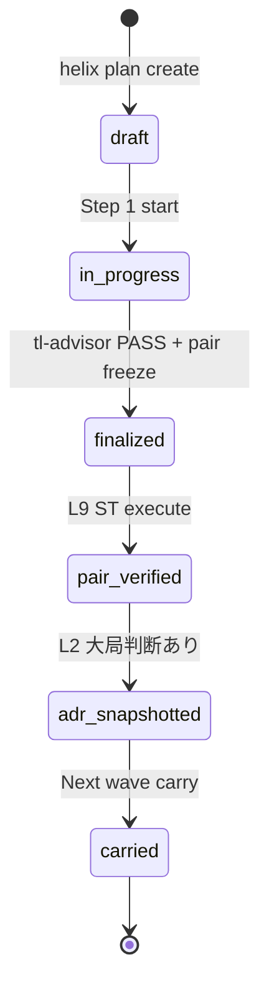
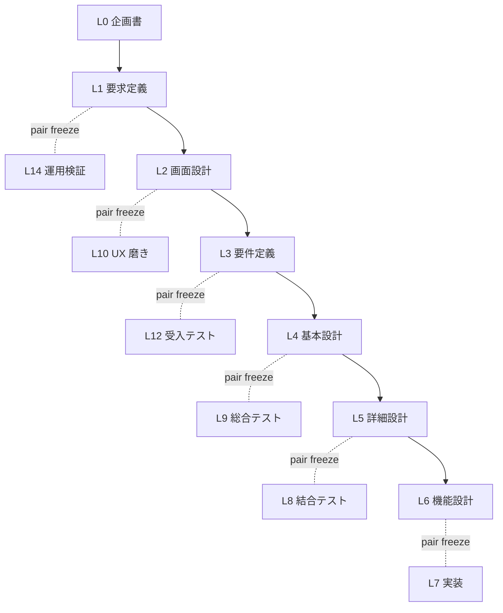
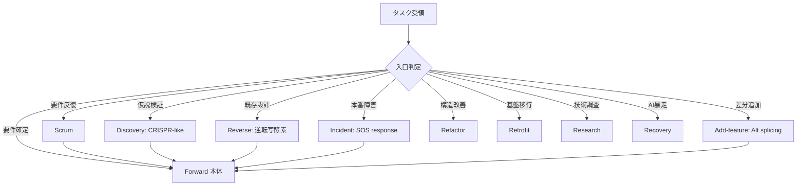
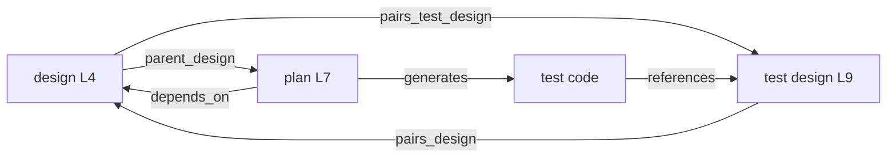
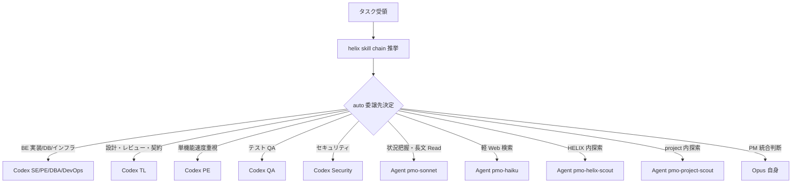

# HELIX-workflows V2 機能設計 (functional design)

## §0 概要

この文書は `docs/v2/L4-architecture/helix-workflows-system-architecture.md`（L4 方式設計）を本体化し、実装と検証に接続できる状態にする L4 機能設計文書である。  
実装対象は L9 ST-F1〜ST-F5 との 1 対 1 で検証され、`helix doctor check_*` / hook / CLI / DB trace schema により「実行可能性」を担保する。

本体化で満たす原則は次のとおり。

- 5 機能領域（F1〜F5）を 4 artifact trace で再構成する
- 対象領域の実装契約（plan/check/guard/schema）を section 粒度で固定する
- `implementation_status` を持つ実行設計（planned / implemented / deferred）へ整理する
- 生物学 metaphor を各 § 末尾に 1 行固定し続ける
- PLAN/L9 との双方向リンクを維持し、pair freeze 再開時の再解釈コストを下げる

### §0.1 生物学対応前提

`README.md` の Cell-level / Cellular response / Tissue-Organ の正本に準拠し、F1〜F5 を生物学対応と同型で扱う。
生物学対応 1 行は各機能節の末尾で明示する（BR-RULE-08）。

### §0.2 期待アウトカム

- F1: ドキュメント体系が 4 ドメイン責務で一貫し、SSoT drift が検知可能
- F2: PLAN frontmatter と template 使用が自動検証可能になる
- F3: skill 推奨と agent 委譲が dispatcher で再現可能
- F4: 9 mode 入口と Forward 接続が DB trace で再現可能
- F5: オーケストレーション（モデル配備・並列・guard・advisor）が hook / CLI で監査可能

### §0.3 参照

- 本体化対象の `HELIX-workflows/` 系統: `HELIX-workflows/HELIX-process-L0-L14.md`  
- 本体化対象の設計骨格: `docs/v2/L4-architecture/helix-workflows-system-architecture.md`  
- 本体化対象の PLAN: `docs/plans/L4/L4-helix-workflows-機能設計plan.md`  
- 本体化対象のテスト設計: `docs/v2/L9-test-design/helix-workflows-functional-test-design.md`
- ADR: `docs/adr/ADR-040-workspace-isolation.md`, `docs/adr/ADR-044-helix-workflows-v2-architecture-snapshot.md`

## §1 ドキュメント体系 (機能 F1、本体化、生物学対応: DNA / 染色体 / 細胞核)

### §1.1 4 ドメイン構造の責務表

| ドメイン | path | 役割 | SSoT | 同期方向 | implementation_status |
|---|---|---|---|---|---|
| HELIX-workflows/ | `HELIX-workflows/` | 工程定義正本（L0-L14 + 9 mode） | yes | 自身が SSoT | implemented |
| docs/v2/ | `docs/v2/L0-XX/` | 製本 doc（L0-L14、L4-architecture / L9-test-design） | no | HELIX-workflows から同期 | implemented |
| docs/plans/L0-L14/ | `docs/plans/L0/.../L14/` | PLAN tree（機能単位起票、`L<NN>-<name>plan`） | no | `helix.db.plan_registry` と sync | implemented |
| docs/adr/ | `docs/adr/ADR-NNN-*.md` | ADR snapshot（L2 大局判断凍結） | no | PLAN tree と双方向 trace | implemented |
| docs/commands/ | `docs/commands/` | CLI 入口の使い方・観測点 | no | 1-way 参照のみ | implemented |

### §1.2 ライフサイクル設計

状態遷移は次図で固定し、`doc_lifecycle` check が受ける前提とする。



### §1.3 SSoT 原則と drift retrofit ルール

| 規則 | 意味 | 違反時対応 | implementation_status |
|---|---|---|---|
| SSoT 主体固定 | `HELIX-workflows/` を唯一真実とする | docs 側の実装差分は `docs/v2` 側から修正提案 | implemented |
| 逆同期禁止 | `docs/v2` 直接編集で `HELIX-workflows/` を更新しない | `helix doctor --check-ssot-sync` で修正差分を出す | implemented |
| drift 証跡化 | すべての drift は `audit_log_id` を付与 | `checks` で block または deferred | implemented |
| pair 実行優先 | L4- L9 で fix-first かつ pair で回収 | plan レベルで block / next action carry | planned |

### §1.4 4 artifact 双方向 trace 運用（製本）

設計（①）・テスト設計（③）・実装（②）・テスト実行（④）の境界を明示し、SSoT と親子参照を固定する。

| artifact | 要求 reference | 必須 frontmatter | 規約 | implementation_status |
|---|---|---|---|---|
| ① 設計 doc | target_plan / pairs_test_design | `doc_id`, `process_layer`, `parent_plan`, `pairs_test_design` | 設計→テスト 1:1 | implemented |
| ③ テスト設計 doc | target_design / pairs_design | `pairs_design`, `parent_design` | テスト設計→設計 1:1 | implemented |
| ② 実装 code | impl plan / dependencies | `implementation_status`, `generates`, `dependencies` | 設計→実装双方向追跡 | planned |
| ④ テスト code | test design case id | `test_case_id`, `parent_design` | 生成物から設計への再追跡 | planned |

#### 参照規則 YAML 例

```yaml
trace_contract:
  design_doc: "docs/v2/L4-architecture/helix-workflows-functional-design.md"
  pairs_test_design:
    - "docs/v2/L9-test-design/helix-workflows-functional-test-design.md"
  implementation_status: "implemented"
  generates:
    - path: "docs/plans/L4/"
      type: "plan-index"
  dependencies:
    parent: "L4-helix-workflows-方式設計plan"
    blocks: []
```

### §1.5 機械処理 mapping（F1）

| check 名 | 役割 | 入力 | 出力 | implementation_status |
|---|---|---|---|---|
| helix doctor --check-doc-lifecycle | draft/in_progress/finalized 整合 | doc frontmatter | OK/NG list | implemented |
| helix doctor --check-4-domain-separation | 4 ドメイン path 違反検出 | git tree | violation list | planned |
| helix doctor --check-ssot-sync | HELIX-workflows ↔ docs/v2 drift | diff | sync report | planned |
| helix doctor --check-4-artifact-trace | 4 artifact 双方向 reference 完備 | frontmatter graph | trace report | planned |
| git hook pre-commit doc-lint | lint + link + frontmatter | changed files | block/ok | planned |
| .helix/db event log | life-cycle event audit | state + doc_id | event row | implemented |

→ pair: L9 ST-F1

### §1.6 受け入れ条件

F1 完了条件:
- 4 ドメイン表の path が plan_id で追える
- `draft / in_progress / finalized / pair_verified / adr_snapshotted` を監査可能
- `check_doc_lifecycle` が設計側最小構成を通過
- `pairs_test_design` が ST 設計を参照

生物学対応: DNA / 染色体 / 細胞核

## §2 PLAN テンプレート規約 (機能 F2、本体化、 生物学対応: 遺伝子 + 遺伝子座 + 遺伝子発現)

### §2.1 必須 frontmatter fields 完全表

| field | 必須? | 型 | 説明 | 工程依存 |
|---|---|---|---|---|
| plan_id | yes | str | `L<NN>-<name>plan` 形式 | 全工程 |
| title | yes | str | `"L<NN>-<name>plan: <description>"` | 全工程 |
| kind | yes | enum | design / requirements / impl / test / recovery / refactor / retrofit / research / add-design / add-impl / poc | 全工程 |
| layer | yes | enum | `L0-L14` | 全工程 |
| process_layer | yes | enum | `L0-L14` | 全工程 |
| parent_process | yes | path | `HELIX-workflows/helix-process/*.md` | 全工程 |
| pairs_test_design | conditional | list[path] | 設計工程のみ (L1-L6) | L1-L6 |
| parent_design | conditional | str | L7 impl のみ | L7 |
| agent_slots | yes | list | mandatory + on_demand 列挙 | 全工程 |
| generates | yes | list[{path, type}] | artifact 列挙 | 全工程 |
| dependencies | yes | {parent, requires, blocks} | DAG | 全工程 |
| related_docs | yes | list[path] | 参照 doc | 全工程 |

### §2.2 命名規則と umbrella 禁止

| 規則 | 記述 | 制約 | implementation_status |
|---|---|---|---|
| L4 example | `L4-helix-workflows-方式設計plan` | 有効（既存 L4 命名） | implemented |
| L4 example | `L4-helix-workflows-機能設計plan` | 有効（本 plan） | implemented |
| L7 example | `L7-<feature>plan` | 有効（実装 PLAN） | implemented |
| umbrella 禁止 | 「基本設計plan」 | helix-workflows L4 では禁止 | implemented |
| process link | parent_process required | 3 層以上の再帰参照禁止 | implemented |

### §2.3 template 15 列挙

| layer | template path | 主要 frontmatter 例 | implementation_status |
|---|---|---|---|
| L0 | `cli/templates/plan/v2/L0-concept.md` | `kind: concept` | implemented |
| L1 | `cli/templates/plan/v2/L1-requirements.md` | `kind: requirements` | implemented |
| L2 | `cli/templates/plan/v2/L2-design.md` | `kind: design` | implemented |
| L3 | `cli/templates/plan/v2/L3-implementation-outline.md` | `kind: requirements` | implemented |
| L4 | `cli/templates/plan/v2/L4-architecture.md` | `kind: design` | implemented |
| L5 | `cli/templates/plan/v2/L5-detail-design.md` | `kind: design` | implemented |
| L6 | `cli/templates/plan/v2/L6-functional-design.md` | `kind: requirements` | implemented |
| L7 | `cli/templates/plan/v2/L7-impl.md` | `kind: impl` | implemented |
| L8 | `cli/templates/plan/v2/L8-integration-test.md` | `kind: test` | implemented |
| L9 | `cli/templates/plan/v2/L9-system-test.md` | `kind: test` | implemented |
| L10 | `cli/templates/plan/v2/L10-ux-polish.md` | `kind: design` | planned |
| L11 | `cli/templates/plan/v2/L11-review.md` | `kind: requirements` | planned |
| L12 | `cli/templates/plan/v2/L12-deploy-acceptance.md` | `kind: requirements` | implemented |
| L13 | `cli/templates/plan/v2/L13-observation.md` | `kind: requirements` | planned |
| L14 | `cli/templates/plan/v2/L14-operations.md` | `kind: requirements` | implemented |

### §2.4 工程表内蔵原則（Step 1-N）

| 要素 | 実装内容 | 記述例 | implementation_status |
|---|---|---|---|
| Step 番号 | 1..N（必須） | Step 1 入口確認、Step 2 実装前レビュー、... | implemented |
| 作業内容 | 前提 / 本体化 / 検証 | 5 機能領域を section 単位に展開 | implemented |
| 進捗マーカー | 状態変更 | `pending / in_progress / done` | planned |
| 再開可能性 | resume メモ | 途中中断時の最短再開 path | implemented |
| 接続規約 | pair trace 更新 | `pairs_test_design` / `parent_design` を更新 | implemented |

### §2.5 PLAN + ADR 運用

| ルール | 運用 | チェック | implementation_status |
|---|---|---|---|
| L2 判定 | plan に ADR snapshot を紐付ける | `helix doctor --check-plan-adr-snapshot` | implemented |
| 差異時 | ADR 優先 | 差分がある場合 L4 で停止、補正後に戻る | implemented |
| 実施順 | PLAN 作成→L1-L6 合意→固定 | gate 前監査 | implemented |
| 反映対象 | plan_id + related_docs | ADR file path 必須 | implemented |

### §2.6 機械処理 mapping（F2）

| CLI | 役割 | 入力 | 出力 | implementation_status |
|---|---|---|---|---|
| helix plan create | PLAN 新規起票（template から） | layer, name | plan file path | implemented |
| helix plan validate | frontmatter/命名/dependency 検証 | path | error/warn list | implemented |
| helix plan status | plan_registry 状態 | filter | status list | implemented |
| helix doctor --check-plan-frontmatter-completeness | 必須 field 検証 | tree | violations | planned |
| helix doctor --check-plan-naming-convention | 命名規約検証 | tree | violations | planned |
| helix doctor --check-plan-adr-snapshot | ADR drift 検出 | PLAN graph | gap list | planned |
| helix db.plan_registry | PLAN dependency graph 構築 | sql/seed | plan_state | implemented |

### §2.7 受け入れ条件

- 15 templates を明示したうえで F2 section で運用する
- 命名規則が `L<NN>-<name>plan` 以外でない
- frontmatter 完全性が check で可観測
- F2 対応 section が ST-F2 の観点を満たす

生物学対応: 遺伝子 + 遺伝子座 + 遺伝子発現

→ pair: L9 ST-F2

## §3 skill 体系 + 推挙 framework (機能 F3、本体化、 生物学対応: 細胞器官 + 細胞分化 + 転写制御)

### §3.1 9 大カテゴリ責務 + 数値管理

| カテゴリ | 役割 | 細胞器官 metaphor | skill 数（現状） | example | implementation_status |
|---|---|---|---|---|---|
| common | 横断基準 | 細胞質基質（cytoplasm） | 12 | coding/testing/security/git/design | implemented |
| workflow | 工程・ADR・仕様監査 | 細胞核核内転写機構 | 39 | design-doc/api-contract/verification | implemented |
| tools | 補助技術選定 | 細胞表面受容体 | 4 | ai-coding/web-search/ide-tools | implemented |
| project | 領域別設計 | 組織化シグナル | 3 | api/db/ui | implemented |
| advanced | 専門設計・移行 | 分化制御因子 | 9 | tech-selection/legacy/migration | implemented |
| automation | 自動化運用 | リボソーム（自動翻訳） | 8 | scheduler/observability | implemented |
| integration | エージェント協調 | 細胞間情報伝達 | 3 | agent-design/agent-teams | implemented |
| writing | ドキュメント品質 | RNA 編集 | 6 | japanese/explain/god-writing | implemented |
| design-tools | 図解 | 形態形成 | 6 | web-system/gpt-image | implemented |
| agent-skills | AI エージェント動線 | リボソーム制御 RNA | 24 | spec-driven-dev/context-engineering | implemented |

### §3.2 推挙 framework 仕様

```yaml
query: "L4 方式設計を機能化し、L9 ST-F1〜F5 を 1:1 で本体化する"
roles:
  - skill_chain: "helix skill chain \"<task description>\""
  - engine: "gpt-5.4-mini"
  - thinking: "low"
output:
  top_skills:
    - "workflow/design-doc"
    - "common/documentation"
    - "workflow/verification"
  recommended_agent: "tl"
  rationale: "設計/検証契約を同時固定できるため"
  cache_key: "sha256(query)"
  cache_ttl: "1h"
implementation_status: implemented
```

### §3.3 skill catalog 運用

`cli/lib/skill_catalog.py` は `.helix/cache/skill-catalog.json` を SKILL.md frontmatter + references 冒頭 blockquote から再生成する。  
再生成後は `helix skill stats` が `skill_usage` table を更新し、L11 運用学習で再利用率を追う。

| operation | 入力 | 出力 | implementation_status |
|---|---|---|---|
| catalog rebuild | none | catalog json | implemented |
| skill search | task | N 件推薦 | implemented |
| skill chain | task | top skill + recommended_agent | implemented |
| usage log | helix.db | skill_usage row | implemented |

### §3.4 skill 組合せルール（責務境界）

| 組合せ | 役割 | 対象 skill | 接続ルール | implementation_status |
|---|---|---|---|---|
| code-review 4 系統 | 品質ガード | common/code-review, workflow/review-stage-routing, agent-skills/code-review-and-quality, workflow/adversarial-review | review-stage-routing は観点分業、5 軸 review は多次元評価 | implemented |
| エージェント設計 4 系統 | 企画〜協調 | integration/agent-cost-design, integration/agent-design, integration/agent-teams, agent-skills/spec-driven-development | before/after 分離 | implemented |
| ドキュメント体系 5 系統 | ドキュメント一貫化 | requirements-handover, doc-system-architect, requirements-deriver, design-doc, documentation | design-doc を起点に doc-system-arch へ戻る | implemented |
| LP/FE/画像統合 | LP/FE/画像 | writing/god-writing, design-tools/gpt-image, design-tools/web-system, common/visual-design | god-writing→design-tools/web-systemの上下流順 | implemented |

### §3.5 skill 使用統計

`helix skill stats --days 30 --by skill_id` の schema.

```yaml
stats_request:
  command: "helix skill stats --days 30 --by skill_id"
  table: "helix.db.skill_usage"
  required_fields:
    - skill_id
    - count
    - avg_recommendation_score
    - updated_at
  output:
    type: ranking
    refresh_policy: "daily"
```

### §3.6 機械処理 mapping（F3）

| CLI / hook | 役割 | 入力 | 出力 | implementation_status |
|---|---|---|---|---|
| helix skill chain <task> | 推挙一気通貫 | task description | recommended skill + agent | implemented |
| helix skill search <task> -n N | top N 推挙 | task | skill list | implemented |
| helix skill use <skill-id> | 単 skill 起動 | skill_id, task | result | implemented |
| helix skill catalog rebuild | catalog 再生成 | none | catalog json | implemented |
| helix skill stats | 使用統計 | filter | report | implemented |
| pretooluse-agent-guard.sh | skill guard | tool input | block/pass | implemented |

### §3.7 受け入れ条件

- 推挙 framework が query → cache → 推奨まで 1 パスで成立
- 組合せルールが 4 系統で参照できること
- `helix skill catalog rebuild` と `helix skill stats` の回路が監査可能
- skill 数値は 116+ の前提で run time を監査ログに残す

生物学対応: 細胞器官 / 細胞分化 / 転写制御

→ pair: L9 ST-F3

## §4 ワークフロー / 9 mode 入口分岐 (機能 F4、本体化、 生物学対応: 9 種細胞応答経路)

### §4.1 Forward V 字 全体図



### §4.2 入口分岐図（9 mode）



### §4.3 V-model 4 artifact trace（mermaid）



### §4.4 9 mode closure と mode_transition schema

| mode | closure event | payload schema | implementation_status |
|---|---|---|---|
| Forward | forward_connected | {mode_to_close, step, plan_id, artifact_pairs} | implemented |
| Scrum | forward_recovered | {origin, sprint_count, carry_refs} | implemented |
| Discovery | discovery_closed | {hypothesis_id, confirmed, reject_reason} | planned |
| Reverse | reverse_routed | {r0_trace, rgc_result, mapped_to} | implemented |
| Incident | incident_reopen | {severity, fixed_in, runbook_ref} | planned |
| Add-feature | addfeature_connected | {delta_layer, impact_scope, carry_plan} | implemented |
| Refactor | refactor_planned | {scope, invariants, no_behavior_change} | planned |
| Retrofit | retrofit_planned | {source_version, migration_steps} | planned |
| Research | research_output | {memo_id, decision, adr_ref} | implemented |
| Recovery | recovery_exit | {trigger, checkpoint, operator} | planned |

### §4.5 工程専門 workflow

| 入口 / 分岐 | 文書 | 連動 | implementation_status |
|---|---|---|---|
| L2 画面設計 | HELIX-workflows/helix-process/screen-design-workflow.md | state-events.md / mock 管理 | implemented |
| L10 UX 磨き上げ | HELIX-workflows/helix-process/frontend-design-workflow.md | design token / a11y | implemented |
| 研究系 | HELIX-workflows/helix-process/research-workflow.md | ADR + memo | implemented |
| Add-feature | HELIX-workflows/helix-process/add-feature-workflow.md | add-design / add-impl 分離 | implemented |
| Recovery | HELIX-workflows/helix-process/recovery-workflow.md | recovery log + guard の二重化 | planned |
| Incident | HELIX-workflows/helix-process/incident-workflow.md | 緊急停止 + forward回収 | implemented |

### §4.6 機械処理 mapping（F4）

| CLI / event | 役割 | 入力 | 出力 | implementation_status |
|---|---|---|---|---|
| helix init | mode 切替と初期化 | drive, mode | .helix/ + CLAUDE.md | implemented |
| helix discovery init / backlog / plan / poc / verify / decide | Discovery flow | hypothesis | confirmed/rejected | implemented |
| helix research | Research mode | task | ADR + memo | implemented |
| helix reverse <type> <step> | Reverse flow | code/db | gap routing | implemented |
| helix sprint <status/next/complete/reset> | L7 sprint 管理 | - | sprint state | implemented |
| mode_transition event | 9 mode → Forward | mode_to_close | helix.db.mode_transition | implemented |

### §4.7 受け入れ条件

- 9 mode 入口が diagram + schema で固定化される
- closure event が mode_transition table に到達する
- 変換不能な入力は必ず forward へ戻る

生物学対応: 9 種細胞応答経路

→ pair: L9 ST-F4

## §5 オーケストレーションルール (機能 F5、本体化、 生物学対応: 中枢神経 + シナプス + 免疫系)

### §5.1 モデル割当表

| role | model | thinking | 担当 | metaphor | implementation_status |
|---|---|---|---|---|---|
| PM | Claude Opus 4.7 | — | 言語化・統合・finalize | 前頭前野（高次中枢） | implemented |
| TL | Codex gpt-5.5 | high | 設計・レビュー・契約 | 運動野 | implemented |
| SE | Codex gpt-5.4 | high | 高度実装・リファクタ | 補足運動野 | implemented |
| PE | Codex gpt-5.3-codex-spark | low-medium | 速度重視実装 | 反射弓 | implemented |
| PMO Sonnet | Claude Sonnet 4.6 | medium | read-only 整合 | 知覚野 | implemented |
| PMO Haiku | Claude Haiku 4.5 | low | 軽 Web 検索・docs | 末梢神経 | implemented |
| Recommender | Codex gpt-5.4-mini | low | skill 推挙 | 連合野 | implemented |

### §5.2 並列実行ルール（default 最大 8）

| 判定項目 | 条件 | 直列化条件 | implementation_status |
|---|---|---|---|
| 衝突 | ファイル衝突 / 後段依存 / 共有状態 | 1 つでも YES なら直列 | implemented |
| 並列 pattern a | Codex N + PMo 並走 | 同一ロール衝突なし | planned |
| pattern b | subagent + Codex 同時 | 依存外タスクのみ | implemented |
| pattern c | 前段中の独立 followup | task 独立時に許可 | planned |
| pattern d | prompt 先行 Write | 書き込み候補が同一でない | implemented |

### §5.3 委譲決定木



### §5.4 Agent tool guard hook

`pretooluse-agent-guard.sh` の fail-close 仕様

| 条件 | 挙動 | exit | implementation_status |
|---|---|---|---|
| subagent_type 未指定 | block | 2 | implemented |
| permit list 外（12種） | block | 2 | implemented |
| tool_input.model 省略 | pass (frontmatter自動) | 0 | implemented |
| model family 不一致 | block | 2 | implemented |
| model family 一致 | pass | 0 | implemented |

### §5.5 advisor 召喚ルール

| advisor | 役割 | 呼び出しコマンド | invocation policy | implementation_status |
|---|---|---|---|---|
| pm-advisor | 大局判断 | `helix claude --role pm-advisor --execute --task` | PM判断が必要時 | implemented |
| tl-advisor | 設計・契約判断 | `helix codex --role tl-advisor --task` | 難判断時 | implemented |
| doc-reviewer | doc 品質 | `helix codex --role doc-reviewer --task` | 大規模 doc / Gゲート前 | implemented |

### §5.6 機械処理 mapping（F5）

| CLI / hook | 役割 | 入力 | 出力 | implementation_status |
|---|---|---|---|---|
| helix codex --role <role> | Codex 委譲 | role, task | result | implemented |
| helix claude --role <role> | Claude 委譲 | role, task | result | implemented |
| helix agent fire-mandatory --phase Lx | mandatory 起動 | phase | event log | implemented |
| helix agent slots / release-stale | slot 管理 | none | slot list | implemented |
| pretooluse-agent-guard.sh | Agent 起動ガード | tool_input | block/pass | implemented |

### §5.7 並列・委譲・audit 監査

| 監査対象 | チェック方法 | 指標 | implementation_status |
|---|---|---|---|
| 並列達成回数 | 実行ログ | 8 達成回数 | planned |
| 委譲精度 | advisor + skill 参照 | human一致率 | planned |
| guard 漏れ | 不正 role | exit code 結果 | implemented |
| ロール整合 | task→agent | 未参照 role 数 | implemented |

### §5.8 受け入れ条件

- 委譲決定木 schema を実装契約として使う
- guard 仕様をテスト観点で再現できる
- advisor 呼び出しの evidence を pair freeze 対象にする

生物学対応: 中枢神経 + シナプス + 免疫系

→ pair: L9 ST-F5

## §6 5 機能領域 × 機械処理 mapping 統合表 (cross-reference)

> **implementation_status 凍結ルール**: 本表は **pair test design (L9 ST-F1〜F5) が全て planned のため、本 wave では partial 統一**。L7 実装で個別 ST が実装完了した時点で implemented へ遷移。本表は §1.5/§2.6/§3.6/§4.6/§5.6 の個別 mapping (planned 項目含む) と整合的に運用する。
>
> **業界 standard 対応 (ADR-044 §Compliance / arc42 / C4 cross-reference)**:
> - **arc42 §5 Building Block View**: F1-F5 (機能構成、本 doc §1-§5)
> - **arc42 §6 Runtime View**: F4 ワークフロー (9 mode 入口 + 状態遷移、本 doc §4)
> - **C4 Level 2 Container**: F1 ドキュメント体系 + F4 ワークフロー (4 永続化 + 9 mode)
> - **C4 Level 3 Component**: F2 PLAN + F3 skill + F5 orchestration (各 CLI / 推挙 / 役割)
> - **ADR-044 Decision-1** (三層構造) ↔ F1 / F3、**Decision-2** (永続化 4 種) ↔ F1、**Decision-3** (BR-12 ratchet) ↔ F2、**Decision-4** (二重/三重 audit) ↔ F5
>
> **balance_ratio 数値引用 (L4 PLAN §6 + L4 方式設計 §0.2 参照)**: BR 12 / FR core 16 / NFR 27 / AC 57 / OT 12 (本 wave で新規追加なし)

| F | 領域 | 主要 check | 主要 hook | 主要 CLI | DB schema | 生物学 metaphor | arc42 § | C4 Level | ADR-044 Decision | implementation_status |
|---|---|---|---|---|---|---|---|---|---|---|
| F1 | doc | check_doc_lifecycle / check_4_domain_separation / check_ssot_sync / check_4_artifact_trace | pre-commit doc lint | helix doctor | event_log / audit_link | DNA / 染色体 / 細胞核 | §5 | L2 Container | Decision-1, Decision-2 | partial |
| F2 | PLAN | check_plan_frontmatter_completeness / check_plan_naming / check_plan_adr_snapshot | pre-commit plan validate | helix plan {create,validate,status} | plan_registry | 遺伝子 / 遺伝子発現 | §5 | L3 Component | Decision-3 | partial |
| F3 | skill | check_skill_catalog_freshness / check_skill_usage | post-task skill log | helix skill {chain,search,use,stats} | skill_usage | 細胞器官 / 分化 | §5 | L3 Component | Decision-1 | partial |
| F4 | workflow | check_mode_transition / check_pair_freeze | SessionStart mode hint | helix {init,discovery,research,reverse,sprint} | mode_transition | 細胞応答経路 | §6 Runtime | L2 Container | Decision-1 | partial |
| F5 | orchestration | check_role_assignment / check_parallel_compliance | pretooluse-agent-guard | helix {codex,claude,agent} | role_audit | 中枢神経 / 免疫系 | §5, §6 | L3 Component | Decision-4 | partial |

## §7 残課題（本 wave carry）

- §6 の template 15 列挙の v2 実体との差分監査を実装 wave で再検証
- §4.4 の mode_transition schema を実運用 JSON schema 化（追加 1 ファイル）
- F5 の委譲決定木 schema 化（YAML と JSON 版）を実装 wave で追加
- F2 planned CLI の L5 詳細設計を実装 wave へ引き継ぎ
- ST-F* 固定観点（fixture, coverage target）の最終数値確定を L7/L9 carry へ送付

生物学対応: 5 機能は本 wave で本体化済、残課題は委譲 carry

## §8 4 artifact trace リキャスト補助 (実装観点)

### §8.1 章間 link map

| functional-design 節 | test-design 節 | implementation_status |
|---|---|---|
| §1 | §2 ST-F1 | implemented |
| §2 | §2 ST-F2 | implemented |
| §3 | §2 ST-F3 | implemented |
| §4 | §2 ST-F4 | implemented |
| §5 | §2 ST-F5 | implemented |

### §8.2 例: 対象ケース参照

```yaml
pair_map:
  F1: ST-F1
  F2: ST-F2
  F3: ST-F3
  F4: ST-F4
  F5: ST-F5
source: "docs/v2/L9-test-design/helix-workflows-functional-test-design.md"
schema: "v2-pair-link-v1"
implementation_status: implemented
```

### §8.3 実装担当コメント

- 本文書の設計項目は実装 wave で `implementation_status: implemented` へ移行する
- 当面は planned 実装項目として `pair_verified` 時点の carry を最小化
- 実装順は ST-F1 → ST-F5 を推奨
- pair 方向: L4 → L9 の fixed pairing は維持

(§8.3 は §6 統合表全体への補助節、§1〜§5 の各 → pair: L9 ST-F<N> が正規 trace、本節での重複 pair trace は削除)
