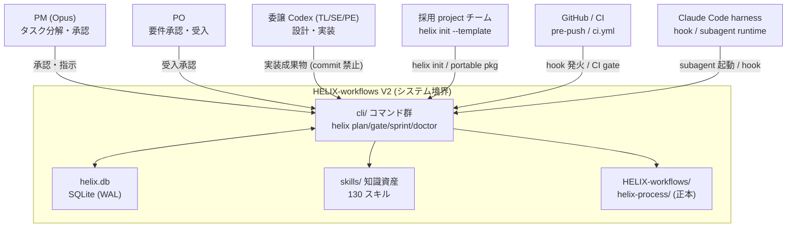

# HELIX-workflows V2 システムコンテキスト & ステークホルダー分析 (arc42 §1-3 / ISO42010 §5.2)

> (recovery-2026-05-30 独立化: system-architecture §11+§12 から正本移設)

## §0 概要

本文書は HELIX-workflows V2 のシステムコンテキストとステークホルダー分析を定義する独立設計書です。

### §0.1 適用標準

| 標準 | 適用箇所 |
|---|---|
| **arc42 §1** | Introduction and Goals — システム要件・品質ゴール・主要 stakeholder の概要 |
| **arc42 §2** | Constraints — 設計・実装を制約する条件 |
| **arc42 §3** | Context and Scope — 外部境界・相互インターフェース (§2 コンテキスト図、§3 境界定義) |
| **ISO/IEC 42010:2022 §5.2** | Stakeholders and their Concerns (§4 マトリクス) |
| **C4 model Level 1** | System Context Diagram (§2 mermaid 図) |

### §0.2 system-architecture.md との関係

本文書は `docs/v2/L4-architecture/helix-workflows-system-architecture.md` の §11/§12 を正本として独立化したものです。system-architecture.md の §11/§12 はポインタ節に置き換えられており、本文書が SSoT です。

---

## §1 外部アクター一覧

HELIX-workflows V2 と相互作用する外部アクターを以下に示す。

| アクター | 種別 | インターフェース | 役割 |
|---|---|---|---|
| **PM (Opus)** | 人間 + AI | Claude Code チャット、`helix plan/gate` CLI | タスク分解・承認・最終判断。コード編集禁止 |
| **委譲 Codex (TL/SE/PE)** | AI | `helix codex --role <role>` CLI | 設計・実装・テスト。commit 禁止 |
| **PO (プロダクトオーナー)** | 人間 | チャット、受入ゲート | 要件承認・受入判断 |
| **採用 project チーム** | 人間 + AI | `helix init --template`、portable package | HELIX-workflows を自プロジェクトに導入して利用 |
| **GitHub / CI** | 外部システム | `git push`、`.github/workflows/ci.yml` | pre-push / CI helix job による lint・gate 自動実行 |
| **Claude Code harness** | AI ランタイム | Claude Code API、hook PreToolUse/PostToolUse | subagent 起動・hook 発火・session 管理 |
| **helix.db (SQLite)** | 内部永続化 | `cli/lib/helix_db.py` | event_log / plan_registry / mode_transition |

---

## §2 C4 Level 1 コンテキスト図 (mermaid)

---

## §3 システム境界 (内/外)

| 境界内 (HELIX が管理する) | 境界外 (HELIX が依存するが管理しない) |
|---|---|
| `cli/` コマンド群、`cli/lib/` Python helper | Claude Code API / Codex API (外部 LLM サービス) |
| `helix.db` SQLite 永続化 | GitHub Actions ランタイム |
| `skills/` 知識資産 130 スキル | ユーザーの採用 project コードベース |
| `HELIX-workflows/` 工程 doc 45 file | OS / WSL2 環境 |
| `.claude/hooks/` / `.claude/agents/` | `~/.codex/` Codex CLI 設定 |

---

## §4 Stakeholder × Concern マトリクス (ISO 42010:2022 §5.2)

本節は ISO/IEC 42010:2022 §5.2 に準拠し、Stakeholder と Concern の 2 軸マトリクスを定義する。行=Stakeholder、列=Concern とし、各セルに「その stakeholder がその concern で何を気にするか」を記載する。

### §4.1 マトリクス

| Stakeholder / Concern | 機能適合性 | 性能効率性 | セキュリティ | 保守性 | 相互作用能力 | コスト / Safety |
|---|---|---|---|---|---|---|
| **PM (Opus)** | 9 mode × 15 工程が要件を漏れなくカバーするか | helix コマンドの応答遅延がワークフロー阻害しないか | AI 暴走・想定外変更がゲートで阻止されるか | ADR / PLAN の変更追跡が容易か | チャット + CLI で意図が正確に伝わるか | Opus / Codex 予算が週間上限内に収まるか (Safety: Recovery mode 発火しないか) |
| **TL (Codex gpt-5.5)** | 設計判断が V-model 対応表に正しく格納されるか | helix doctor / lint の速度が開発ループを遅延させないか | TB-1/TB-2 guard が設計外操作を確実に阻止するか | L5/L6 設計 doc の drift が doctor で自動検出されるか | `helix codex --role tl` が正確なスキル・コンテキストを注入するか | tl-advisor 呼び出しコストが適正か |
| **SE (Codex gpt-5.4)** | 実装 sprint の entry/exit 条件が明確か | CI helix job の実行時間 (20-120s) が acceptable か | commit 禁止ルールと hard guard が確実に機能するか | L6 → L7 の 4 artifact trace が自動 lint されるか | `helix sprint` / `helix handover` が継続実装を支援するか | SE sprint の工数見積もり精度 |
| **PO (プロダクトオーナー)** | L3 要件の FR が採用 project の実際の機能として確認できるか | 受入テスト (L12) の実行時間が許容範囲か | 個人情報・機密がドキュメントに混入しないか (TB-5) | 受入条件が変更された時に design doc に反映されるか | helix gate コマンドが PO 非技術者に分かりやすい結果を返すか | ライセンス / コンプライアンスリスク |
| **採用 project オーナー** | portable package が自プロジェクト tech stack に対応するか | `helix init --template` の初期化が数分以内に完了するか | HELIX framework 自体に backdoor / secret 混入がないか | framework バージョンアップ時に既存 PLAN が壊れないか | 既存 Git / CI 環境に helix が追加設定なしで組み込めるか | framework 採用の初期コストと学習コスト |
| **監査担当 (auditor)** | 全 gate の pass/fail が helix.db に trace 可能か | audit YAML 生成・検索の応答時間 | bypass 証跡が evidence として保存されているか (Non-repudiation) | helix doctor の check 項目が業界標準 (arc42 / 25010) に対応しているか | audit report が非技術者に提示可能な形式か | 監査工数・証跡保持コスト (retention 90 日) |
