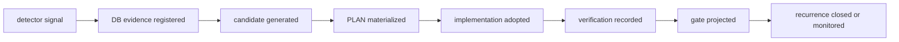

# DB-backed evidence lifecycle 基本設計

## 1. 目的

本書は、DDD / TDD / V-model gate の自動検出結果を HELIX DB の証跡として扱い、検出、候補化、PLAN 化、実装採用、検証記録、gate 投影、再発閉塞まで一貫して追跡する L4 基本設計である。

この設計は後続 feature ではない。L6 までの設計整備が合格に達しているかを定量チェックと定性チェックで判断するための現在フェーズの設計補正である。

## 2. 境界

| 区分 | 本書で固定すること | 本書で固定しないこと |
|---|---|---|
| L4 基本設計 | evidence lifecycle の業務境界、外部的な状態、主要データ領域、gate への投影方針 | 物理列、SQL、migration |
| L5 詳細設計 | 状態遷移、既存テーブルへの写像、冪等 key、失敗時の扱い | 新規 schema |
| L6 機能設計 | 関数 / surface 単位の仕様、入出力、判定 | 実装コード |
| L7 単体テスト設計 | 本タスクでは作成しない。必要分は add-feature として起票する | G8/G9/G12/G14 の実走 gate 実装 |

## 3. 外部的なライフサイクル

| 状態 | 意味 | 完了扱い |
|---|---|---|
| `detected` | detector / doctor / hook / harness が signal を見つけた | 不可 |
| `registered` | signal が HELIX DB の evidence として保存された | 不可 |
| `candidate_generated` | route / learning / PLAN / PR candidate が生成された | 不可 |
| `plan_materialized` | owner、allowed_files、acceptance、rollback を持つ PLAN または task ができた | 不可 |
| `implementation_adopted` | 承認済み範囲で実装または文書補正が入った | 不可 |
| `verification_recorded` | test / doctor / gate / CI equivalent の実行証跡が保存された | 条件付き不可 |
| `gate_projected` | gate 表示が元 signal の解消または監視状態を示す | 条件付き不可 |
| `recurrence_closed` | 同一 signal の再発検出が closed または monitored_with_owner になった | closure 候補 |

## 4. DB 領域への写像

既存の `helix.db` 領域へ写像する。schema migration は行わない。

| Lifecycle 領域 | 既存 DB / registry | 用途 |
|---|---|---|
| signal source | `hook_events`, `harness_check_events`, `verify_runs`, doctor JSON | 検出元の raw evidence |
| normalized evidence | `events`, `metrics`, `feedback`, `audit_log` | signal の分類、集約、発生時刻、payload |
| plan adoption | `plan_registry`, `plan_references`, `plan_generates`, handover log | 候補を Forward の PLAN / task へ戻す |
| implementation evidence | `entries`, `links`, `code_index`, `test_design_entries` | docs / code / test_design / test の trace |
| verification evidence | `gate_runs`, `verify_runs`, `automation_runs`, CI/equivalent artifact | 検証実行と gate 判定 |
| recurrence tracking | `feedback`, `metrics`, `harness_check_events` | 再発状態と owner |

## 5. Gate 投影方針

`VG-overview` と `requirement_drift` は L6 focus の整備状況を定量判定する。右腕の G8/G9/G12/G14 は実テスト実行と閉塞を確認するための後半 gate であり、現在の L6 focus clean を full-flow completion とは扱わない。

| 判定 | 使う証跡 | 扱い |
|---|---|---|
| L6 設計整備合格 | `requirement_drift clean`, `trace_symmetry clean`, L4/L5/L6 evidence lifecycle docs, L7 add-feature ticket | current-scope pass |
| full-flow 完了 | strict full-flow `overall_clean=true`, deferred 0, CI/equivalent connected, recurrence closed | まだ未完 |
| candidate 生成 | feedback-loop route / learning / PLAN / PR candidates | 改善候補であり closure ではない |
| waiver | reason / owner / expires / applicability | not_applicable または monitored として扱い、pass とは分ける |

## 6. 安全境界

- `schema_migration=false`
- `destructive_data_operation=false`
- `auto_apply=false`
- `auth_or_pii_change=false`
- `external_api_or_infrastructure_change=false`
- `production_db_operation=false`
- candidate を自動で PLAN / PR / gate pass へ昇格しない。
- L6 focus clean を full-flow completion として扱わない。

## 7. L5 / L6 / L7 への引き継ぎ

| 下位層 | 引き継ぐ内容 |
|---|---|
| L5 詳細設計 | state machine、既存テーブル写像、冪等 key、失敗時 rollback |
| L6 機能設計 | DBEV-FN-* 関数 / surface 単位の入出力と判定 |
| L7 add-feature | `docs/plans/add-feature/add-feature-2026-06-10-db-backed-evidence-lifecycle-l7.md` で単体テスト設計と実装接続を別起票 |
