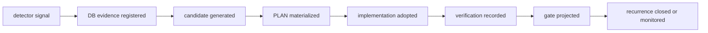

# DB-backed evidence lifecycle 基本設計

## 1. 目的

本書は、DDD / TDD / V-model gate の自動検出結果を HELIX DB の証跡として扱い、検出、候補化、PLAN 化、実装採用、検証記録、gate 投影、再発閉塞まで一貫して追跡する L4 基本設計である。

この設計は後続 feature ではない。L6 までの設計整備が合格に達しているかを定量チェックと定性チェックで判断するための現在フェーズの設計補正である。

## 2. 境界

| 区分 | 本書で固定すること | 本書で固定しないこと |
|---|---|---|
| L4 基本設計 | evidence lifecycle の業務境界、外部的な状態、主要データ領域、gate への投影方針 | 物理列、SQL、migration |
| L5 詳細設計 | 状態遷移、既存テーブルへの写像、冪等 key、失敗時の扱い | 新規 schema |
| L6 機能設計 | 関数 / surface 単位の仕様、入出力、判定 | 実装コード |
| L7 単体テスト設計 | 本タスクでは作成しない。必要分は add-feature として起票する | G8/G9/G12/G14 の実走 gate 実装 |

## 3. 外部的なライフサイクル

| 状態 | 意味 | 完了扱い |
|---|---|---|
| `detected` | detector / doctor / hook / harness が signal を見つけた | 不可 |
| `registered` | signal が HELIX DB の evidence として保存された | 不可 |
| `candidate_generated` | route / learning / PLAN / PR candidate が生成された | 不可 |
| `plan_materialized` | owner、allowed_files、acceptance、rollback を持つ PLAN または task ができた | 不可 |
| `implementation_adopted` | 承認済み範囲で実装または文書補正が入った | 不可 |
| `verification_recorded` | test / doctor / gate / CI equivalent の実行証跡が保存された | 条件付き不可 |
| `gate_projected` | gate 表示が元 signal の解消または監視状態を示す | 条件付き不可 |
| `recurrence_closed` | 同一 signal の再発検出が closed または monitored_with_owner になった | closure 候補 |

## 4. DB 領域への写像

既存の `helix.db` 領域へ写像する。schema migration は行わない。

| Lifecycle 領域 | 既存 DB / registry | 用途 |
|---|---|---|
| signal source | `hook_events`, `harness_check_events`, `verify_runs`, doctor JSON | 検出元の raw evidence |
| normalized evidence | `events`, `metrics`, `feedback`, `audit_log` | signal の分類、集約、発生時刻、payload |
| plan adoption | `plan_registry`, `plan_references`, `plan_generates`, handover log | 候補を Forward の PLAN / task へ戻す |
| implementation evidence | `entries`, `links`, `code_index`, `test_design_entries` | docs / code / test_design / test の trace |
| verification evidence | `gate_runs`, `verify_runs`, `automation_runs`, CI/equivalent artifact | 検証実行と gate 判定 |
| recurrence tracking | `feedback`, `metrics`, `harness_check_events` | 再発状態と owner |

## 5. Gate 投影方針

`VG-overview` と `requirement_drift` は L6 focus の整備状況を定量判定する。右腕の G8/G9/G12/G14 は実テスト実行と閉塞を確認するための後半 gate であり、現在の L6 focus clean を full-flow completion とは扱わない。

| 判定 | 使う証跡 | 扱い |
|---|---|---|
| L6 設計整備合格 | `requirement_drift clean`, `trace_symmetry clean`, L4/L5/L6 evidence lifecycle docs, L7 add-feature ticket | current-scope pass |
| full-flow 完了 | strict full-flow `overall_clean=true`, deferred 0, CI/equivalent connected, recurrence closed | まだ未完 |
| candidate 生成 | feedback-loop route / learning / PLAN / PR candidates | 改善候補であり closure ではない |
| waiver | reason / owner / expires / applicability | not_applicable または monitored として扱い、pass とは分ける |

## 6. 安全境界

- `schema_migration=false`
- `destructive_data_operation=false`
- `auto_apply=false`
- `auth_or_pii_change=false`
- `external_api_or_infrastructure_change=false`
- `production_db_operation=false`
- candidate を自動で PLAN / PR / gate pass へ昇格しない。
- L6 focus clean を full-flow completion として扱わない。

## 7. 実行証跡コントラクト（F2 design-review 補正 — gate 時 green theater の封じ）

> 本節は [no-leak foundation design-review](../../research/2026-06-21-no-leak-foundation-design-review.md) の **F2（gate 時 実行証跡）** を設計確定する。§3 の `verification_recorded` 状態 / §4 の `verification evidence`（gate_runs / verify_runs / automation_runs）が **genuine** である条件を固定し、`HELIX_DOCTOR_SKIP_EXEC_TESTS=1` による gate/push/CI skip が exec_pass を詐称する穴（g7_subcheck の skip-time exec_pass 計上、design-review B-1/D-2）を**設計レベルで塞ぐ**。物理 schema は §4 の既存テーブルへ写像し migration しない（CLAUDE.md「推測 schema 回避」）。

### F2-1 実行証跡 artifact のコントラクト（`verification_recorded` を genuine にする最小集合）

`detected → … → verification_recorded` の遷移には、対象 pair の検証実行が次を**すべて**伴う：

| field | 意味 | genuine 条件 |
|---|---|---|
| `run_id` | 実行の一意 ID（`automation_runs` と紐付け） | 実在し automation_runs に対応 |
| `commit_sha` | 実行時の HEAD commit | 検証対象 commit と一致 |
| `target_pair` | 対象 L-pair / UT-ID | 変更 pair を被覆 |
| `exit_code` | 実行プロセス終了コード | 0（green） |
| `tests_green_at` | green 観測時刻 | gate 判定時刻との順序整合（F3 review-evidence と同型の時刻 invariant） |
| `artifact_sha256` | 実行出力（ログ / JUnit 等）の content hash | 出力実体と一致（改ざん検知） |

skip / 未実行は `verification_recorded` へ**遷移できない**（F2-3 で status を分離）。

### F2-2 gate verification の置換（skip → evidence-check、CI 速度と実行保証の両立）

- 現状: push gate / CI は `HELIX_DOCTOR_SKIP_EXEC_TESTS=1` で実テストを skip し、skip 時に exec_pass を計上する（green theater）。
- 設計: gate は「skip を信頼する」のでなく「**変更 pair について F2-1 artifact の存在と genuine 性を確認する**」。
  - 速い経路（CI 並列 / 別 job）が artifact を生成 → gate はその artifact を**参照して**判定する（gate 内で再実行しない＝速度維持、実行は保証）。
  - 変更 pair に対応する genuine artifact が無ければ **fail-close**（skip を pass にしない）。
  - これにより design-review §3 F2 要件「CI 速度と実行保証の両立」を満たす。

### F2-3 skip ≠ pass の status 分離（exec_pass-on-skip の封じ）

- 穴: 実行 skip 時に `exec_pass` を計上する（g7_subcheck の skip-time 計上、design-review F2 の核）。
- 設計: 実行結果 status を **`exec_pass` / `exec_fail` / `exec_skipped` / `exec_missing_evidence`** に分離。`exec_skipped` と `exec_missing_evidence` は **pass に算入しない**。pair_closure の `test_execution_pass` は **genuine artifact（F2-1）に裏付けられた `exec_pass` のみ**で成立する。

### F2-4 安全境界（追加）

- 既存テーブル（§4: `gate_runs` / `verify_runs` / `automation_runs`）へ写像し schema migration しない。physical schema は実行証跡の永続化要求が detector で観測されてから確定。
- gate は artifact を **read-only 参照**で判定し、実行を再現しない（`auto_apply=false` 維持）。

### F3-1 定性レビュー証跡コントラクト（F3 — review_evidence、本 lifecycle へ相乗り）

実行証跡（F2）と同じ lifecycle に、定性レビュー健全性（F3）の証跡を相乗りさせる（独立 doc を作らない＝G-P drift / count-pin cascade 回避、TL ruling 2026-06-21）。これにより [no-leak foundation design-review](../../research/2026-06-21-no-leak-foundation-design-review.md) の **F3（tl_review=="approve" の文字列一致のみで gate を通す穴、push_gate.py:825-839 / trace_symmetry.py:749-750）** を設計レベルで塞ぐ。実体 detector は実装済（`cli/lib/review_evidence_checks.py` + 7 UT、commit 6a1bce3）。

`review_evidence` artifact の genuine 最小集合（schema = design-review §6.3）：

| field | 意味 | genuine 条件 |
|---|---|---|
| `review_id` / `review_kind` | レビューの一意 ID と種別 | 実在 |
| `reviewer_model` / `worker_model` | レビュアと被レビュア（実装者）のモデル | `reviewer_model != worker_model`（自己レビュー禁止） |
| `reviewed_commit` | レビュー対象 commit | verdict が指す commit と一致（古いレビュー流用禁止） |
| `review_output_path` / `review_output_sha256` | レビュー出力実体と content hash | 実体と一致（改ざん検知） |
| `tests_green_at` / `reviewed_at` | green 観測時刻 / レビュー時刻 | `tests_green_at <= reviewed_at`（green 前レビューを genuine にしない） |
| `verdict` | approve / changes_required 等 | 上記 AND 成立時のみ genuine |

`review_genuine=false`（いずれか不成立 / field 不在）は pair_closure の `semantic_gate` 充足に**算入しない**（F2 の skip≠pass と同型の fail-close）。L5 詳細 = §6 と同じ既存テーブル写像、L6 関数粒度 DbC = [L6 §3.2](../L6-functional-design/db-backed-evidence-lifecycle-機能設計.md)。

## 8. L5 / L6 / L7 への引き継ぎ

| 下位層 | 引き継ぐ内容 |
|---|---|
| L5 詳細設計 | state machine、既存テーブル写像、冪等 key、失敗時 rollback。**F2: 実行証跡 artifact の冪等 key（run_id + commit_sha + target_pair）、artifact_sha256 の算出/検証手順、exec status enum の遷移** |
| L6 機能設計 | DBEV-FN-* 関数 / surface 単位の入出力と判定。**F2: artifact genuine 判定関数（exec_pass を genuine artifact 限定にする）と exec status 分離の DbC（requires/ensures/invariant）** |
| L7 add-feature | `docs/plans/add-feature/add-feature-2026-06-10-db-backed-evidence-lifecycle-l7.md` で単体テスト設計と実装接続を別起票。**F2 の gate verification 置換（skip→evidence-check）と g7_subcheck skip-time exec_pass 修正もこの実装に含める** |
