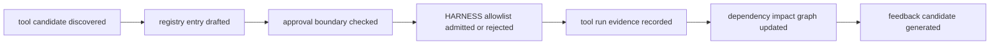

# HARNESS external tools / dependency impact 基本設計

## 1. 目的

MCP サーバー、プラグイン、SAST、code scanning、dependency / impact analysis を HELIX HARNESS の管理下に置き、未承認ツール実行を防ぎながら、エラー、デグレ、依存関係、修正影響範囲、開発運用ボトルネックを HELIX DB feedback に接続する。

現在フェーズでは外部ツールをインストールしない。L4-L6 の設計を閉じ、導入は承認済み add-feature / Sprint へ分離する。

## 2. 外部境界

| 領域 | 本設計で固定すること | 本設計で実施しないこと |
|---|---|---|
| MCP / plugin admission | official source、transport、auth、tool scope、write capability、owner、approval 状態 | MCP server / plugin のインストール |
| SAST / code scanning | Semgrep CE / CodeQL などを HARNESS advisory evidence として扱う入口 | CI workflow 変更、remote scan 実行 |
| DDD / coding-rule / TDD | 既存 detector と外部 findings の接続方針 | detector body の変更 |
| dependency / impact | `source -> target -> affected artifact -> required gate` の説明モデル | 新規 DB schema |
| HELIX DB feedback | tool findings を events / metrics / feedback に append する lifecycle | auto-fix / auto-apply |

## 3. External Tool Admission Lifecycle

| 状態 | 意味 | 完了扱い |
|---|---|---|
| `candidate_discovered` | Web / repo / user request から候補を検出 | 不可 |
| `registry_drafted` | official URL、license/auth/network/write scope を記録 | 不可 |
| `approval_checked` | 人間承認、allowed_files、rollback、verification を確認 | 不可 |
| `allowlisted` | HARNESS 実行許可に入った | 不可 |
| `run_evidence_recorded` | 実行結果が保存された | 条件付き不可 |
| `impact_graph_updated` | 影響範囲が gate / artifact へ写像された | 条件付き不可 |
| `feedback_candidate_generated` | 改善候補が出た | closure ではない |

## 4. 依存・影響範囲モデル

| Node | 例 | 用途 |
|---|---|---|
| source | changed file, tool finding, doc ID, detector signal | 起点 |
| dependency | import, registry link, DDD term, coding rule, MCP tool, package | 影響経路 |
| affected artifact | L1-L6 doc, test design, code module, command, gate | 修正対象候補 |
| required gate | requirement_drift, trace_symmetry, G7, G8/G9/G12/G14, CI equivalent | 検証対象 |
| feedback | event / metric / feedback candidate | 再発防止 |

修正影響範囲は「どの source が、どの dependency を経由して、どの artifact と gate に影響するか」を機械可読に説明できることを合格条件にする。

## 5. Web-backed candidates

| Candidate | Source | 2026-06-12 再確認焦点 | 現在の扱い |
|---|---|---|---|
| MCP protocol admission | official MCP specification `https://modelcontextprotocol.io/specification/2025-06-18/basic/index` | JSON-RPC 2.0、lifecycle management、authorization、resources/prompts/tools、HTTP auth と stdio credential 境界 | candidate evidence only |
| GitHub MCP Server | GitHub Docs / GitHub official repository | remote/local configuration、OAuth / PAT、host policy、token scope、write-capable GitHub tools | candidate requires approval |
| Semgrep CE | Semgrep official docs | `semgrep scan`、CI/local execution surface、rule source/license、fail behavior | candidate requires license / CI boundary review |
| CodeQL | GitHub official docs | CodeQL database、query results、code scanning alerts、SARIF / third-party interoperability、Actions or external CI route | candidate requires GitHub security / CI route review |

### 5.1 Web evidence to design controls

| Official evidence focus | L4 control |
|---|---|
| MCP tools are arbitrary tool execution surfaces and require explicit user consent / authorization | HARNESS admission must keep `tool_invocation_consent_required=true` (`tool invocation consent`) until a tool is approved with owner, scope, and rollback. |
| GitHub MCP can expose repo / issue / PR / workflow operations through OAuth or PAT | Any GitHub MCP candidate with write capability stays blocked until token scope, organization policy, and allowed command set are approved. |
| Semgrep CE can run locally or in CI and emits static-analysis findings | Semgrep findings are advisory evidence only until rule source/license, fail behavior, and execution surface are approved. |
| CodeQL can produce code scanning alerts and interoperate through SARIF-capable code scanning routes | CodeQL remains a candidate until Actions/external CI route, SARIF ingestion, and HELIX DB feedback mapping are approved. |

## 6. 安全境界

- `external_tool_installation_allowed_now=false`
- `credential_or_secret_change=false`
- `external_network_execution=false`
- `schema_migration=false`
- `auto_install=false`
- `auto_apply=false`
- 未承認 tool candidate は HARNESS が実行しない。
- tool finding は advisory evidence であり、PLAN / gate / recurrence closure なしに goal completion と扱わない。

## 7. L5 / L6 / L7 への引き継ぎ

| 下位層 | 引き継ぐ内容 |
|---|---|
| L5 詳細設計 | registry schema、approval gate、impact graph、DB append 写像、失敗時扱い |
| L6 機能設計 | HEXT-FN-* の関数 / surface 単位契約 |
| L7 add-feature | registry / allowlist / tool runner / tests の実装。現在タスクでは作成しない |
