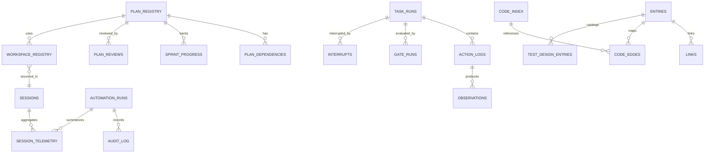

# データ設計

## 1. 目的と境界

本書は `helix.db` を中心とした論理データモデルを定義し、主要テーブル群の責務と関連を固定する。L4 では業務的なまとまり、主要エンティティ、関連の方向、永続化責務のみを扱う。

主キー型、列型、index、DDL、migration script、保持期間の厳密値、rollback 手順は L5 物理データ設計に送る。

## 2. 論理データモデル

HELIX の永続化対象は、工程管理、実行監査、AI harness telemetry、資産索引、workspace / session 継続の 5 領域に分かれる。

| データ領域 | 主な責務 | 代表エンティティ | implementation_status |
|---|---|---|---|
| Plan Governance | PLAN 正本の索引、依存、進捗の追跡 | `plan_registry`, `plan_dependencies`, `sprint_progress` | implemented |
| Execution Tracking | run 単位の進行、gate、割込、レビューの追跡 | `task_runs`, `action_logs`, `gate_runs`, `interrupts`, `plan_reviews` | implemented |
| Automation Audit | push / pr / hook / audit / session の記録 | `automation_runs`, `audit_log`, `session_telemetry`, `hook_events` | implemented |
| Workspace and Continuity | session 継続、workspace、lock、job 管理 | `sessions`, `workspace_registry`, `locks`, `jobs`, `schedules` | implemented |
| Asset and Trace Catalog | code / doc / test-design / relation の索引 | `code_index`, `entries`, `links`, `code_edges`, `test_design_entries` | implemented |

## 3. 主要テーブル概要

| テーブル | 領域 | 概要 | 主な関連 | implementation_status |
|---|---|---|---|---|
| `plan_registry` | Plan Governance | PLAN の識別子、状態、owner、生成物を保持する中心台帳 | `plan_dependencies`, `sprint_progress`, `workspace_registry` | implemented |
| `plan_dependencies` | Plan Governance | PLAN 間の requires / blocks 関係を保持する | `plan_registry` | implemented |
| `sprint_progress` | Plan Governance | sprint 単位の完了状況と更新時刻を保持する | `plan_registry` | implemented |
| `task_runs` | Execution Tracking | 実行タスクの開始から完了までを記録する | `action_logs`, `gate_runs`, `interrupts` | implemented |
| `action_logs` | Execution Tracking | task 内の個別アクションと証跡を保持する | `task_runs`, `observations` | implemented |
| `gate_runs` | Execution Tracking | gate 判定結果、失敗理由、再試行回数を保持する | `task_runs` | implemented |
| `plan_reviews` | Execution Tracking | PLAN review の verdict と findings 件数を保持する | `plan_registry` | implemented |
| `automation_runs` | Automation Audit | push / pr / hook など自動化実行の単位を保持する | `audit_log`, `session_telemetry` | implemented |
| `audit_log` | Automation Audit | append-only の監査ログを保持する | `automation_runs` | implemented |
| `session_telemetry` | Automation Audit | session 単位の tool use、token、cost を集約する | `automation_runs`, `sessions` | implemented |
| `hook_events` | Automation Audit | hook 実行の結果を簡潔に残す | `task_runs` 相当の実行文脈 | implemented |
| `schema_version` | Automation Audit | DB schema バージョンと migration 進行を保持する | migration 実行群 | implemented |
| `workspace_registry` | Workspace and Continuity | task ごとの workspace 状態を保持する | `plan_registry`, `sessions` | implemented |
| `sessions` | Workspace and Continuity | AI セッション単位の識別情報を保持する | `session_telemetry` | implemented |
| `locks` | Workspace and Continuity | 排他制御の状態を保持する | `jobs`, `workspace_registry` | implemented |
| `code_index` | Asset and Trace Catalog | code symbol と場所の索引を保持する | `code_edges`, `entries` | implemented |
| `entries` | Asset and Trace Catalog | docs / skill / workflow / command などの資産台帳を保持する | `links`, `code_edges` | implemented |
| `links` | Asset and Trace Catalog | asset 間の参照リンクを保持する | `entries` | implemented |
| `test_design_entries` | Asset and Trace Catalog | test-design 資産の索引を保持する | `entries`, `links` | implemented |

補助テーブルとして、`metrics`, `bench_snapshots`, `skill_usage`, `harness_check_events`, `deferred_findings`, `design_sprint_entries` などを持つ。これらは上記 5 領域の補助データとして扱う。

## 4. エンティティ関連

## 5. データフロー観点

### 5.1 PLAN と実行の流れ

1. PLAN 系文書の frontmatter から `plan_registry` と関連テーブルへ索引情報が登録される。
2. 実行開始時に `task_runs` または `automation_runs` が起点 row になる。
3. 判定結果は `gate_runs`、`audit_log`、`session_telemetry` に蓄積される。
4. 集約系コマンドはこれらを参照して status、doctor、review、handover の判断材料を返す。

### 5.2 資産索引の流れ

1. `entries` と `code_index` が docs / code の所在を保持する。
2. `links` と `code_edges` が資産間の関連を保持する。
3. `test_design_entries` が V-model pair の探索起点を補う。

## 6. L5 への引き継ぎ

L5 では以下を詳細化する。

- テーブルごとの列定義、型、NULL 制約、UNIQUE 制約
- index 設計と参照性能要件
- migration 単位と `schema_version` 更新規約
- `helix doctor` や hook が参照する監査データの保持期間

本書の範囲では、`helix.db` が工程管理、監査、継続、資産索引の共通保存先であることを固定し、物理詳細は確定しない。
