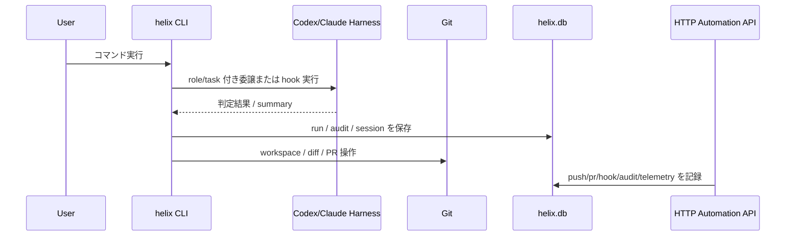

# 外部IF設計

## 1. 目的と境界

本書は HELIX の外部接続境界を整理し、どの相手とどの入口で接続するかを固定する。L4 では接続主体、入口、役割、データ責務の概要のみを扱う。

request / response の詳細フィールド、CLI option 単位の厳密契約、hook payload schema、HTTP status / error body、DB column 定義は L5 IF 詳細設計に送る。

## 2. 外部接続一覧

| IF-ID | 接続先 | 方向 | 入口 | 役割 | implementation_status |
|---|---|---|---|---|---|
| IF-01 | 利用者 shell | inbound | `cli/helix` | HELIX の全コマンド入口 | implemented |
| IF-02 | Codex CLI | 双方向 | `helix-codex` wrapper | role 付き実行、plan-only guard、summary 収集 | implemented |
| IF-03 | Claude Code runtime | 双方向 | SessionStart / PreToolUse / PostToolUse hook | read-only 調査、hook enforcement、context 注入 | implemented |
| IF-04 | Git repository / worktree | 双方向 | `git`, `helix workspace`, `helix pr` | 差分管理、workspace 分離、PR 連携 | implemented |
| IF-05 | SQLite `helix.db` | 双方向 | `cli/lib/helix_db.py` | 実行時 state と監査の永続化 | implemented |
| IF-06 | ローカル HTTP automation consumer | inbound | `cli/lib/http_api/routes/*` | push / pr / hook / audit / telemetry 補助 API | implemented |

## 3. 接続境界の考え方

| 境界 | HELIX 内責務 | 接続先責務 |
|---|---|---|
| CLI 境界 | role 制約、工程表注入、コマンド dispatch | 利用者が task と実行意図を与える |
| AI harness 境界 | wrapper で policy を付与し、禁止操作を抑止する | Codex / Claude が task を処理して結果を返す |
| VCS 境界 | workspace と review 導線を提供する | git が差分履歴と merge 単位を保持する |
| DB 境界 | 監査、run、session、asset 索引を保存する | SQLite がローカル永続化を担う |
| HTTP 境界 | 補助 API を公開し内部 service に変換する | caller が trigger と実行文脈を与える |

## 4. 主要インターフェース概要

### 4.1 CLI 入口

| 項目 | 概要 |
|---|---|
| 主体 | 利用者、script、wrapper |
| 代表入口 | `helix`, `helix plan`, `helix gate`, `helix review`, `helix handover`, `helix code` |
| 役割 | workflow 起動、状態確認、実行委譲、review |
| 詳細化先 | L5 IF 詳細設計で command contract を定義 |

### 4.2 Codex / Claude harness

| 項目 | Codex 側 | Claude 側 |
|---|---|---|
| 入口 | `helix-codex` | `helix-claude`, hook wrappers |
| 主用途 | 実装、設計、review、summary 出力 | read-only 調査、review、hook 駆動支援 |
| 境界ルール | `--approved`、allowed-files、plan-only guard | hook event ごとの fail-close と context guard |
| 詳細化先 | L5 IF 詳細設計 | L5 IF 詳細設計 |

### 4.3 Git / workspace

| 項目 | 概要 |
|---|---|
| 主体 | `git`, `git worktree`, `helix workspace`, `helix pr` |
| 役割 | branch と workspace の分離、差分レビュー、PR 作成 |
| HELIX 側責務 | PLAN / task 単位で作業領域を分け、review と gate の導線を維持する |
| 詳細化先 | L5 で merge 条件、abort 条件、conflict handling を定義 |

### 4.4 SQLite

| 項目 | 概要 |
|---|---|
| 代表 API | `_write_connection`, `resolve_default_db_path`, `insert_audit_log`, `upsert_session_telemetry` |
| 役割 | PLAN、run、session、audit、asset catalog の保存 |
| 境界ルール | 文書正本ではなく runtime state の保存先として扱う |
| 詳細化先 | L5 物理データ設計 |

### 4.5 HTTP 補助 API

| API | 目的 | 主な利用場面 |
|---|---|---|
| `POST /api/v1/automation/push/{plan_id}/trigger` | push 前 gate 実行と run 記録 | 自動 push 導線 |
| `POST /api/v1/automation/pr/{plan_id}/trigger` | PR 作成前 gate 実行と run 記録 | PR 自動化導線 |
| `POST /api/v1/automation/hooks/{hook_kind}/callback` | hook 実行結果の記録 | Claude/Codex hook 連携 |
| `POST /api/v1/automation/audit/log` | audit summary の記録 | review / QA / security 証跡 |
| `POST /api/v1/automation/session/telemetry` | session telemetry の記録 | session start / stop 連携 |

## 5. 連携シーケンス概要

## 6. IF ごとの設計上の制約

| IF | 制約 | 参照要件 |
|---|---|---|
| CLI | 明示承認なしの write 実行を避ける | NFR-SC-04 |
| AI harness | 非許可 tool 呼出しを block する | NFR-SC-03 |
| Git / workspace | 並列 workspace 衝突を起こさない | NFR-PF-03 |
| SQLite | schema mismatch と破損を検知可能にする | NFR-AV-02, NFR-MG-02 |
| HTTP 補助 API | 監査と telemetry の記録経路を保持する | FR-DOCTOR-01, FR-EVT-01 |

### 6.1 認可・fail-close・timeout の L4 方針 (IF-06 / AI harness)

外部IF境界の認可と失敗時挙動はセキュリティ責務 (NFR-SC) のため、**具体閾値・scheme は L5 へ送るが基本方針は L4 で凍結**する (tl-advisor 2026-06-02 P1: 「認可/fail-close を全て L5 送りにしない」)。

| IF | 認可方針 (L4 凍結) | fail-close 方針 (L4 凍結) | timeout / retry 方針 (L4 凍結) |
|---|---|---|---|
| IF-06 HTTP 補助 API | loopback (`127.0.0.1`) bind の **local-only** を既定とし、ネットワーク公開しない。公開が必要な場合のみ token 認可を必須化 (scheme 詳細は L5) | gate / 検証失敗時は run を記録した上で副作用 (push / pr) を**実行しない** (記録は許可・操作は遮断)。認可外 caller は即時拒否 | request timeout 既定ありで超過は fail-close。**自動 retry は既定で行わない** (二重 push/pr 防止)。retry 値の確定は L5 |
| IF-02 Codex harness | `--approved` + allowed-files + plan-only guard を必須とし、承認なし write は不可 | guard 違反 (非許可 path / commit / push) は wrapper で block。Codex 単独 commit / push は禁止 (呼出し元が判断) | wrapper timeout で SIGTERM、編集の atomic 性は保持 (部分適用の検証は呼出し元) |
| IF-03 Claude hook | hook event ごとに role / model / path guard を fail-close 強制 | guard deny は操作を停止、bypass は環境変数 + evidence 必須 | hook timeout 超過は fail-close、hook を回避しない |

上表は **方針 (direction) の凍結**であり、閾値・token scheme・retry 回数・error body の確定値は L5 IF 詳細設計が正本。

## 7. L5 への引き継ぎ

L5 では以下を確定する。

- CLI option、hook payload、HTTP body の詳細 schema
- 認可の具体 scheme (token 等)、fail-close の閾値、timeout / retry の確定値 (§6.1 で凍結した L4 方針の数値化)
- DB API ごとの呼出し前提とエラー分類
- Git / workspace 操作時の状態遷移と rollback 規約

本書では外部接続点の境界だけを固定し、詳細 I/O と error handling は確定しない。
