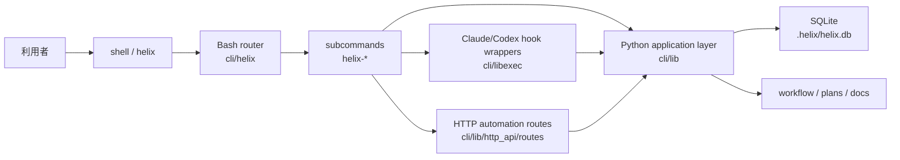

# 方式設計

## 1. 目的と適用範囲

本書は HELIX-workflows V2 の L4 基本設計として、システム構成、アーキテクチャ方針、技術スタックを固定する。arc42 の §3 Context、§4 Solution Strategy、§5 Building Block View に相当する。

L4 で扱うのは全体構成、層責務、主要接続点、主要な技術判断までとする。関数単位の仕様、クラス分割、アルゴリズム詳細、SQL DDL、HTTP payload 詳細、エラー分岐詳細は L5 詳細設計または L6 機能設計に送る。

## 2. システムコンテキスト

HELIX-workflows は、設計正本、CLI 実装、ローカル永続化、AI harness、hook 実行面を同一ワークスペースで連携させるローカルファーストの開発運用基盤である。主な利用者は TL / SE / QA / PMO であり、操作入口は `cli/helix` に集約する。

| 外部主体 | 接続点 | 役割 | implementation_status |
|---|---|---|---|
| 利用者 | shell / `helix` command | HELIX workflow の開始、確認、委譲 | implemented |
| Codex CLI | `helix-codex` wrapper | role / task / sandbox を注入した実行 | implemented |
| Claude Code | SessionStart / PreToolUse / PostToolUse hook | read-only 調査、review、hook 連携 | implemented |
| Git repository | `git`, `helix workspace`, `helix pr` | 差分管理、workspace 分離、PR 作成 | implemented |
| SQLite `helix.db` | `cli/lib/helix_db.py` | PLAN、監査、実行履歴、telemetry の保存 | implemented |
| L4/L9 文書群 | `docs/`, `HELIX-workflows/` | 正本参照、設計と総合テスト設計の pair freeze | implemented |

## 3. 解決戦略

ADR-044 の主要判断を L4 方式へ反映し、以下の 5 方針を採用する。

| 方針 | 採用内容 | L3 / NFR との対応 |
|---|---|---|
| 正本分離 | `HELIX-workflows/` と `docs/` を設計正本、`cli/` を実装面として分離する | FR-PLAN-01, NFR-OP-04 |
| 入口統一 | 利用者の操作入口を `cli/helix` に集約し、サブコマンドへ振り分ける | FR-9MODE-01, NFR-SE-02 |
| ポリシー集約 | gate、route、doctor、handover、review などの判断を Python 層へ集約する | FR-GATE-01, FR-DRIFT-01, FR-DOCTOR-01 |
| 永続化の一本化 | 実行時 state の主要保存先を `helix.db` とし、文書正本とは責務分離する | FR-EVT-01, FR-MIGR-01, NFR-AV-02 |
| hook / harness 連携 | AI 実行器とは wrapper と hook で疎結合に接続し、CLI 本体を中核に保つ | FR-CTX-01, FR-GR-01, NFR-SC-03 |

## 4. アーキテクチャ構成

### 4.1 層構成

| 層 | 主な実体 | 責務 | implementation_status |
|---|---|---|---|
| 利用者インターフェース層 | shell, `helix help`, plan/handover 文書 | 操作起点、状況確認、作業再開 | implemented |
| Bash router 層 | [`cli/helix`](/home/tenni/ai-dev-kit-vscode/cli/helix) | サブコマンド入口の統一、環境読込、実行委譲 | implemented |
| コマンド実行層 | `helix-*` 実行ファイル群 | workflow ごとのユースケース起動 | implemented |
| Python application 層 | [`cli/lib/route_engine.py`](/home/tenni/ai-dev-kit-vscode/cli/lib/route_engine.py), [`cli/lib/helix_db.py`](/home/tenni/ai-dev-kit-vscode/cli/lib/helix_db.py), `plan_*`, `doctor_*` | 判定ロジック、集計、永続化、workflow orchestration | implemented |
| 永続化層 | `.helix/helix.db`, YAML / JSON 補助証跡 | 実行 state、監査、handover、設定の保持 | implemented |
| 統合層 | `cli/libexec/helix-pre-bash`, `helix-post-tool-use`, `helix-session-start`, HTTP routes | Codex / Claude / git / HTTP 補助面との接続 | implemented |

### 4.2 層間の責務境界

- Bash router は「どのサブコマンドを起動するか」までを担当し、業務判断は Python application 層に持ち込まない。
- Python application 層は workflow / gate / telemetry の判断を担当し、利用者向けの常設 UI を持たない。
- `helix.db` は実行時 state の記録先であり、要件・設計・pair freeze の正本ではない。
- hook / HTTP route は統合アダプタであり、単独で業務ルールを保持せず Python application 層へ委譲する。

## 5. ビルディングブロック概要

| ブロック | 主な対象 | 概要 | 次工程で詳細化するもの |
|---|---|---|---|
| Workflow Control | `helix plan`, `helix gate`, `helix sprint`, `helix route` | 工程進行、mode 選択、gate 判定 | L5: 内部処理設計 |
| Runtime Governance | `llm_guard.py`, `context_guard.py`, `agent_policy_guard.py` | role 制約、tool 利用制御、context 注入 | L5: IF 詳細設計 |
| Audit and Persistence | `helix_db.py`, migrations, `doctor_*` | 実行履歴、監査、telemetry、schema version 管理 | L5: 物理データ設計 |
| Handover and Workspace | `handover.py`, `workspace_manager.py` | セッション継続、workspace 分離、再開支援 | L5: 内部処理設計 |
| Automation API | HTTP routes for push/pr/hooks/audit/telemetry | 外部呼出しの局所的な API 提供 | L5: IF 詳細設計 |

## 6. 技術スタック

| レイヤ | 技術 | 用途 | implementation_status |
|---|---|---|---|
| CLI router | Bash 5 系 | 入口統一、環境変数整備、サブコマンド実行 | implemented |
| Application | Python 3.11+ | gate / route / audit / db / hook 補助ロジック | implemented |
| Persistence | SQLite 3.40+ | `helix.db` によるローカル永続化 | implemented |
| VCS / workspace | git 2.40+, git worktree | 差分管理、workspace 分離、PR 前提の履歴管理 | implemented |
| Document format | Markdown + YAML frontmatter | PLAN、設計、test-design、ADR の正本管理 | implemented |
| AI harness | Codex CLI, Claude Code hook | role 付き実行、review、context injection | implemented |
| HTTP support | Python route modules | push/pr/hook/audit/telemetry の補助 API | implemented |

## 7. 非機能要件への対応方針

| 観点 | 方針 | 参照要件 |
|---|---|---|
| 可用性 | CLI 入口と DB 保存を分離し、hook 側の局所障害で全体を停止させない構成とする | NFR-AV-01, NFR-AV-02 |
| 性能 | 入口を Bash、判断を Python、保存を SQLite に分け、影響範囲 query と doctor の責務を明確化する | NFR-PF-01, NFR-PF-02 |
| 保守性 | 文書正本、CLI、DB schema の責務を分けて trace を取りやすくする | NFR-OP-04, NFR-OP-06 |
| セキュリティ | raw CLI 抑止、hook guard、commit/push guard を harness 側で強制する | NFR-SC-03, NFR-SC-04 |
| 互換性 | Linux / macOS 前提、Codex / Claude の両導線を wrapper で整える | NFR-SE-01, NFR-SE-02 |

## 8. L5 / L6 への引き継ぎ

L5 では以下を詳細化対象とする。

- `helix.db` の物理テーブル定義、index、migration 運用
- HTTP route ごとの request / response / error 契約
- hook 実行順、timeout、retry、fail-close 条件
- command ごとの内部処理フローと状態遷移

L6 では以下を詳細化対象とする。

- FR ごとの関数仕様
- モジュール分割後の責務境界
- edge case と単体テスト観点
