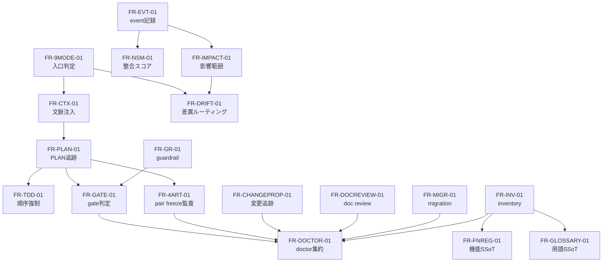

# 機能構成設計

## 1. 目的と境界

本書は FR18 件の機能群を L4 粒度で俯瞰し、機能群の責務分担と連携順を固定する。対象は「何の機能が、どの機能群と依存関係を持つか」までとし、関数仕様、クラス分割、処理手順、詳細アルゴリズム、テストケース列挙は L6 に送る。

## 2. 機能母集団の整理

L3 正本に基づき、機能は code 16 件と registry-only 2 件で構成する。registry-only は機械可読 SSoT の整備が未完了であり、L4 では inventory / glossary の統制対象として扱う。

| 区分 | 件数 | 対象 | L4 で固定すること |
|---|---:|---|---|
| code | 16 | FR-NSM-01, FR-GR-01, FR-TDD-01, FR-9MODE-01, FR-GATE-01, FR-IMPACT-01, FR-EVT-01, FR-4ART-01, FR-INV-01, FR-CTX-01, FR-DRIFT-01, FR-PLAN-01, FR-DOCTOR-01, FR-MIGR-01, FR-DOCREVIEW-01, FR-CHANGEPROP-01 | 配置、依存、主責務 |
| registry-only | 2 | FR-FNREG-01, FR-GLOSSARY-01 | code 昇格条件と連携先 |

## 3. 機能群

| 機能群 | 含まれる FR | 役割 |
|---|---|---|
| Entry and Routing | FR-9MODE-01, FR-CTX-01, FR-DRIFT-01 | 実行入口の判定、role / layer 文脈注入、異常の進路決定を担う |
| Plan and Gate Control | FR-PLAN-01, FR-GATE-01, FR-TDD-01, FR-4ART-01 | PLAN、gate、pair freeze、実装順制御を担う |
| Audit and Quality | FR-DOCTOR-01, FR-GR-01, FR-DOCREVIEW-01, FR-CHANGEPROP-01 | fail-close 判定、品質監査、doc review、デグレ禁止を担う |
| Runtime and Continuity | FR-EVT-01, FR-NSM-01, FR-IMPACT-01, FR-MIGR-01 | event 記録、計測、影響範囲把握、移行管理を担う |
| Asset and Knowledge Governance | FR-INV-01, FR-FNREG-01, FR-GLOSSARY-01 | 資産台帳、機能 SSoT、用語 SSoT を担う |

## 4. FR 一覧と責務

| FR-ID | bucket | 責務概要 | 主な連携先 |
|---|---|---|---|
| FR-NSM-01 | code | PLAN 完遂状況と整合スコアを集計し、運用判断の基礎指標を提供する | FR-EVT-01, FR-DOCTOR-01 |
| FR-GR-01 | code | guardrail 条件を監視し、危険な実行を block または throttle する | FR-GATE-01, FR-DOCTOR-01 |
| FR-TDD-01 | code | sprint 内の実行順を固定し、テストアフターを防ぐ | FR-PLAN-01, FR-GATE-01 |
| FR-9MODE-01 | code | signal から mode 候補を選び、適切な workflow 入口を決める | FR-CTX-01, FR-DRIFT-01 |
| FR-GATE-01 | code | static check と AI review 条件を束ね、gate verdict を返す | FR-PLAN-01, FR-4ART-01, FR-GR-01 |
| FR-IMPACT-01 | code | artifact と event を横断し、変更波及範囲を返す | FR-PLAN-01, FR-EVT-01, FR-INV-01 |
| FR-EVT-01 | code | mode closure と Forward 復帰情報を記録し、再開可能性を支える | FR-NSM-01, FR-IMPACT-01 |
| FR-4ART-01 | code | 設計、実装、テスト設計、テストコードの trace 欠落を監査する | FR-GATE-01, FR-PLAN-01 |
| FR-INV-01 | code | skill、CLI、PLAN、docs、DB schema の inventory と密度可視化を行う | FR-FNREG-01, FR-GLOSSARY-01, FR-DOCTOR-01 |
| FR-CTX-01 | code | layer と role に応じた skill、agent、command の注入条件を返す | FR-9MODE-01, FR-PLAN-01 |
| FR-DRIFT-01 | code | drift を分類し、interrupt / recovery / reverse などへ振り分ける | FR-9MODE-01, FR-IMPACT-01 |
| FR-PLAN-01 | code | PLAN の dependency と generates を追跡し、工程の前後関係を固定する | FR-GATE-01, FR-TDD-01, FR-4ART-01 |
| FR-DOCTOR-01 | code | 複数監査結果を束ね、領域別または全体の summary を返す | FR-GR-01, FR-INV-01, FR-CHANGEPROP-01 |
| FR-MIGR-01 | code | schema migration と retrofit の進行状況を管理する | FR-EVT-01, FR-DOCTOR-01 |
| FR-DOCREVIEW-01 | code | 文書品質 review を role 分離で実行し、設計品質の根拠を残す | FR-DOCTOR-01, FR-INV-01 |
| FR-CHANGEPROP-01 | code | 上流変更に対する下流追従と balance_ratio の後戻り禁止を監査する | FR-PLAN-01, FR-DOCTOR-01 |
| FR-FNREG-01 | registry-only | FR 一覧の中央 SSoT を保持し、未定義 FR や参照 drift の検出基準になる | FR-INV-01, FR-DOCTOR-01 |
| FR-GLOSSARY-01 | registry-only | 用語 SSoT を保持し、設計・PLAN・skill 間の用語ゆれ統制基準になる | FR-INV-01, FR-DOCREVIEW-01 |

## 5. 機能間連携

### 5.1 連携原則

- 入口系は FR-9MODE-01 を起点とし、FR-CTX-01 が role / layer の実行文脈を補う。
- 工程制御系は FR-PLAN-01 を基礎に FR-GATE-01、FR-TDD-01、FR-4ART-01 が判定を積み上げる。
- 品質系は FR-DOCTOR-01 を集約点とし、guardrail、doc review、change propagation を統合する。
- knowledge 系の registry-only 2 件は単独実行主体ではなく、inventory と doctor の判定基準として参照される。

### 5.2 機能マップ

## 6. code16 / registry-only2 の扱い

| 区分 | 設計方針 | L5 / L6 への送り先 |
|---|---|---|
| code16 | 実装実体が存在するため、L5 で内部処理と外部 IF を整理し、L6 で FR 単位の仕様化へ進める | L5 内部処理設計、L6 `FR-XXX/` |
| registry-only2 | 実行主体ではなく統制基準のため、L4 では連携先と昇格条件のみ固定する | L5 物理データ設計または inventory 詳細化 |

registry-only の昇格条件は、機械可読 SSoT 本体、専用 check、実行入口の 3 点が揃うこととする。これを満たすまでは inventory と doctor から参照される補助機能として扱う。

## 7. 次工程への引き継ぎ

L5 で詳細化するもの:

- FR ごとの内部処理フロー
- 監査系と実行系の I/O 契約
- inventory / registry の物理保存先

L6 で詳細化するもの:

- code16 各 FR の機能仕様
- edge case と単体テスト設計
- モジュール境界と責務の細分化
