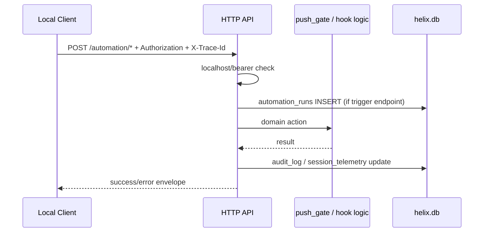

# IF詳細設計

## 1. 目的と境界

本書は HELIX-workflows V2 の外部接続境界を L5 粒度へ詳細化し、CLI 呼出し、HTTP automation endpoint、hook callback、DB API 呼出しの I/O 契約と error handling を定義する。個別関数シグネチャや route helper の実装詳細は L6 に送る。

## 2. 入力とトレース

| 区分 | 入力 | 本書での使い方 |
|---|---|---|
| L4 方式 | `docs/v2/L4-basic-design/方式設計.md` | CLI 中心構造と integration 層の境界を詳細化する |
| L4 機能構成 | `docs/v2/L4-basic-design/機能構成設計.md` | Entry/Routing、Audit、Continuity の IF を整理する |
| L4 データ | `docs/v2/L4-basic-design/データ設計.md` | endpoint ごとの保存先テーブルを決める |
| L4 外部 IF | `docs/v2/L4-basic-design/外部IF設計.md` | CLI/harness/HTTP/DB の接点を具体契約へ落とす |
| 実装 | `cli/helix`, `cli/lib/http_api/server.py`, `cli/lib/http_api/auth.py`, `cli/lib/http_api/routes/*.py`, `cli/lib/helix_db.py` | 実際の request/response、認証、side effect を確定する |

## 3. IF ファミリ

各 IF ファミリに安定 `IF-*` ID を付与する（L5↔L8 trace 用。L8 結合テスト設計の `IT-IF-*` はこの ID へ trace する。§5.2 の各 endpoint は `IF-HTTP-01` 配下の詳細）。

| IF ID | 区分 | 実体 | 方向 | 主責務 |
|---|---|---|---|---|
| IF-CLI-01 | CLI | `cli/helix`, `cli/helix-*` | inbound/outbound | サブコマンド dispatch、usage、終了コード返却 |
| IF-HARNESS-01 | Harness | `helix-codex`, `helix-claude`, `.claude/hooks/*.sh`, `cli/libexec/*` | 双方向 | role/task 注入、hook guard、summary 収集 |
| IF-HTTP-01 | HTTP Automation | `server.py`, `routes/push_pr.py`, `routes/hooks.py`, `routes/audit.py`, `routes/telemetry.py` | inbound | push/pr/hook/audit/telemetry 補助 API |
| IF-DB-01 | DB API | `helix_db.py` の insert/update helper | outbound | run、audit、session、workspace の永続化 |

## 4. CLI 共通契約

### 4.1 top-level 入口

`cli/helix` の外部契約は `helix <subcommand> [args...]` とし、subcommand は case 文で個別 entrypoint へ委譲する。

| 項目 | 契約 |
|---|---|
| 入力 | `<subcommand>` と後続引数 |
| 出力 | text 主体。個別 command が必要に応じて json/text を返す |
| 正常終了 | `exit 0` |
| 利用者エラー | 不明 command 時 `exit 1` |
| 副作用 | なし。副作用は委譲先が持つ |

### 4.2 CLI カテゴリ

| カテゴリ | 代表 command | 役割 |
|---|---|---|
| workflow 管理 | `helix plan`, `helix gate`, `helix sprint`, `helix route` | 工程進行、判定、ルーティング |
| harness | `helix codex`, `helix claude`, `helix review`, `helix team` | AI 実行器との境界 |
| state 管理 | `helix handover`, `helix workspace`, `helix job`, `helix lock` | 継続・排他・非同期制御 |
| search / catalog | `helix code`, `helix entry`, `helix audit` | trace、索引、監査 |

## 5. HTTP automation 共通契約

### 5.1 認証・前処理

| 項目 | 契約 |
|---|---|
| 公開 endpoint | `GET /health` のみ |
| 認証条件 | `request.remote_addr` が `127.0.0.1` / `::1` / `localhost` |
| token | `Authorization: Bearer <HELIX_HTTP_API_TOKEN>` |
| trace | `X-Trace-Id` を受理し応答へ返す |
| envelope | success=`{data, trace_id}` / error=`{error:{code,message}, trace_id}` |

`validate_request_headers()` は現行実装では no-op であり、将来の header lint 挿入ポイントとして予約されている。

### 5.2 endpoint 一覧

| Method/Path | 入力 | 主副作用 | 主なエラー |
|---|---|---|---|
| `POST /api/v1/automation/push/{plan_id}/trigger` | body=`commit_sha, branch, trigger_actor, execute`, query=`force?, dry_run?` | `automation_runs` insert/update、`audit_log` insert、`push_gate.run_all_gates()` | `400`, `404`, `409`, `500` |
| `POST /api/v1/automation/pr/{plan_id}/trigger` | push と同一 | push と同一 | push と同一 |
| `POST /api/v1/automation/hooks/{hook_kind}/callback` | body=`hook_kind, run_id, actor, payload` | `audit_log` insert | `400`, `404`, `500` |
| `POST /api/v1/automation/audit/log` | body=`audit_kind, payload, run_id, actor, related_plan_id?` | `audit_log` insert | `400`, `404`, `409`, `500` |
| `POST /api/v1/automation/session/telemetry` | body=`run_id, session_id, started_at, ended_at, model, role, tokens_used?, cost_usd?` | `session_telemetry` upsert | `400`, `404`, `500` |
| `GET /health` | なし | なし | なし |
| `GET /api/v1/_status` | なし | なし | `403` if auth missing |

## 6. endpoint 詳細

### 6.1 push / pr trigger

```json
{
  "commit_sha": "abc1234",
  "branch": "feature/x",
  "trigger_actor": "http-client",
  "execute": true,
  "remote": "origin"
}
```

処理順:

1. `plan_id` 存在と body 必須項目を検証する
2. `automation_runs` に run を記録する
3. `push_gate.run_all_gates(execute, remote, branch)` を呼ぶ
4. `completed` / `failed` で run を finalize する
5. `audit_log` に endpoint 起点の監査行を残す

### 6.2 hook callback

`hook_kind` は `pretool | posttool | stop | session_start` を許容する。body の `hook_kind` と path parameter は一致必須とする。

```json
{
  "hook_kind": "posttool",
  "run_id": 42,
  "actor": "claude-hook",
  "payload": {
    "tool": "Edit",
    "status": "ok"
  }
}
```

### 6.3 audit endpoint

- HTTP の `audit_kind` は `footer | summary | diff_lines | security_scan | qa_check`
- DB には `audit_kind="endpoint_call"` で記録し、HTTP 側の kind は `payload.http_audit_kind` へ退避する
- `run_id` は `automation_runs.id` に存在している必要がある

### 6.4 session telemetry

- `session_id` は UNIQUE
- upsert payload は `actor = "<role>/<model>"` に正規化する
- `tokens_used` と `cost_usd` は 0 以上必須

## 7. hook 論理契約

現行 repository には複数の `.claude/hooks/*.sh` が存在するが、IF 契約としては以下の論理 event 群に収束させる。

| 論理 event | 代表 script | callback payload に含めるべき情報 |
|---|---|---|
| `SessionStart` | `sessionstart-harness-summary.sh`, `sessionstart-history-injection.sh` | `session_id`, `cwd`, `mode_hint`, `history_summary` |
| `PreToolUse` | `pretooluse-agent-guard.sh`, `pretooluse-codex-slot-check.sh`, `pretooluse-design-doc-web-search-guard.sh` | `tool_name`, `matcher`, `decision`, `reason` |
| `PostToolUse` | `post-tool-use.sh`, `posttooluse-plan-auto-register.sh`, `posttooluse-skill-catalog-rebuild.sh` | `tool_name`, `target_files`, `decision`, `result` |
| `Stop` | `stop.sh`, `stop-recovery-update.sh` | `session_id`, `summary`, `status` |
| `UserPromptSubmit` | `userpromptsubmit-context-bundle.sh` | `bundle_ref`, `injected_context_keys` |

## 8. エラー処理と retry

| 条件 | 応答/処理 |
|---|---|
| 入力不足、型不正 | `400 BAD_REQUEST` |
| localhost 制約違反、token 不一致 | `403 AUTH_FAILED` / `AUTH_NOT_CONFIGURED` |
| `plan_id` / `run_id` 未存在 | `404 NOT_FOUND` |
| DB insert/finalize 衝突 | `409 CONFLICT` |
| gate 実行や upsert の例外 | `500 INTERNAL` |

- HTTP route 自体は内部 retry を持たない
- retry 制御は `automation_runs.retry_count/max_retries` で外側から観測する
- `push_pr` の `dry_run=true` は `execute=false` に強制変換される

## 9. 結合シーケンス



## 10. implementation_status

| IF | 状態 | 根拠 |
|---|---|---|
| CLI router | implemented | `cli/helix` |
| localhost + bearer auth | implemented | `http_api/auth.py` |
| response envelope | implemented | `http_api/envelope.py` |
| push/pr trigger | implemented | `routes/push_pr.py` |
| hook callback | implemented | `routes/hooks.py` |
| audit logging endpoint | implemented | `routes/audit.py` |
| session telemetry endpoint | implemented | `routes/telemetry.py` |

## 11. L6 へ送る事項

本書では以下を確定しない。

- 各 endpoint helper の private 関数仕様
- CLI option ごとの細粒度 validation 網羅
- callback payload の field ごとの完全 JSON Schema

これらは L6 関数仕様と L7/L8 のテスト設計で具体化する。
