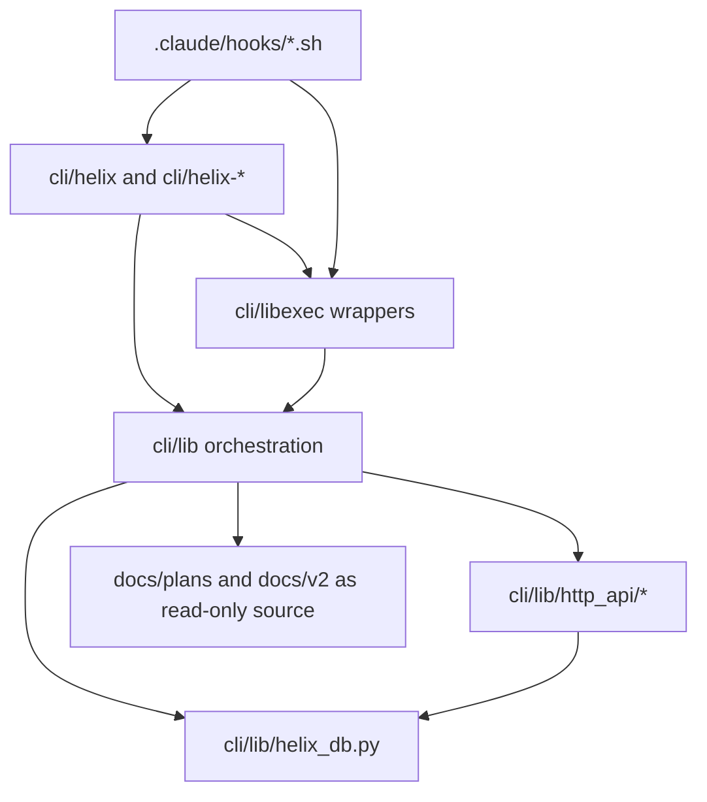

# モジュール分割設計

## 1. 目的と境界

本書は HELIX-workflows V2 の L5 詳細設計として、L4 機能群をどのファイル群へ配置するか、責務境界をどこで切るか、依存方向をどう固定するかを定義する。対象はファイル/パッケージ単位の責務分担であり、各関数やクラスの細粒度仕様は L6 に送る。

## 2. 入力とトレース

| 区分 | 入力 | 本書での使い方 |
|---|---|---|
| L4 方式 | `docs/v2/L4-basic-design/方式設計.md` | router/application/persistence/integration の層境界を具体化する |
| L4 機能構成 | `docs/v2/L4-basic-design/機能構成設計.md` | 機能群をモジュール群へ割り当てる |
| L4 データ | `docs/v2/L4-basic-design/データ設計.md` | persistence 系モジュールの責務を切る |
| L4 外部 IF | `docs/v2/L4-basic-design/外部IF設計.md` | CLI/hook/HTTP route の配置境界を固定する |
| 実装 | `cli/helix`, `cli/lib/*.py`, `cli/lib/http_api/*`, `.claude/hooks/*.sh` | 実ファイル単位の責務と依存方向を確定する |

## 3. 分割原則

- `cli/helix` は入口統一専用とし、業務判断を持たない
- `cli/lib/*.py` は 1 モジュール 1 主責務を原則にし、cross-cutting concern は guard/persistence/orchestration に分ける
- HTTP route は `/routes/*.py` で endpoint ごとに分離し、共通 envelope/auth は上位モジュールへ寄せる
- migration は `cli/lib/migrations/vNN_*.py` に additive 単位で分離する
- `.claude/hooks/*.sh` は hook event 単位で分離し、Python 業務ロジックを持ち込まない

## 4. モジュール分類

各分類に安定 `MOD-*` ID を付与する（L5↔L8 trace 用。L8 結合テスト設計の `IT-MOD-*` はこの ID へ trace する。section 見出しでなく ID で trace を固定）。

| MOD ID | 分類 | 主な実体 | 責務 |
|---|---|---|---|
| MOD-01 | CLI Router | `cli/helix`, `cli/helix-*` | サブコマンド入口、usage、entrypoint dispatch |
| MOD-02 | Core Orchestration | `route_engine.py`, `workspace_manager.py`, `handover.py`, `plan_validator.py`, `task_dispatcher.py` | workflow 遷移、PLAN 解決、workspace/handover の状態管理 |
| MOD-03 | Guard / Policy | `context_guard.py`, `llm_guard.py`, `agent_policy_guard.py`, `research_guard.py` | 実行可否、context 整合、禁止操作の block |
| MOD-04 | Persistence | `helix_db.py`, `migrations/*.py`, `plan_registry.py` | SQLite schema、state 永続化、migration 管理 |
| MOD-05 | HTTP Automation | `http_api/server.py`, `http_api/auth.py`, `http_api/envelope.py`, `http_api/routes/*.py` | ローカル HTTP 補助 API、認証、response envelope |
| MOD-06 | Catalog / Trace | `code_catalog.py`, `contract_registry.py`, `doc_map_matcher.py`, `deliverable_gate.py` | コード索引、artifact trace、gate 補助 |
| MOD-07 | Hook / Harness | `.claude/hooks/*.sh`, `cli/libexec/*`, `helix-codex`, `helix-claude`, `helix-review` | Claude/Codex 連携、hook 実行、wrapper 強制 |

## 5. L4 機能群との対応

| L4 機能群 | 主担当モジュール | 補助モジュール | 備考 |
|---|---|---|---|
| Entry and Routing | `cli/helix`, `route_engine.py` | `context_guard.py`, `task_dispatcher.py` | shell 入口と mode 判定を分離 |
| Plan and Gate Control | `plan_validator.py`, `plan_registry.py`, `deliverable_gate.py` | `matrix_compiler.py`, `vmodel_pair_freeze.py` | PLAN 検証と pair freeze を Python 層へ集約 |
| Audit and Quality | `helix_db.py`, `review_output.py`, `doc_map_matcher.py` | `research_guard.py`, `agent_policy_guard.py` | 監査記録と fail-close 補助 |
| Runtime and Continuity | `workspace_manager.py`, `handover.py`, `session_helper.py` | `lock_helper.py`, `job_queue_helper.py` | session/workspace 継続を状態管理へ集約 |
| Asset and Knowledge Governance | `code_catalog.py`, `contract_registry.py`, `skill_catalog.py` | `entry_helper.py`, `code_edges.py` | 索引・参照関係・skill inventory を保持 |
| Automation API | `http_api/routes/push_pr.py`, `hooks.py`, `audit.py`, `telemetry.py` | `server.py`, `auth.py`, `envelope.py` | endpoint ごとに責務分離 |

## 6. 代表モジュールの責務

### 5.1 Router / Entry

| モジュール | 役割 | 持たない責務 |
|---|---|---|
| `cli/helix` | top-level command dispatch | gate 判定、DB 書込 |
| `cli/helix-codex` | role/task/prompt の wrapper | core business rule |
| `cli/helix-review` | review 起動入口 | finding 保存ロジック本体 |

### 5.2 Core Orchestration

| モジュール | 役割 |
|---|---|
| `route_engine.py` | signal→mode/kind/action の決定 |
| `plan_validator.py` | PLAN frontmatter の静的検査 |
| `workspace_manager.py` | git worktree と registry の整合管理 |
| `handover.py` | CURRENT.json / md の lifecycle 管理 |

### 5.3 Persistence / Schema

| モジュール | 役割 |
|---|---|
| `helix_db.py` | ベース schema、接続/lock、共通 CRUD helper |
| `migrations/v31_db_separation.py`〜`v35_plan_registry.py` | additive migration |
| `plan_registry.py` / `plan_parser.py` | PLAN registry との接続面 |

### 5.4 HTTP Automation

| モジュール | 役割 |
|---|---|
| `server.py` | app factory、共通 auth gate、error handler |
| `auth.py` | localhost + bearer token 認証 |
| `envelope.py` | success/error 応答整形 |
| `routes/push_pr.py` | push/pr trigger と `automation_runs` 連携 |
| `routes/hooks.py` | hook callback と `audit_log` 連携 |
| `routes/audit.py` | audit endpoint と `audit_log` 連携 |
| `routes/telemetry.py` | `session_telemetry` UPSERT |

## 7. 依存方向ルール

- shell entrypoint は Python core にのみ依存する
- hook script は `cli/libexec` または `helix-*` 呼出しまでに止める
- HTTP route は `envelope/auth/server` と `helix_db` に依存し、他の route へ直接依存しない
- migration は `helix_db` 配下の additive extension とし、逆方向依存を持たない
- docs は read-only source として参照し、実行時 state を持たない

## 8. 分割の例外

| 例外 | 理由 | 制御方法 |
|---|---|---|
| `cli/helix` | 入口統一のため多サブコマンドを抱える | `exec` のみで薄く保つ |
| `helix_db.py` | schema と helper を一箇所で管理する必要がある | additive migration で肥大化を抑える |
| `http_api/server.py` | auth と blueprint 登録を一元化する必要がある | route 本体は `routes/*.py` へ分離 |

## 9. 変更時の分割ルール

- 新しい workflow 判定は `route_engine.py` に追加し、router には alias だけを足す
- 新しい DB 領域は `helix_db.py` へ直接追記せず、可能な限り `migrations/vNN_*.py` で additive に定義する
- 新しい HTTP endpoint は既存 route file を肥大化させず、責務が独立していれば別 route file を追加する
- hook script が Python 業務ロジックを持ち始めたら `cli/lib` 側へ移し、hook は wrapper 化する

## 10. implementation_status

| 区分 | 状態 | 根拠 |
|---|---|---|
| CLI router / wrappers | implemented | `cli/helix`, `cli/helix-*`, `helix-codex`, `helix-claude` |
| Core orchestration | implemented | `route_engine.py`, `plan_validator.py`, `workspace_manager.py`, `handover.py` |
| HTTP automation | implemented | `server.py`, `routes/push_pr.py`, `hooks.py`, `audit.py`, `telemetry.py` |
| Guard / policy | implemented | `context_guard.py`, `llm_guard.py`, `agent_policy_guard.py` |
| Persistence / migrations | implemented | `helix_db.py`, `migrations/v31`〜`v35` |

## 11. L6 へ送る事項

本書では以下を固定しない。

- 個別モジュール内部の private helper 分割
- 関数単位の責務境界
- 型定義、戻り値契約、例外型の完全列挙

これらは L6 機能設計で、FR 単位または endpoint 単位へ落とし込む。
