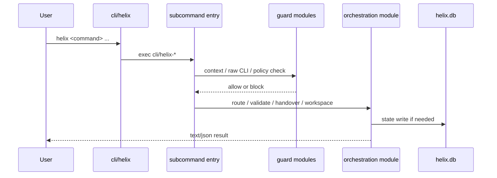

# 内部処理設計

## 1. 目的と境界

本書は HELIX-workflows V2 の L5 詳細設計として、CLI 実行から判定、永続化、hook 連携までの内部処理フローを結合レベルで固定する。対象はモジュール間の制御移譲、状態遷移、擬似コード、失敗時のふるまいであり、個別関数シグネチャや edge case の全列挙は L6 に送る。

## 2. 入力とトレース

| 区分 | 入力 | L5 で詳細化する観点 |
|---|---|---|
| L4 方式 | `docs/v2/L4-basic-design/方式設計.md` | 層責務、CLI 中心アーキテクチャ、hook/DB 分離 |
| L4 機能構成 | `docs/v2/L4-basic-design/機能構成設計.md` | Entry and Routing、Plan/Gate、Audit/Quality、Continuity の連携 |
| L4 データ | `docs/v2/L4-basic-design/データ設計.md` | 実行記録・監査・継続の保存タイミング |
| L4 外部 IF | `docs/v2/L4-basic-design/外部IF設計.md` | CLI、hook、HTTP route、SQLite 境界の呼出順 |
| 実装 | `cli/helix`, `cli/lib/route_engine.py`, `cli/lib/plan_validator.py`, `cli/lib/workspace_manager.py`, `cli/lib/handover.py`, `cli/lib/http_api/server.py`, `cli/lib/http_api/routes/*.py`, `cli/lib/helix_db.py` | 実際の制御順、fail-close 点、状態更新先 |

## 3. 主処理パイプライン

各処理 phase に安定 `IP-*` ID を付与する（L5↔L8 trace 用。L8 結合テスト設計の `IT-IP-*` はこの ID へ trace する。§5 の主要内部処理はこれら phase の詳細）。

| IP ID | Phase | 起点モジュール | 主処理 | 出力 |
|---|---|---|---|---|
| IP-01 | Entry | `cli/helix` | サブコマンド名を解決し `exec` で専用 entrypoint に委譲する | コマンド別 shell/Python 実行 |
| IP-02 | Guard | `context_guard.py`, `llm_guard.py` | 必須 context、raw CLI、hook 整合を検査する | 許可/拒否 verdict |
| IP-03 | Orchestration | `route_engine.py`, `plan_validator.py`, `workspace_manager.py`, `handover.py` | mode ルーティング、PLAN 検証、workspace 操作、handover 継続 | 実行方針、状態更新、再開情報 |
| IP-04 | Persistence | `helix_db.py`, `migrations/*.py` | run、audit、session、workspace の状態を SQLite に保存する | `helix.db` row 群 |
| IP-05 | Automation | `http_api/server.py`, `routes/push_pr.py`, `routes/hooks.py`, `routes/audit.py`, `routes/telemetry.py` | 外部 trigger を内部 run/audit 更新へ変換する | `automation_runs` / `audit_log` / `session_telemetry` |

## 4. CLI 入口から内部処理への遷移



`cli/helix` 自体は router に徹し、工程判断や DB 操作は持たない。これにより Bash router 層と Python application 層の責務が分離される。

### 4.1 サブコマンド dispatch 擬似コード

```text
input: argv[0]=subcommand, argv[1:]=args
1. CMD が空なら help を既定値にする
2. case 文で CMD に対応する cli/helix-* を選ぶ
3. 不明コマンドなら usage を stderr に出して exit 1
4. 既知コマンドなら exec で対象 entrypoint に制御を渡す
```

## 5. 主要内部処理

### 5.1 mode ルーティング

`RouteEngine.evaluate()` は signal、uncertainty、impact、env、drift_type から `mode / kind / subtype / priority / action` を返す。

```text
input: signal, uncertainty, impact, env, drift_type
1. signal alias を正規化する
2. severity を low/high に正規化する
3. signal と env から drift_type と route を解決する
4. uncertainty×impact の 2x2 表から priority/action を決める
5. suggest_command と recommended_command を組み立てる
6. RouteResult を返す
error: 不正 signal は RouteEngineError で fail-close
```

### 5.2 PLAN 検証

`plan_validator.py` は frontmatter を読み、V1/V2 plan_id、`process_layer`、`pairs_test_design`、role 定義、artifact path を照合する。

```text
input: plan markdown path
1. frontmatter を YAML として読み込む
2. 必須 field と型を抽出する
3. plan_id を V1/V2/unknown に分類する
4. role map から許容 role を読込む
5. parent/pair/generates の path 解決を試み、warn-only で記録する
6. warning 群を返し、gate 側が fail-close 条件へ昇格する
```

### 5.3 handover 継続

`handover.py` は `.helix/handover/CURRENT.json` / `CURRENT.md` を正本として、再開可否と stale 判定を行う。

| 状態 | 許可遷移 | 主要契機 |
|---|---|---|
| `in_progress` | `blocked`, `ready_for_review` | 作業継続、完了 |
| `blocked` | `in_progress`, `escalated` | 解消、停止 |
| `ready_for_review` | なし | TL/PM への引継ぎ |
| `escalated` | なし | 人間判断待ち |

```text
resume:
1. CURRENT の updated_at を読む
2. stale threshold を超えたら stale と判定する
3. owner/status/phase/sprint を読み、許可値か検査する
4. 継続可能なら owner や completed_files を更新する
5. Markdown summary と JSON を同時更新する
```

### 5.4 workspace 管理

`workspace_manager.py` は git worktree と `.helix/workspaces` を同期し、main repo 汚染を避ける。

| 状態 | 許可遷移 | 主処理 |
|---|---|---|
| `active` | `merged`, `dropped` | create / exec / merge |
| `merged` | なし | patch 適用済み |
| `dropped` | なし | 強制破棄または cleanup |

```text
merge:
1. main repo の dirty/untracked/submodule を検査する
2. workspace 側 diff を patch 化する
3. three_way 条件に応じて target 進行を検査する
4. git apply --check 相当で conflict を検出する
5. 適用成功後、workspace_registry.status を merged に更新する
```

### 5.5 HTTP automation

`create_app()` は `/health` を除き `validate_request_headers()` と `require_localhost_and_bearer()` を通す。各 route は `automation_runs` を起点に audit/telemetry を保存する。

```text
push/pr trigger:
1. path の plan_id と body 必須 field を検証する
2. automation_runs に run を INSERT する
3. push_gate.run_all_gates() を実行する
4. 成功/失敗で run status を completed/failed に更新する
5. audit_log に endpoint 起点の監査行を追記する
6. trace_id を含む response envelope を返す
```

## 6. 共通状態遷移

### 6.1 `automation_runs`

| 状態 | 遷移先 | 発火点 |
|---|---|---|
| `pending` | `running`, `failed`, `cancelled` | run 作成直後、または実行前 abort |
| `running` | `completed`, `failed`, `cancelled` | gate 実行完了、例外 |
| `completed` | なし | 正常終了 |
| `failed` | なし | gate 実行失敗、DB finalize 失敗 |

### 6.2 `session_telemetry`

`session_id` を一意キーに UPSERT し、`tokens_total` と `cost_usd` を累積管理する。session 終了時に `last_updated_at` が更新される。

### 6.3 `schema_version`

`helix_db.py` と additive migration (`v31`〜`v35`) は `schema_version` を通じて段階移行される。破壊的変更は扱わず、既定は additive migration + backward compatibility で進める。

## 7. 失敗時の原則

- 不正 command は router 層で `exit 1`
- 不正 plan frontmatter は validator 層で warning 化し、gate が fail-close 判定を持つ
- raw LLM CLI や hook 整合違反は guard 層で block する
- HTTP automation は `400/403/404/409/500` を使い分け、`trace_id` を必ず返す
- DB 例外時は route 層で `automation_runs` を `failed` に寄せる

## 8. L6 へ送る事項

本書では以下を確定しない。

- 個別関数の引数/戻り値シグネチャ
- command ごとの edge case 網羅
- migration 関数単位の分岐網羅
- route handler 単位の単体テストケース詳細

これらは L6 機能設計と L7/L8 の test-design で詳細化する。
