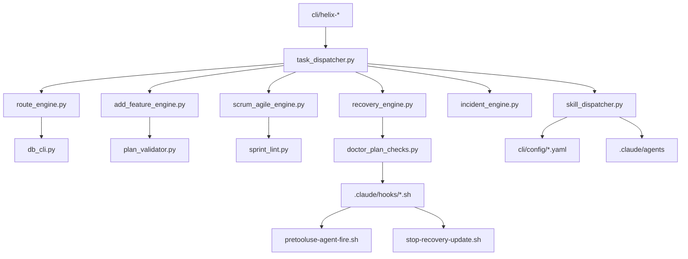

# HELIX-workflows モジュール分割設計（L5）

## §0 PLAN reference + scope 宣言

本設計は `docs/plans/L5/L5-helix-workflows-モジュール分割設計plan.md` の §2.1 を実体化する。

- 参照 PLAN: `docs/plans/L5/L5-helix-workflows-モジュール分割設計plan.md`
- 参照 L4 機能設計: `docs/v2/L4-architecture/helix-workflows-functional-design.md`
- 参照 L4 方式設計: `docs/v2/L4-architecture/helix-workflows-system-architecture.md`
- 参照 ADR: `docs/adr/ADR-044-helix-workflows-v2-architecture-snapshot.md`
- 参照内部設計: `docs/v2/L5-internal-design/helix-workflows-internal-processing-design.md`
- 参照ロール: `cli/ROLE_MAP.md`

### §0.1 本設計の拘束
- 対象はモジュール分割・責務分担・依存 graph の固定。
- 対象外は API 仕様、DB schema、外部接続、機能実装詳細。
- 対象範囲は pmo-sonnet inventory を原点とし、実ファイルとの差分を明示。

### §0.2 モジュール分割を行う理由
1. 役務分担の安定化（誰が何を触るかの可視化）。
2. 変更時の影響範囲を最短で算定できること。
3. 依存方向の明示と lint 自動化の起点を定義すること。
4. F1-F10 との traceability を固定化すること。

### §0.3 固定化方針
- 章立ては `§0` 〜 `§14` に固定。
- `implementation_status` は planned / partial / implemented を必ず記載。
- 禁止 7 種 subagent の扱いをこの設計で明記。
- F6-F10 の新規 module path を `cli/lib/{homeostasis,evolution,migration,apoptosis,coexist}.py` に固定。

## §1 module 分類体系 (11 大分類)

### §1.1 全体構造（11 大分類）

- M1: cli/（bash entry dispatcher）
- M2: cli/lib/（Python helper）
- M3: .claude/hooks/（イベント/監査）
- M4: .claude/agents/（role 委譲）
- M5: cli/config/（YAML 設定）
- M6: skills/（agent/prompt 資産）
- M7: scripts/git-hooks/（VCS 保護）
- M8: docs/v2/（設計情報）
- M9: docs/plans/（工程表）
- M10: docs/adr/（決定履歴）
- M11: HELIX-workflows/（業務ルール本体）

### §1.2 分類ガード
- いずれも 1 層は 1 主要責務を持つ。
- 交差依存はドキュメント上で宣言（依存行列）し、隠れ依存を排除。
- 追加モジュール時の命名規約を M1〜M11 横断で適用。

### §1.3 固定数（観測値）
- M1: `cli/` = 80 entry (canonical: `find cli -maxdepth 1 -name 'helix-*' -type f -executable | wc -l` = 80。2026-05-29 functional-registry で確定、§14 集計と一致。ls ベースの 93/94 は非実行ファイル・dir entry を含む過大計上)
- M1-s: `cli/helix-plan-cmds` = 12 file
- M2: `cli/lib/` `*.py` = 139 file（非テスト）
- M3: `.claude/hooks/` = 17 file
- M4: `.claude/agents/` = 19 file
- M5: `cli/config/` = 5 file
- M6: `skills/` = 119 `SKILL.md`
- M7: `scripts/git-hooks/` = 2 file

### §1.4 差分メモ
- pmo-sonnet inventory の想定値と実体に差分があった（72/84 は古い想定。canonical は `find -type f -executable` で cli 80 entry + plan-cmds 12 file = 92 件、2026-05-29 functional-registry で確定。ls ベースの 93/94 は dir entry 等を含む過大計上）。
- 差分は本 PLAN の前提差分として採番し、次アクションで解消。

## §2 機能 × module matrix (F1-F10 × 各 module、表形式)

### §2.0 機能マップ

| 機能 | 代表モジュール | 主要触媒 |
|---|---|---|
| F1 | docs/template 管理 | plan_validator, workflow_dsl_parser, vmodel_lint |
| F2 | PLAN template 管理 | plan_parser, plan_lint, plan_dependencies |
| F3 | skill/discovery | skill_catalog, skill_recommender, skill_dispatcher |
| F4 | 9 mode 入口 | task_dispatcher, route_engine, scrum_local |
| F5 | オーケストレーション | doctor_plan_checks, helix_doctor, codex_* |
| F6 | homeostasis | (new) homeostasis.py, plan_health, scheduler_helper |
| F7 | evolution | learning_engine, matrix_advisor, gate_check_generator |
| F8 | reproduction | recovery_engine, recovery_workflow_engine |
| F9 | apoptosis | recovery_plan_check, demotion_checker, rollback_orchestrator |
| F10 | coexist | compatibility_adapter, coexist path, migration.py |

### §2.1 F1-F10 詳細行（観測表現）

> **L8 結合テスト pointer の意味論**: 本 §2.1 は機能 (F1-F10) 別の module 割付 matrix のため、L8 pointer は per-function 内部処理結合を検証する `IT-IP-Fx` (L8 §2、F organized) を指す。一方 module-layer 横断の結合 (cli↔cli/lib / hook↔cli/lib 等) は §3-§9 の module 一覧が `IT-MOD` (L8 §3、CLI/HOOK/SUB/SKILL organized) と pair する。frontmatter `pairs_test_design` は両者 (IT-MOD 主 + dependency-resolution) を列挙済。

### §2.1.F1 モジュール割付
| function ID | owner module / file path | public command / bash func / python func / config schema | dependency direction | implementation_status | L6 関数仕様 pointer | L8 結合テスト pointer | 例外・carry 理由 |
|---|---|---|---|---|---|---|---|
| F1-1 | `cli/helix-doctor` | `helix doctor --check-doc-lifecycle` | `cli/helix-doctor -> cli/lib/vmodel_lint.py` | implemented | `→ L6 関数仕様 §F1` | `→ L8 IT-IP-F1` | doctor は集約入口。4 artifact 判定本体は lib 側へ委譲。 |
| F1-2 | `cli/lib/vmodel_lint.py` | `main(argv=None)` | `vmodel_lint -> cli/lib/vmodel_pair_freeze.py` | implemented | `→ L6 関数仕様 §F1` | `→ L8 IT-IP-F1` | 双方向 trace lint の本体。 |
| F1-3 | `cli/lib/vmodel_pair_freeze.py` | `check_pair_freeze()` | `vmodel_pair_freeze -> docs/plans + docs/v2` | implemented | `→ L6 関数仕様 §F1` | `→ L8 IT-IP-F1` | pair freeze 監査と stale revision 補助を保持。 |
| F1-4 | `cli/lib/test_design_scaffold.py` | `generate_skeleton() / write_scaffold()` | `test_design_scaffold -> paired design docs` | implemented | `→ L6 関数仕様 §F1` | `→ L8 IT-IP-F1` | 設計 doc から test design 雛形を生成し 4 artifact を接続。 |
| F1-5 | `cli/lib/gate_check_generator.py` | `build_doc_map()` | `gate_check_generator -> doc-map.yaml -> hooks` | implemented | `→ L6 関数仕様 §F1` | `→ L8 IT-IP-F1` | 編集 path と設計 doc の結線点。 |
| F1-6 | `cli/templates/docs/PLAN.md.template` | `PLAN.md.template` | `template -> cli/helix-plan -> docs/plans` | implemented | `→ L6 関数仕様 §F1` | `→ L8 IT-IP-F1` | 4 artifact 記法の文書 SSoT。runtime 判定は持たない。 |

### §2.1.F2 モジュール割付
| function ID | owner module / file path | public command / bash func / python func / config schema | dependency direction | implementation_status | L6 関数仕様 pointer | L8 結合テスト pointer | 例外・carry 理由 |
|---|---|---|---|---|---|---|---|
| F2-1 | `cli/helix-plan` | `helix plan {create,validate,status,review}` | `cli/helix-plan -> plan_parser / plan_validator / plan_health` | implemented | `→ L6 関数仕様 §F2` | `→ L8 IT-IP-F2` | PLAN frontmatter の公開入口。 |
| F2-2 | `cli/lib/plan_parser.py` | `parse_frontmatter() / upsert_plan()` | `plan_parser -> plan_dependencies + helix.db` | implemented | `→ L6 関数仕様 §F2` | `→ L8 IT-IP-F2` | 構文解析と registry 反映を担当。 |
| F2-3 | `cli/lib/plan_validator.py` | `validate_plan() / detect_dependency_cycle()` | `plan_validator -> parsed frontmatter + role config` | implemented | `→ L6 関数仕様 §F2` | `→ L8 IT-IP-F2` | 意味検証と依存 graph 検査。 |
| F2-4 | `cli/lib/plan_lint.py` | `validate_plan_frontmatter()` | `plan_lint -> plan_validator.VALID_KINDS` | implemented | `→ L6 関数仕様 §F2` | `→ L8 IT-IP-F2` | 文面 lint と重複警告の静的層。 |
| F2-5 | `cli/lib/plan_dependencies.py` | `load_dependencies() / save_dependencies()` | `plan_dependencies -> plan_registry / helix.db` | implemented | `→ L6 関数仕様 §F2` | `→ L8 IT-IP-F2` | DAG 保存専用。validator 本体とは分離。 |
| F2-6 | `.claude/hooks/posttooluse-plan-auto-register.sh` | `PostToolUse(Edit/Write on PLAN*.md)` | `hook -> plan_parser -> compatibility_adapter.write_connection()` | implemented | `→ L6 関数仕様 §F2` | `→ L8 IT-IP-F2` | PLAN 更新直後の registry 自動同期。 |
| F2-7 | `cli/lib/plan_health.py` | `scan_all_plans()` | `plan_health -> docs/plans tree` | partial | `→ L6 関数仕様 §F2` | `→ L8 IT-IP-F2` | 健康度集計はあるが completeness gate との fail-close 接続は未完。 |

- `plan_parser.py` は frontmatter 読み取りと DB 反映だけを持ち、意味検証を抱え込まない。ここで validation まで行うと、更新時に parse failure と policy failure の責務が混線する。
- `plan_validator.py` は path 存在、role、依存 cycle の外部整合を担当し、書き込みを持たない。失敗時は warning / fail を返すだけに凍結する。
- `plan_lint.py` は文面規約と duplicate 候補の静的 lint に限定し、`plan_validator.py` のロジックを再実装しない。3 層分離を壊すと運用時の failure attribution ができなくなる。

### §2.1.F3 モジュール割付
| function ID | owner module / file path | public command / bash func / python func / config schema | dependency direction | implementation_status | L6 関数仕様 pointer | L8 結合テスト pointer | 例外・carry 理由 |
|---|---|---|---|---|---|---|---|
| F3-1 | `cli/helix-skill` | `helix skill {search,chain,use,catalog rebuild,stats}` | `cli/helix-skill -> skill_recommender / skill_dispatcher` | implemented | `→ L6 関数仕様 §F3` | `→ L8 IT-IP-F3` | skill 操作の統一 CLI。 |
| F3-2 | `cli/lib/skill_catalog.py` | `build_catalog() / load_catalog()` | `skill_catalog -> skills/**/SKILL.md` | implemented | `→ L6 関数仕様 §F3` | `→ L8 IT-IP-F3` | catalog 再生成の source of truth。 |
| F3-3 | `cli/lib/skill_recommender.py` | `recommend()` | `skill_recommender -> skill_catalog + TTL cache` | implemented | `→ L6 関数仕様 §F3` | `→ L8 IT-IP-F3` | 推挙 score と cache key を管理。 |
| F3-4 | `cli/lib/skill_dispatcher.py` | `dispatch() / determine_agent()` | `skill_dispatcher -> helix codex/claude` | implemented | `→ L6 関数仕様 §F3` | `→ L8 IT-IP-F3` | 推奨結果を実行アクションへ変換。 |
| F3-5 | `.claude/hooks/posttooluse-skill-catalog-rebuild.sh` | `PostToolUse(SKILL.md Write/Edit)` | `hook -> skill_catalog -> json/jsonl cache` | implemented | `→ L6 関数仕様 §F3` | `→ L8 IT-IP-F3` | catalog rebuild の debounce 起点。 |

### §2.1.F4 モジュール割付
| function ID | owner module / file path | public command / bash func / python func / config schema | dependency direction | implementation_status | L6 関数仕様 pointer | L8 結合テスト pointer | 例外・carry 理由 |
|---|---|---|---|---|---|---|---|
| F4-1 | `cli/helix-route` | `helix route` | `cli/helix-route -> cli/lib/route_engine.py` | implemented | `→ L6 関数仕様 §F4` | `→ L8 IT-IP-F4` | 9 mode 入口の公開 command。 |
| F4-2 | `cli/lib/route_engine.py` | `RouteEngine.evaluate() / from_detect_output()` | `route_engine -> route result only` | implemented | `→ L6 関数仕様 §F4` | `→ L8 IT-IP-F4` | 判定専用。実行 side effect を持たない。 |
| F4-3 | `cli/lib/task_dispatcher.py` | `dispatch_task()` | `task_dispatcher -> helix command / shell / webhook adapters` | implemented | `→ L6 関数仕様 §F4` | `→ L8 IT-IP-F4` | task type ごとの実行変換層。 |
| F4-4 | `cli/lib/workflow_dsl_parser.py` | `load_workflow() / validate_workflow_schema()` | `workflow_dsl_parser -> recovery/escalation workflow yaml` | partial | `→ L6 関数仕様 §F4` | `→ L8 IT-IP-F4` | DSL 実装範囲は recovery/escalation 中心で、9 mode 全域ではない。 |
| F4-5 | `cli/lib/scrum_local.py` | `init_local_loop() / verify_loop() / decide_loop()` | `scrum_local -> compatibility_adapter.write_connection()` | implemented | `→ L6 関数仕様 §F4` | `→ L8 IT-IP-F4` | Discovery/Scrum 系 state machine の局所永続化。 |
| F4-6 | `cli/lib/reverse_local.py` | `route_to_forward()` | `reverse_local -> reverse loop state -> Forward handoff` | implemented | `→ L6 関数仕様 §F4` | `→ L8 IT-IP-F4` | Reverse から Forward への接続専任。 |

- `route_engine.py` は canonical mode 決定と alias 正規化だけを担当し、子 workflow を直接起動しない。ここに side effect を入れると route 判定の再利用と dry-run が壊れる。
- `task_dispatcher.py` は承認済み task_type を `helix` command / shell / webhook へ変換する実行層であり、route 判定ロジックを再計算しない。判定失敗時は `DispatchError` を返して blocked 扱いに倒す。
- routing 境界を 2 層に固定する理由は、mode 推奨の説明責務と実行責務を切り離し、fail-open な誤遷移を防ぐためである。

### §2.1.F5 モジュール割付
| function ID | owner module / file path | public command / bash func / python func / config schema | dependency direction | implementation_status | L6 関数仕様 pointer | L8 結合テスト pointer | 例外・carry 理由 |
|---|---|---|---|---|---|---|---|
| F5-1 | `cli/helix-codex` | `helix codex --role <role>` | `cli/helix-codex -> codex_thinking / codex_post_validation / codex_post_hook` | implemented | `→ L6 関数仕様 §F5` | `→ L8 IT-IP-F5` | Codex dispatch と post-audit の主入口。 |
| F5-2 | `cli/helix-claude` | `helix claude --role <role>` | `cli/helix-claude -> prompt/task-file generation` | implemented | `→ L6 関数仕様 §F5` | `→ L8 IT-IP-F5` | Claude 側の read/write 文脈注入を担当。 |
| F5-3 | `cli/helix-agent` | `helix agent {fire-mandatory,suggest,audit}` | `cli/helix-agent -> agent_mandatory / agent_slots` | implemented | `→ L6 関数仕様 §F5` | `→ L8 IT-IP-F5` | mandatory/on-demand agent の統制入口。 |
| F5-4 | `cli/helix-doctor` | `helix doctor --summary` | `cli/helix-doctor -> doctor_plan_checks / doctor_recovery_check / doctor_summary` | implemented | `→ L6 関数仕様 §F5` | `→ L8 IT-IP-F5` | doctor 系監査の公開 command。 |
| F5-5 | `cli/lib/doctor_plan_checks.py` | `run_check_plan_drift() / run_check_plan_cycle()` | `doctor_plan_checks -> plan_parser / plan_validator results` | implemented | `→ L6 関数仕様 §F5` | `→ L8 IT-IP-F5` | PLAN drift / generates / dependency の監査本体。 |
| F5-6 | `cli/lib/gate_check_generator.py` | `build_doc_map()` | `gate_check_generator -> matrix_compiler -> gate files` | implemented | `→ L6 関数仕様 §F5` | `→ L8 IT-IP-F5` | gate/doc-map 生成の接点。 |
| F5-7 | `.claude/hooks/pretooluse-agent-guard.sh` | `PreToolUse(Agent)` | `PreToolUse guard -> tool/model family policy` | implemented | `→ L6 関数仕様 §F5` | `→ L8 IT-IP-F5` | 非許可 tool / model family を fail-close。 |
| F5-8 | `.claude/hooks/pretooluse-agent-fire.sh` | `PreToolUse(Agent auto fire)` | `PreToolUse fire -> session_helper / agent_slots` | implemented | `→ L6 関数仕様 §F5` | `→ L8 IT-IP-F5` | subagent 呼び出し前の slot 記録。 |
| F5-9 | `.claude/hooks/post-tool-use.sh` | `PostToolUse dispatcher` | `PostToolUse -> posttooluse-* fan-out` | implemented | `→ L6 関数仕様 §F5` | `→ L8 IT-IP-F5` | 書き込み後の自動後処理集約。 |
| F5-10 | `cli/lib/compatibility_adapter.py` | `write_connection()` | `compatibility_adapter -> dual-write / cutover db routing` | implemented | `→ L6 関数仕様 §F5` | `→ L8 IT-IP-F5` | DB write の物理ルーティング境界。 |
| F5-11 | `cli/lib/helix_db.py` | `record_invocation() / record_selection()` | `helix_db -> sqlite persistence` | implemented | `→ L6 関数仕様 §F5` | `→ L8 IT-IP-F5` | 実行監査と selection 記録の永続化。 |

- `cli/helix-doctor` は shell entry の集約器で、診断ロジックは `doctor_plan_checks.py` と `doctor_recovery_check.py` に押し込める。doctor entry 自身が判定本体を持つと、レビュー不能な bash 条件分岐が増えるため凍結する。
- `doctor_plan_checks.py` は read-only finding 生成、`gate_check_generator.py` は gate/doc-map 生成に責務を限定する。両者を混在させると「監査」と「生成」が相互依存し、doctor の失敗が artifact 生成まで巻き込む。
- `pretooluse-agent-guard.sh` / `pretooluse-agent-fire.sh` / `post-tool-use.sh` は PreToolUse と PostToolUse を跨がない。事前ガード、事前記録、事後ファンアウトの順序を固定し、途中失敗時は block or continue の責務を明確化する。
- `cli/helix-codex` は dispatch と audit 境界を持ち、`codex_post_validation.py` が allowed-files / diff_lines を、`codex_post_hook.py` が review score 永続化を担当する。順序を崩すと scope 逸脱検知より先に DB 書き込みが発生する。
- helix.db write は `compatibility_adapter.write_connection()` を唯一の物理境界に固定する。上位 hook/CLI から SQLite へ直接書くと dual-write / cutover / rollback の対称性が失われるため凍結する。

### §2.1.F6 モジュール割付
| function ID | owner module / file path | public command / bash func / python func / config schema | dependency direction | implementation_status | L6 関数仕様 pointer | L8 結合テスト pointer | 例外・carry 理由 |
|---|---|---|---|---|---|---|---|
| F6-1 | `cli/lib/homeostasis.py` | `planned: helix budget --homeostasis` | `homeostasis.py -> budget.py / plan_health.py / scheduler_helper.py` | planned | `→ L6 関数仕様 §F6` | `→ L8 IT-IP-F6` | §0.3 freeze path。実ファイル未作成。 |
| F6-2 | `cli/lib/budget.py` | `collect_status()` | `budget.py -> Claude/Codex budget sources` | partial | `→ L6 関数仕様 §F6` | `→ L8 IT-IP-F6` | 消費収集はあるが閾値判定は homeostasis 専用に未統合。 |
| F6-3 | `cli/lib/budget_cli.py` | `cmd_status() / cmd_forecast() / main()` | `budget_cli -> budget.collect_status()` | partial | `→ L6 関数仕様 §F6` | `→ L8 IT-IP-F6` | homeostasis 専用 subcommand は未追加。 |
| F6-4 | `cli/lib/plan_health.py` | `scan_all_plans()` | `plan_health -> docs/plans + plan metadata` | implemented | `→ L6 関数仕様 §F6` | `→ L8 IT-IP-F6` | PLAN health の既存指標を提供。 |
| F6-5 | `cli/lib/scheduler_helper.py` | `run_due_schedules() / requeue_stale_schedules()` | `scheduler_helper -> task_dispatcher` | implemented | `→ L6 関数仕様 §F6` | `→ L8 IT-IP-F6` | 再実行と並列度制御の既存基盤。 |
| F6-6 | `.claude/hooks/precompact-state-snapshot.sh` | `PreCompact snapshot` | `PreCompact -> blocked_sessions + backup` | implemented | `→ L6 関数仕様 §F6` | `→ L8 IT-IP-F6` | 高負荷時 compact 前退避。閾値判定は持たない。 |
| F6-7 | `cli/lib/session_start_helpers.py` | `build_progress_block()` | `session_start_helpers -> helix status / handover` | partial | `→ L6 関数仕様 §F6` | `→ L8 IT-IP-F6` | 可視化はあるが metrics_log 連携は未実装。 |

### §2.1.F7 モジュール割付
| function ID | owner module / file path | public command / bash func / python func / config schema | dependency direction | implementation_status | L6 関数仕様 pointer | L8 結合テスト pointer | 例外・carry 理由 |
|---|---|---|---|---|---|---|---|
| F7-1 | `cli/lib/evolution.py` | `planned: helix evolution {score,promote,deprecate}` | `evolution.py -> learning_engine.py / demotion_checker.py` | planned | `→ L6 関数仕様 §F7` | `→ L8 IT-IP-F7` | §0.3 freeze path。CLI 契約のみ先に固定。 |
| F7-2 | `cli/helix-learn` | `helix learn` | `cli/helix-learn -> learning_engine.py` | implemented | `→ L6 関数仕様 §F7` | `→ L8 IT-IP-F7` | 成功 run から recipe を生成する既存入口。 |
| F7-3 | `cli/helix-promote` | `helix promote` | `cli/helix-promote -> learning_engine.find_recipe()` | implemented | `→ L6 関数仕様 §F7` | `→ L8 IT-IP-F7` | recipe を builder 生成物へ昇格。 |
| F7-4 | `cli/lib/learning_engine.py` | `analyze_success() / save_recipe() / find_recipe()` | `learning_engine -> helix.db + global_store` | implemented | `→ L6 関数仕様 §F7` | `→ L8 IT-IP-F7` | score 入力と学習結果の永続化本体。 |
| F7-5 | `cli/lib/matrix_advisor.py` | `run_advisory()` | `matrix_advisor -> matrix index/state` | partial | `→ L6 関数仕様 §F7` | `→ L8 IT-IP-F7` | advisory only。自動 promote/deprecate は未接続。 |
| F7-6 | `cli/lib/demotion_checker.py` | `check_demotion_eligibility() / demote()` | `demotion_checker -> violation history` | implemented | `→ L6 関数仕様 §F7` | `→ L8 IT-IP-F7` | 降格判定の局所ロジック。 |

### §2.1.F8 モジュール割付
| function ID | owner module / file path | public command / bash func / python func / config schema | dependency direction | implementation_status | L6 関数仕様 pointer | L8 結合テスト pointer | 例外・carry 理由 |
|---|---|---|---|---|---|---|---|
| F8-1 | `cli/lib/migration.py` | `planned: helix version bump --major/--minor` | `migration.py -> migrate.py / compatibility_adapter.py` | planned | `→ L6 関数仕様 §F8` | `→ L8 IT-IP-F8` | §0.3 freeze path。現状は `migrate.py` が近縁機能を代行。 |
| F8-2 | `cli/lib/migrate.py` | `main(argv=None) / merge_yaml()` | `migrate.py -> template merge + settings merge` | implemented | `→ L6 関数仕様 §F8` | `→ L8 IT-IP-F8` | テンプレート migration の現行実装。 |
| F8-3 | `cli/lib/compatibility_adapter.py` | `write_connection()` | `compatibility_adapter -> dual-write / cutover` | implemented | `→ L6 関数仕様 §F8` | `→ L8 IT-IP-F8` | 世代移行中の DB routing 境界。 |
| F8-4 | `cli/lib/recovery_engine.py` | `main(argv=None)` | `recovery_engine -> recovery_plan_check.py` | implemented | `→ L6 関数仕様 §F8` | `→ L8 IT-IP-F8` | 中断時 safe mode への回収経路。 |
| F8-5 | `cli/lib/recovery_workflow_engine.py` | `main(argv=None) / snapshot_on_stop()` | `recovery_workflow_engine -> rollback_orchestrator.py` | implemented | `→ L6 関数仕様 §F8` | `→ L8 IT-IP-F8` | 段階的 recovery workflow の state 管理。 |
| F8-6 | `cli/lib/rollback_orchestrator.py` | `rollback_preflight() / rollback_execute()` | `rollback_orchestrator -> backup manifest` | implemented | `→ L6 関数仕様 §F8` | `→ L8 IT-IP-F8` | migration 失敗時の唯一の reverse gate。 |

- `migration.py` は将来の version/portable orchestration 契約を受け持つ planned wrapper とし、既存 `migrate.py` の template merge 実装をそのまま抱き込まない。意図決定と実体変更を分けるためである。
- `recovery_engine.py` は mode-level triage、`recovery_workflow_engine.py` は phase/state の継続管理、`rollback_orchestrator.py` は巻き戻し実行に責務を固定する。失敗時に 3 者が同じ state を書き始める設計は不可とする。
- migration/recovery 境界を凍結する理由は、upgrade 失敗時の復旧 path を 1 本に絞り、partial apply と rollback の監査証跡を二重化しないためである。

### §2.1.F9 モジュール割付
| function ID | owner module / file path | public command / bash func / python func / config schema | dependency direction | implementation_status | L6 関数仕様 pointer | L8 結合テスト pointer | 例外・carry 理由 |
|---|---|---|---|---|---|---|---|
| F9-1 | `cli/lib/apoptosis.py` | `planned: helix plan apoptosis --dry-run/--execute` | `apoptosis.py -> recovery_plan_check.py / compatibility_adapter.py` | planned | `→ L6 関数仕様 §F9` | `→ L8 IT-IP-F9` | §0.3 freeze path。自動 archive/cleanup 本体は未着手。 |
| F9-2 | `cli/lib/recovery_plan_check.py` | `check_recovery_plan_freshness() / check_session_exit_4items()` | `recovery_plan_check -> recovery markdown + revised date` | implemented | `→ L6 関数仕様 §F9` | `→ L8 IT-IP-F9` | stale 判定と session exit checklist を提供。 |
| F9-3 | `cli/lib/doctor_recovery_check.py` | `run_check_recovery_freshness()` | `doctor_recovery_check -> recovery_plan_check` | implemented | `→ L6 関数仕様 §F9` | `→ L8 IT-IP-F9` | doctor から stale recovery plan を監査。 |
| F9-4 | `cli/lib/demotion_checker.py` | `check_demotion_eligibility() / demote()` | `demotion_checker -> violation history` | implemented | `→ L6 関数仕様 §F9` | `→ L8 IT-IP-F9` | lifecycle 降格判定の局所ロジック。 |
| F9-5 | `cli/lib/rollback_orchestrator.py` | `rollback_preflight() / rollback_execute()` | `rollback_orchestrator -> backup manifest + cleanup window` | partial | `→ L6 関数仕様 §F9` | `→ L8 IT-IP-F9` | rollback はあるが stale PLAN archive の自動実行とは未統合。 |
| F9-6 | `cli/lib/compatibility_adapter.py` | `write_connection()` | `compatibility_adapter -> helix.db physical write routing` | partial | `→ L6 関数仕様 §F9` | `→ L8 IT-IP-F9` | obsolete cleanup の write gateway 候補。apoptosis 専用 table update は未実装。 |

- lifecycle cleanup の DB write は `compatibility_adapter.write_connection()` を通す前提に固定し、hook や shell からの直書きを許可しない。これにより cutover 中でも archive / obsolete update を同一経路で追跡できる。
- `recovery_plan_check.py` は stale 判定と exit checklist の read-only 判断に留め、削除実行を持たない。削除実行まで抱えると autophagy failure と freshness warning を分離できなくなる。

### §2.1.F10 モジュール割付
| function ID | owner module / file path | public command / bash func / python func / config schema | dependency direction | implementation_status | L6 関数仕様 pointer | L8 結合テスト pointer | 例外・carry 理由 |
|---|---|---|---|---|---|---|---|
| F10-1 | `cli/lib/coexist.py` | `planned: helix coexist {framework,status,adopt}` | `coexist.py -> compatibility_adapter.py / merge_settings.py` | planned | `→ L6 関数仕様 §F10` | `→ L8 IT-IP-F10` | §0.3 freeze path。共生 command は未実装。 |
| F10-2 | `cli/lib/compatibility_adapter.py` | `write_connection()` | `compatibility_adapter -> dual-write / cutover db routing` | partial | `→ L6 関数仕様 §F10` | `→ L8 IT-IP-F10` | DB coexist の下位 adapter。namespace/ACL 判定までは未到達。 |
| F10-3 | `cli/lib/merge_settings.py` | `merge() / merge_settings_for_migrate()` | `merge_settings -> external settings.json hooks` | partial | `→ L6 関数仕様 §F10` | `→ L8 IT-IP-F10` | 既存 framework 設定へ HELIX hook を共生挿入する土台。 |
| F10-4 | `cli/lib/shadow_replay.py` | `replay_to_shadow_db()` | `shadow_replay -> projection state comparison` | partial | `→ L6 関数仕様 §F10` | `→ L8 IT-IP-F10` | 共生中の新旧 state を並走比較する補助。 |
| F10-5 | `cli/lib/cutover_orchestrator.py` | `cutover_preflight() / cutover_execute()` | `cutover_orchestrator -> compatibility_adapter / shadow_replay` | partial | `→ L6 関数仕様 §F10` | `→ L8 IT-IP-F10` | 共生解除または主系切替の判定点。 |
| F10-6 | `cli/lib/rollback_orchestrator.py` | `rollback_preflight() / rollback_execute()` | `rollback_orchestrator -> coexist/cutover rollback path` | partial | `→ L6 関数仕様 §F10` | `→ L8 IT-IP-F10` | 共生失敗時の退避経路。coexist 専用 metadata は未定義。 |

## §3 cli/ dispatcher

### §3.1 helix-* bash entry 一覧 (実測 93 + plan-cmds 12 file = 105)

本節は entry の物理一覧を凍結する。

#### §3.1.1 既存 entry 一覧（実測 93、本 doc 一覧の追補は L7 carry）
- cli/helix-add-feature
- cli/helix-agent
- cli/helix-asset
- cli/helix-audit
- cli/helix-auto-run
- cli/helix-bats-cleanup
- cli/helix-bench
- cli/helix-budget
- cli/helix-builder
- cli/helix-check-claudemd
- cli/helix-claude
- cli/helix-code
- cli/helix-codex
- cli/helix-commands
- cli/helix-context
- cli/helix-dashboard
- cli/helix-db
- cli/helix-debt
- cli/helix-debug
- cli/helix-detect
- cli/helix-discover
- cli/helix-discovery
- cli/helix-doctor
- cli/helix-drift-check
- cli/helix-entry
- cli/helix-gate
- cli/helix-gate-api-check
- cli/helix-handover
- cli/helix-harness
- cli/helix-heartbeat-scheduler
- cli/helix-hook
- cli/helix-incident
- cli/helix-init
- cli/helix-innovation
- cli/helix-interrupt
- cli/helix-job
- cli/helix-learn
- cli/helix-lock
- cli/helix-log
- cli/helix-matrix
- cli/helix-meta-phase
- cli/helix-migrate
- cli/helix-mode
- cli/helix-observe
- cli/helix-plan
- cli/helix-pr
- cli/helix-promote
- cli/helix-push
- cli/helix-readiness
- cli/helix-recipe
- cli/helix-recover
- cli/helix-recovery
- cli/helix-refactor
- cli/helix-research
- cli/helix-retro
- cli/helix-retrofit
- cli/helix-reverse
- cli/helix-review
- cli/helix-route
- cli/helix-scheduler
- cli/helix-scrum
- cli/helix-scrum-agile
- cli/helix-session-start
- cli/helix-session-summary
- cli/helix-setup
- cli/helix-size
- cli/helix-skill
- cli/helix-sprint
- cli/helix-status
- cli/helix-statusline
- cli/helix-stop-hook
- cli/helix-task
- cli/helix-team
- cli/helix-test
- cli/helix-test-debug
- cli/helix-test-design-scaffold
- cli/helix-verify-agent
- cli/helix-verify-all
- cli/helix-vmodel
- cli/helix-workspace

#### §3.1.2 plan-cmds 一覧（12）
- cli/helix-plan-cmds/_shared.sh
- cli/helix-plan-cmds/deps.sh
- cli/helix-plan-cmds/draft.sh
- cli/helix-plan-cmds/finalize.sh
- cli/helix-plan-cmds/generates.sh
- cli/helix-plan-cmds/import.sh
- cli/helix-plan-cmds/lint.sh
- cli/helix-plan-cmds/list.sh
- cli/helix-plan-cmds/mini.sh
- cli/helix-plan-cmds/reset.sh
- cli/helix-plan-cmds/review.sh
- cli/helix-plan-cmds/status.sh

### §3.2 役割 dispatch table (cli/ROLE_MAP.md 連動)

`cli/ROLE_MAP.md` はロール定義 31 を示すが、dispatch は本節で固定。

- plan 系: tl / docs / pg（主）
- code 系: tl / se / qa
- discovery / mode 系: tl / pg / pmo-sonnet
- audit / doctor 系: security / qa / tl
- skill 系: recommender / docs / pmo-sonnet
- db/detect 系: dba / tl

#### §3.2.1 dispatch 規約
- `helix-*` は `cli/lib` のみ直接操作を持つ。
- hook 呼び出しは `hooks` 側で監査。
- `be-*` 禁止 file は dispatch 起点にしない。

## §4 cli/lib/ Python helper (138 module、4 層分類)

### §4.1 engine 層 (mode エンジン)

- 追加対象: `*_engine.py`
- cli/lib/add_feature_engine.py
- cli/lib/agent_engine.py
- cli/lib/auto_run_engine.py
- cli/lib/escalation_engine.py
- cli/lib/incident_engine.py
- cli/lib/learning_engine.py
- cli/lib/recovery_engine.py
- cli/lib/recovery_workflow_engine.py
- cli/lib/refactor_engine.py
- cli/lib/retrofit_engine.py
- cli/lib/route_engine.py
- cli/lib/scrum_agile_engine.py

### §4.2 DB アクセス層

- cli/lib/db_cli.py
- cli/lib/discovery_migrate.py
- cli/lib/drift_db_diff.py
- cli/lib/dual_write_connection.py
- cli/lib/dual_write_mismatch.py
- cli/lib/event_envelope.py
- cli/lib/feedback_hook.py
- cli/lib/helix_db.py
- cli/lib/migrate.py
- cli/lib/plan_registry.py

### §4.3 validator / lint 層

- cli/lib/agent_policy_guard.py
- cli/lib/audit_validator.py
- cli/lib/context_guard.py
- cli/lib/job_p0_guard.py
- cli/lib/llm_guard.py
- cli/lib/phase_guard.py
- cli/lib/plan_frontmatter.py
- cli/lib/plan_lint.py
- cli/lib/plan_validator.py
- cli/lib/research_guard.py
- cli/lib/research_tool_guard.py
- cli/lib/skill_frontmatter_lint.py
- cli/lib/skip_annotation_linter.py
- cli/lib/sprint_lint.py
- cli/lib/vmodel_lint.py
- cli/lib/zizmor_ignore_lint.py

### §4.4 helper / 共通層

- cli/lib/agent_mandatory.py
- cli/lib/agent_slots.py
- cli/lib/allowed_files_estimator.py
- cli/lib/audit_a1.py
- cli/lib/audit_hash.py
- cli/lib/audit_inventory.py
- cli/lib/budget.py
- cli/lib/budget_cli.py
- cli/lib/budget_forecast.py
- cli/lib/code_catalog.py
- cli/lib/code_edges.py
- cli/lib/code_recommender.py
- cli/lib/codex_post_hook.py
- cli/lib/codex_post_validation.py
- cli/lib/codex_thinking.py
- cli/lib/command_catalog.py
- cli/lib/command_mapper.py
- cli/lib/compaction_adapter.py
- cli/lib/compatibility_adapter.py
- cli/lib/concurrent_lock.py
- cli/lib/contract_registry.py
- cli/lib/correlation_context.py
- cli/lib/cutover_orchestrator.py
- cli/lib/defaults_loader.py
- cli/lib/deferred_findings.py
- cli/lib/deliverable_gate.py
- cli/lib/demotion_checker.py
- cli/lib/doc_map_matcher.py
- cli/lib/doctor_plan_checks.py
- cli/lib/doctor_recovery_check.py
- cli/lib/doctor_summary.py
- cli/lib/effort_classifier.py
- cli/lib/entry_helper.py
- cli/lib/escalation_integration.py
- cli/lib/freeze_checker.py
- cli/lib/gate_check_generator.py
- cli/lib/gate_policy_helper.py
- cli/lib/global_store.py
- cli/lib/handover.py
- cli/lib/handover_auto_dump.py
- cli/lib/harness_monitor.py
- cli/lib/helix_db.py
- cli/lib/hook_payload.py
- cli/lib/init_helpers.py
- cli/lib/invocation_helper.py
- cli/lib/job_queue_helper.py
- cli/lib/llm_classifier_base.py
- cli/lib/lock_helper.py
- cli/lib/matrix_advisor.py
- cli/lib/matrix_compiler.py
- cli/lib/merge_settings.py
- cli/lib/meta_phase.py
- cli/lib/model_fallback.py
- cli/lib/model_registry.py
- cli/lib/observability_helper.py
- cli/lib/paths.py
- cli/lib/plan_dependencies.py
- cli/lib/plan_deps_helper.py
- cli/lib/plan_health.py
- cli/lib/plan_parser.py
- cli/lib/plan_schema.py
- cli/lib/projector_lag.py
- cli/lib/push_gate.py
- cli/lib/recovery_plan_check.py
- cli/lib/redaction.py
- cli/lib/review_output.py
- cli/lib/rollback_orchestrator.py
- cli/lib/scheduler_helper.py
- cli/lib/scrum_reverse_matrix.py
- cli/lib/scrum_trigger.py
- cli/lib/session_cleaner.py
- cli/lib/session_helper.py
- cli/lib/session_start_helpers.py
- cli/lib/setup_helper.py
- cli/lib/shadow_replay.py
- cli/lib/sprint_auto_check.py
- cli/lib/task_type_inference.py
- cli/lib/team_runner.py
- cli/lib/test_design_scaffold.py
- cli/lib/transcript_summary.py
- cli/lib/uuid7_generator.py
- cli/lib/verify_agent.py
- cli/lib/vmodel_loader.py
- cli/lib/vmodel_pair_freeze.py
- cli/lib/workflow_dsl_parser.py
- cli/lib/workspace_cli.py
- cli/lib/workspace_manager.py
- cli/lib/workspace_snapshot.py
- cli/lib/yaml_parser.py

### §4.5 mode dispatch 層

- cli/lib/compatibility_adapter.py
- cli/lib/discovery_compat.py
- cli/lib/discovery_migrate.py
- cli/lib/reverse_local.py
- cli/lib/route_engine.py
- cli/lib/scrum_local.py
- cli/lib/scrum_to_reverse_routing.py
- cli/lib/skill_dispatcher.py
- cli/lib/task_dispatcher.py

### §4.6 doctor check 層

- cli/lib/demotion_checker.py
- cli/lib/doctor_plan_checks.py
- cli/lib/doctor_recovery_check.py
- cli/lib/freeze_checker.py
- cli/lib/gate_check_generator.py
- cli/lib/recovery_plan_check.py
- cli/lib/sprint_auto_check.py

### §4.7 skill 系

- cli/lib/skill_catalog.py
- cli/lib/skill_classifier.py
- cli/lib/skill_classify_runner.py
- cli/lib/skill_dispatcher.py
- cli/lib/skill_frontmatter_lint.py
- cli/lib/skill_helix_layer_audit.py
- cli/lib/skill_jsonl_schema.py
- cli/lib/skill_recommender.py
- cli/lib/skill_review.py

### §4.8 新規追加 module 候補（F6-F10）

- `cli/lib/homeostasis.py`
- `cli/lib/evolution.py`
- `cli/lib/migration.py`
- `cli/lib/apoptosis.py`
- `cli/lib/coexist.py`

### §4.9 依存 graph（mermaid）

## §5 cli/config/ YAML / JSON (5 file)

### §5.1 既存 config

- `cli/config/models.yaml`
- `cli/config/defaults.yaml`
- `cli/config/model-fallback.yaml`
- `cli/config/plan-limits.yaml`
- `cli/config/vmodel-semantics.yaml`

### §5.2 追加候補

- `cli/config/helix-workflows.yaml`
- `cli/config/coexist.yaml`
- `cli/config/homeostasis-threshold.yaml`
- `cli/config/apoptosis.yaml`

## §6 .claude/hooks/ Claude Code hook (17 file)

### §6.1 種別 × 責務 matrix

|種別|件数|代表例|責務|
|---|---:|---|---|
|PreToolUse|6|pretooluse-agent-fire, pretooluse-codex-slot-check|ガード実行|
|PostToolUse|5|posttooluse-plan-auto-register, posttooluse-skill-catalog-rebuild|副作用集約|
|SessionStart|2|sessionstart-harness-summary|開始時コンテキスト|
|Stop|2|stop-recovery-update, stop|回復更新|
|PreCompact|1|precompact-state-snapshot|圧縮前状態保存|
|UserPromptSubmit|1|userpromptsubmit-context-bundle|問い合わせコンテキスト|

### §6.2 hook 一覧
- .claude/hooks/post-tool-use.sh
- .claude/hooks/posttooluse-design-doc-web-search-revert.sh
- .claude/hooks/posttooluse-helix-job-enqueue.sh
- .claude/hooks/posttooluse-plan-auto-register.sh
- .claude/hooks/posttooluse-skill-catalog-rebuild.sh
- .claude/hooks/precompact-state-snapshot.sh
- .claude/hooks/pretooluse-agent-fire.sh
- .claude/hooks/pretooluse-agent-guard.sh
- .claude/hooks/pretooluse-askuserquestion.sh
- .claude/hooks/pretooluse-codex-slot-check.sh
- .claude/hooks/pretooluse-design-doc-web-search-guard.sh
- .claude/hooks/pretooluse-opus-repo-block.sh
- .claude/hooks/sessionstart-harness-summary.sh
- .claude/hooks/sessionstart-history-injection.sh
- .claude/hooks/stop-recovery-update.sh
- .claude/hooks/stop.sh
- .claude/hooks/userpromptsubmit-context-bundle.sh

### §6.3 hook 依存関係
- SessionStart 系は最初に実行し、初期状態を注入。
- UserPromptSubmit 系は文脈注入を追加。
- PreToolUse 系は実行前ガードを行う。
- PostToolUse 系は回復/ログ/再登録を実施。
- Stop 系は hook 終端時に回復 update を保証。

## §7 .claude/agents/ subagent (19 file)

### §7.1 許可 12 種 + 禁止 7 種

### §7.1.1 禁止 7 種（維持/廃止候補）
- be-api
- be-logic
- code-reviewer
- db-schema
- devops-deploy
- qa-test
- security-audit

### §7.1.2 許可 12 種

- .claude/agents/pdm-innovation-manager.md
- .claude/agents/pdm-marketing-innovation.md
- .claude/agents/pdm-tech-innovation.md
- .claude/agents/pmo-haiku.md
- .claude/agents/pmo-helix-explorer.md
- .claude/agents/pmo-helix-scout.md
- .claude/agents/pmo-project-explorer.md
- .claude/agents/pmo-project-scout.md
- .claude/agents/pmo-sonnet.md
- .claude/agents/pmo-tech-docs.md
- .claude/agents/pmo-tech-fork.md
- .claude/agents/pmo-tech-news.md

### §7.2 model family 整合性
- opus: 3
- sonnet: 13
- haiku: 3

### §7.3 prohibited 扱い
- いずれも本設計では「禁止 7」として扱う。
- 2 選択肢: 削除か DEPRECATED マーカー維持。

## §8 scripts/ git hook (2 file)

- `scripts/git-hooks/pre-commit`
- `scripts/git-hooks/pre-push`

## §9 skills/ HELIX skill（119 SKILL.md）

### §9.1 category 別件数（固定）
- workflow: 40
- agent-skills: 24
- common: 12
- advanced: 9
- project: 8
- automation: 8
- design-tools: 6
- tools: 4
- writing: 5
- integration: 3

### §9.2 SKILL_MAP.md +1 乖離

- SKILL_MAP ヘッダ: 118 スキル
- 実体: 119 `SKILL.md`
- 差分は 1 件であり、同期遅延として差分候補を維持。

### §9.3 SKILL 一覧（全件）
- advanced/ai-integration
- advanced/external-api
- advanced/i18n
- advanced/innovation-mgr
- advanced/legacy
- advanced/marketing-innovation
- advanced/migration
- advanced/tech-innovation
- advanced/tech-selection
- agent-skills/api-and-interface-design
- agent-skills/browser-testing-with-devtools
- agent-skills/ci-cd-and-automation
- agent-skills/code-review-and-quality
- agent-skills/context-engineering
- agent-skills/debugging-and-error-recovery
- agent-skills/deprecation-and-migration
- agent-skills/documentation-and-adrs
- agent-skills/frontend-ui-engineering
- agent-skills/helix-discovery
- agent-skills/helix-scrum
- agent-skills/idea-refine
- agent-skills/incremental-implementation
- agent-skills/mock-driven-development
- agent-skills/performance-optimization
- agent-skills/planning-and-task-breakdown
- agent-skills/security-and-hardening
- agent-skills/shipping-and-launch
- agent-skills/source-driven-development
- agent-skills/spec-driven-development
- agent-skills/system-design-sizing
- agent-skills/technical-writing
- agent-skills/test-driven-development
- agent-skills/using-agent-skills
- automation/browser-script
- automation/flow-optimize
- automation/init-setup
- automation/job-queue
- automation/lock
- automation/observability
- automation/scheduler
- automation/site-mapping
- common/code-review
- common/coding
- common/design
- common/documentation
- common/error-fix
- common/git
- common/infrastructure
- common/performance
- common/refactoring
- common/security
- common/testing
- common/visual-design
- design-tools/character
- design-tools/diagram
- design-tools/gpt-image
- design-tools/graphic
- design-tools/pptx
- design-tools/web-system
- integration/agent-cost-design
- integration/agent-design
- integration/agent-teams
- project/api
- project/db
- project/fe-a11y
- project/fe-component
- project/fe-design
- project/fe-style
- project/fe-test
- project/ui
- tools/ai-coding
- tools/ai-search
- tools/ide-tools
- tools/web-search
- workflow/adversarial-review
- workflow/api-contract
- workflow/compliance
- workflow/context-memory
- workflow/cross-detection
- workflow/debt-register
- workflow/dependency-map
- workflow/deploy
- workflow/design-doc
- workflow/detection-routing
- workflow/dev-policy
- workflow/dev-setup
- workflow/doc-review
- workflow/doc-system-architect
- workflow/estimation
- workflow/gate-planning
- workflow/incident
- workflow/layer-context-injection
- workflow/learning-engine
- workflow/observability-sre
- workflow/poc
- workflow/postmortem
- workflow/project-management
- workflow/quality-lv5
- workflow/requirements-deriver
- workflow/requirements-handover
- workflow/research
- workflow/retrofit
- workflow/reverse-analysis
- workflow/reverse-r0
- workflow/reverse-r1
- workflow/reverse-r2
- workflow/reverse-r3
- workflow/reverse-r4
- workflow/reverse-rgc
- workflow/review-stage-routing
- workflow/runbook
- workflow/schedule-wbs
- workflow/threat-model
- workflow/verification
- writing/explain
- writing/god-writing
- writing/japanese
- writing/presentation
- writing/social

## §10 doc / PLAN / ADR 配置原則（4 ドメイン分離）

- docs/plans は工程
- docs/v2 は設計
- docs/adr は決定
- HELIX-workflows は正本

## §11 module 命名規約

### §11.1 命名規則
- cli/lib: snake_case
- shell: kebab-case
- hooks: kebab-case
- yaml: kebab-case
- skill: category + skill / SKILL.md

### §11.2 命名反則例
- 命名と実体責務の乖離を禁止。
- 追加時は import 経路も同時に確認。

## §12 dependency direction rules

### §12.1 方向則
- 正方向: `cli/*` -> `cli/lib/*`
- 例外: `hooks` -> `cli/*`（event)
- 禁止: `cli/lib/*` -> `cli/*`、`cli/lib/*` -> `hook` の逆依存

### §12.2 検知 lint（candidate）
- `helix doctor check_dependency_direction`
- `--target cli`
- `--fail-on-cycle`

## §13 4 artifact 双方向 trace

- ドキュメント trace: PLAN -> L5 internal design -> L4 -> ADR
- 逆 trace: ADR -> PLAN -> L5 internal design -> hooks/agents/skills
- 監査 trace: `implementation_status` が更新対象を示す。

## §14 implementation_status 表

| category | planned | partial | implemented |
|---|---:|---:|---:|
| cli entry 80 + plan cmds 12 | 0 | 100 | 0 |
| cli/lib 139 modules | 0 | 1 | 0 |
| hooks 17 | 0 | 0 | 1 |
| agents 19 | 0 | 0 | 1 |
| skills 119 | 1 | 0 | 0 |
| config 5 | 4 | 1 | 0 |
| dependency lint | 1 | 0 | 0 |

## §15 トレース検証方針 (gate-level trace audit)

§14 の implementation_status 表と §2.1 の機能×module matrix を起点に、gate (G4/G5/G6) 通過時のトレース検証を以下で実施する。識別子ごとの個別チェックリストは列挙せず、機械検証可能な観測点に集約する。

| 観点 | 検証対象 | 観測手段 | 凍結時の期待 |
|---|---|---|---|
| 設計→実装 trace | §2.1 matrix の owner module / file path | `helix code find` + 実 file 存在確認 | implemented 行は実 path が存在 |
| 設計→テスト trace | §2.1 の L8 結合テスト pointer (IT-IP-Fx) + §13 4 artifact | `vmodel_lint` 双方向 trace | 各 F に対応 ST pointer が解決 |
| 依存方向 trace | §12 dependency direction rules | `helix doctor` dependency check (L8 dependency-resolution-design) | cli/lib → cli の逆流 0 |
| 実装状態 trace | §14 implementation_status 表 | `helix code stats --bucket coverage_eligible` | planned/partial/implemented が実体と一致 |

- 上記 4 観点は L8 結合テスト設計 (`helix-workflows-dependency-resolution-design.md`) の check 群 (check_one_way / check_circular / check_missing / check_subagent_guard) と pair する。
- gate-level の個別 trace 項目は L7 実装時に `helix doctor` / `vmodel_lint` の機械検証で代替し、設計 doc 内での網羅列挙は行わない (BR-RULE: 機械検証可能性を文書量より優先)。
- carry (L7): planned module (F6-F10 new module 6 件) の trace は実装後に implemented へ遷移。
