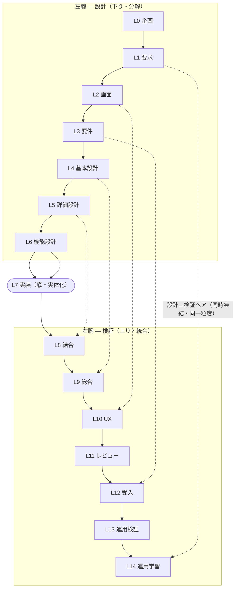
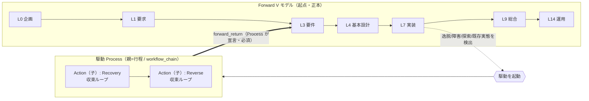

# HELIX Core

HELIX は V モデルを起点とするプロジェクトマネジメント型品質管理実装システムである。V モデルにドキュメント・実装・テスト・カバレッジ・契約を対応づけて正本化し、HELIX DB がその整合を機械的に追う。ドキュメントで資産化し、実装で実体化し、テストで品質を固定する。どこかだけを変更して、他をずらしたままにすることを許さない。

## 0. 絶対原則

HELIX の Core / DB / gate / workflow / harness は、次の絶対原則に従う。これが HELIX の最上位制約である。

1. **V モデルが起点である**。すべての成果は V モデル（Forward L0-L14）上で正本化される。
2. **他の駆動 workflow は V モデルから外れてよい。ただし最終的に V モデルへ戻すための仕組みであり、代替ではない**。Reverse / Discovery / Scrum / Add-feature / Refactor / Retrofit / Incident / Research / Recovery は、外れた事象を受け止めて Forward へ戻す枝である。
3. **V モデルに戻さなければ HELIX DB のコアは動かない**。V モデルに紐付かない成果は trace / drift / coverage / 契約整合の管理対象にならず、HELIX 上で「完了」として成立しない。
4. **AI を含むすべての実行者は、この原則の内側でだけ動く**。V モデルへの収束を持たない作業を完了扱いにしてはならない。

この原則が崩れると、過剰起票・未検証の実装主張・テスト無し・V モデル片肺といった成果が、DB に紐付かないまま流出する。**原則を文章でなく仕組みで守らせること**が Core の役割である。

## 1. V モデル（起点）

V モデルは、ドキュメント・実装・テスト・カバレッジ・契約を対応づけて正本化する骨格であり、HELIX の起点である。左腕で設計を分解し（下り）、底 L7 で実体化し、右腕で検証して統合する（上り）。左腕の各設計層は、右腕の対応する検証層と**対**になる。

- **対で閉じる**: 各設計層は、設計時に対の検証（テスト設計）を先に置き、対の層で実行する。対は**同時に凍結**し、片方だけの成立（片肺）を完了扱いにしない。
- **粒度も対称**: 設計は対の検証と同じ粒度で書く（L6 機能設計 = 単体テスト粒度）。粒度ペアリングの正本は `HELIX-workflows/HELIX-process-L0-L14.md`。
- **検証条件を先に置く**: 作業前に合格基準・検証条件を固定する。実装は TDD（テストファースト）、Discovery は仮説・PoC・採用 / 棄却基準を先に置く。
- L 単位の entry / gate / 成果物の詳細は `HELIX-workflows/HELIX-process-L0-L14.md` を正本とする。

作る対象が AI エージェントシステムの場合、V モデルを 2 回通す（**W モデル / HELIX W**）。Phase 1（一般システム、L1-L9）と Phase 2（エージェント昇華、L1-L9）を各々 V モデルで作り、L10 で合流して L10-L14 を一度だけ通す。W は別の起点ではなく V モデルを 2 回適用した合成であり、両 Phase とも同一の V モデル DB へ収束する（絶対原則は各 Phase と合流点の両方で成立する）。詳細は `HELIX-workflows/helix-process/two-stage-agent-design.md`。

## 2. HELIX DB（V モデル収束で動くコア）

HELIX DB は、PLAN・docs・code・test・coverage・contract・command・skill を登録し、整合を機械的に追う台帳であり、V モデルを正本とする。

HELIX DB は、V モデル DB（正本）と workflow 補助 state を持ち、各 workflow の closure event で補助 state を V モデル DB に統合する。

**V モデルへ収束しない成果は DB のコアに載らない**。＝ trace / drift / coverage / 契約整合の対象にならず、HELIX 上では未完了である。これが絶対原則 3 の実体であり、off-V モデルの成果（過剰起票・未検証実装主張・片肺）が「成立しない」ことを機械で担保する。

逸脱 workflow の成果物は、対応する PLAN として起票し、本線 DB に取り込む。個別領域の作業で終わらせず、Forward の成果物と同じ整合管理に収束させる。

## 3. 駆動 workflow（V モデルへ戻す枝）

Forward 以外の workflow は、逸脱・既存実態・障害・探索・改修などを受け止め、最終的に Forward へ戻す循環処理である。

Forward は要求・設計から実装・検証へ降ろすトップダウンの正本処理であり、Reverse は既存コード・既存実態・失敗事象から要件・設計・契約を復元し、Forward へ戻すボトムアップの復元処理である。

駆動 workflow は Forward の代替ではない。枝葉で発生した成果、判断、復旧結果は、必ず Forward の該当工程へ接続し、HELIX DB へ収束させる。戻し先（Forward 接続先）を持たない workflow は完了できない。

駆動 workflow が Forward へ戻る仕組みは次のように定まる。駆動は逸脱・既存実態・障害・探索・改修から起動し、単一 workflow 内部の収束ループを回し、その親 Process が持つ `forward_return` の Forward 該当 L へ戻る。駆動の PLAN は **Process ⊃ Action の親子**で構成する。Process（親 = 行程）は駆動モデル・工程の連鎖を `workflow_chain` に記録し、`forward_return`（Forward 戻し先）を必須に持つ。Action（子 = 実行）は単一 workflow 内部の収束ループを記録し、`parent_process` で親に繋ぐ。複数の駆動が連続する流れ（例: Discovery → Reverse、Recovery → Reverse）は Process の連鎖であり、Action の入れ子ではない。この親子モデルと `forward_return` による Forward 収束の正本は `HELIX-workflows/helix-process/plan-model.md` とする（本書は仕組みの存在と戻し規律のみを定め、frontmatter 契約などの詳細は重複させない）。

> 図の読み: Forward（背骨＝正本）の途中で逸脱等を検出 → 駆動 Process（親）を起動 → Process は workflow の連鎖（例: Recovery → Reverse、各々が Action 子の収束ループ）→ `forward_return` で Forward の該当 L へ戻す。連鎖は **Process 層**で表し、Action を入れ子にしない。

## 4. 自動検出ループ

drift、劣化、trace 不整合、AI 暴走、障害を検出し、Reverse / Recovery / Incident / Refactor などへルーティングする。

自動登録で DB が充実し、DB 検出で workflow が発動し、PLAN 起票後に再登録される。検出された事象も最終的に V モデルへ戻す。この循環で、ずれや破綻を人手の記憶ではなく仕組みとして閉じる。

## 5. ドキュメント設計

ドキュメントは DDD の考え方で進める。ユビキタス言語を SSoT とし、Bounded Context ごとに責務と用語境界を分け、境界を越える場合は anti-corruption layer で意味を写像する。

各 L のドキュメントは、独自用語を増やして自己完結させるのではなく、上位の用語・境界・要求に接続する。これにより、ドキュメント体系そのものを HELIX DB の trace と自動検出の対象にする。

## 6. オーケストレーション層

gate、PLAN、handover、runtime rules で工程を制御する。

作業の目的、受入条件、担当、再開点、通過条件を固定し、AI や作業者が工程を飛ばしたり、正本を無視したり、V モデルへ戻さず終えたりしないようにする。

## 7. 実行効率化層

skill、command、subagent、Codex / Claude harness で実作業を高速化・分担する。

AI は HELIX の代替判断者ではなく、HELIX の制約内で動く実行者である。実行効率化層は、品質管理の主語を AI に移さず、HELIX の工程・DB・gate に従わせるための実行基盤である。

## 8. 機能単位の役割

| 機能 | 役割 |
|---|---|
| Forward V モデル | L0-L14 で要求、設計、実装、検証、運用学習を正本化する（起点） |
| HELIX DB | V モデル成果物と workflow 成果を登録し、収束した分だけ trace / drift / coverage を追う |
| Reverse | 既存コード、既存実態、失敗事象から要件・設計・契約を復元する |
| Discovery | 不確実な仮説を検証し、採用 / 棄却 / Forward 接続を判断する |
| Scrum | 短周期の仮説検証・分割実行を扱い、成果を Forward へ接続する |
| Add-feature | 既存正本に新機能を追加し、要求・設計・テスト・実装へ反映する |
| Refactor | 振る舞いを保ったまま構造劣化を収束し、成果を Forward の該当工程へ戻す |
| Retrofit | 既存成果物を現行の HELIX 正本構造へ合わせ直す |
| Incident | 本番障害や緊急不具合を止血し、恒久対策と postmortem を Forward と DB に戻す |
| Recovery | AI 暴走、工程逸脱、認識ズレ、破綻状態を収束し、再開点を Forward と DB に戻す |
| Research | 技術調査と判断材料を整理し、ADR / PLAN / Forward へ接続する |
| HELIX W | AI エージェントシステム時に、通常システム V とエージェント V を合流させる特殊 workflow |
| PLAN | 目的、工程、成果物、受入条件、依存、進捗、再開点を管理する |
| Handover | セッションや担当をまたぐ作業正本を管理する |
| Gate / Detector | 成果物存在、trace、契約、テスト、品質劣化、V モデル収束を機械的に判定する |
| Skill | 領域別の知識、チェックリスト、作業手順を提供する |
| Command | HELIX DB、PLAN、gate、workflow、harness を操作する実行インターフェース |
| Subagent / Role | PM / TL / SE / QA / specialist などの責務分担を実行単位にする |
| Runtime Rules | Claude / Codex / CLI / team 実行時の共通規律を定義する |
| Runtime Adapter | Claude / Codex など実行環境ごとの差分を吸収する |

## 9. 問い合わせ方法

Core は詳細手順を持たない。AI や作業者は、知りたい内容に応じて該当する正本だけを読む。

| 知りたいこと | 参照先 |
|---|---|
| 実行時の共通規律 | `helix/HELIX_RUNTIME_RULES.md` |
| Codex 固有ルール | `helix/CODEX_RUNTIME_ADAPTER.md` |
| Claude 固有ルール | `helix/CLAUDE_RUNTIME_ADAPTER.md` |
| 常時注入 core セット（配布契約） | `helix/core-manifest.tsv`（単一権威。setup.sh / loader が参照） |
| L0-L14 の工程定義 | `HELIX-workflows/HELIX-process-L0-L14.md` |
| ドキュメント構成・参照関係・配置判断 | `HELIX-workflows/helix-process/document-topology.md` |
| DDD 用語・境界 | `docs/v2/L0-helix-workflows/concept.md` §12 Glossary / §14 Bounded Context |
| 各 workflow の詳細 | `HELIX-workflows/helix-process/*.md` |
| 駆動 PLAN の構造と Forward 戻し方（Process ⊃ Action / `forward_return`） | `HELIX-workflows/helix-process/plan-model.md` |
| DB 登録・収束・検出 | `HELIX-workflows/helix-process/db-integration.md` / `HELIX-workflows/helix-process/detection-routing.md` |
| 自動化・ゲート判定 | `HELIX-workflows/helix-process/automation-gate-map.md` |
| スキル・ゲート・ロール | `skills/SKILL_MAP.md` |
| 現在の作業正本 | `.helix/handover/CURRENT.md` / `.helix/task-plan.yaml` / `docs/plans/L*/` |

## 10. 最終チェック

- V モデル（Forward）で正本化する接続先があるか。**戻し先を持たない作業を完了扱いにしていないか**。
- V モデルに戻し、HELIX DB のコアに登録され、trace / drift / detector の管理対象になっているか。
- 合格基準・検証条件を先に置いているか。実装を伴う場合はテストファーストを破っていないか。
- ドキュメント、実装、テスト、カバレッジが対応しているか。設計⇔検証の対が片肺になっていないか。
- ドキュメントが DDD の用語・境界・責務に沿っているか。
- 逸脱・探索・障害・劣化を駆動 workflow で受け止め、Forward へ戻しているか。
- 既存コード・既存実態・失敗事象から要件や設計へ戻す場合に、Reverse を通しているか。
- 逸脱 workflow の成果物を PLAN 化し、HELIX DB に収束させているか。
- HELIX 管理下の PLAN / handover / L 成果物を無視していないか。
- AI を判断主体にせず、HELIX の制約内で動く実行者として扱っているか。
