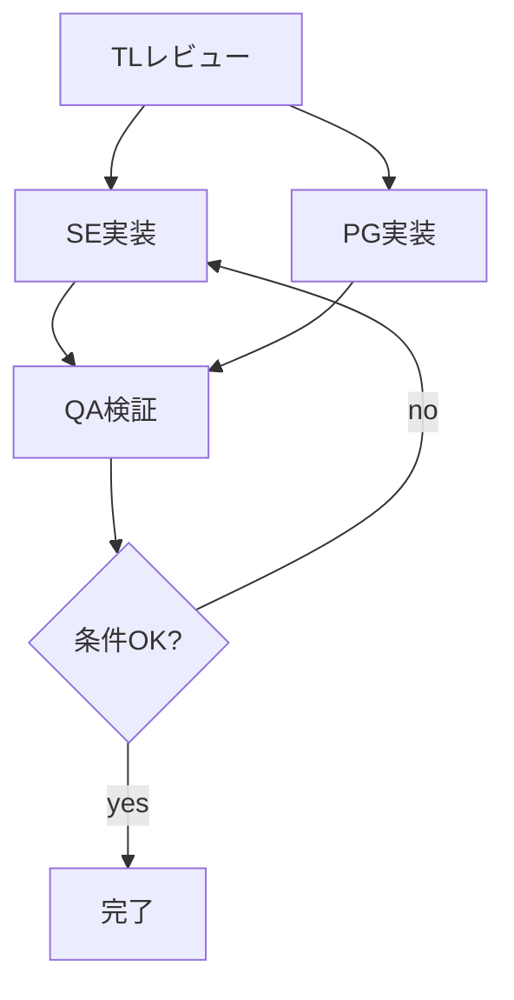

# Agent Teams スキル

## 適用タイミング

このスキルは以下の場合に読み込む：
- 複数の独立した視点から設計を検証したい
- クロスドメイン（複数プラットフォーム/サービス）の整合性を確認したい
- アーキテクチャの意思決定で対立意見が必要

---

## 1. Sub-agents vs Agent Teams

### 判断基準

| 基準 | Sub-agents (Task tool) | Agent Teams |
|------|----------------------|-------------|
| 関係性 | 親子（結果を報告） | 対等（相互メッセージ） |
| コンテキスト | 親が管理・集約 | 各自独立のコンテキスト窓 |
| 最適用途 | 実装の並列化 | 設計の多角検証 |
| コスト | 低〜中 | 高（各自コンテキスト消費） |
| セットアップ | 不要 | 環境変数設定必須 |
| 調整方式 | 親が制御 | 共有タスクリスト + メールボックス |

### 判断フロー

```
タスクの性質は？
├── 実装・コーディング
│   → Sub-agents（ai-coding §4 参照）
│
├── 設計レビュー → 規模は？
│   ├── 単一ドメイン → adversarial-review で十分
│   └── 複数ドメイン横断 → Agent Teams
│
└── アーキテクチャ決定 → 選択肢の数は？
    ├── 2択 → adversarial-review
    └── 3択以上 or 複数ドメイン制約 → Agent Teams
```

→ Sub-agents の詳細は `skills/tools/ai-coding/SKILL.md` §4 を参照
→ adversarial-review の詳細は `skills/workflow/adversarial-review/SKILL.md` を参照

---

## 2. セットアップ

### 有効化

```json
// .vscode/settings.json or ~/.claude/settings.json
{
  "env": {
    "CLAUDE_CODE_EXPERIMENTAL_AGENT_TEAMS": "1"
  }
}
```

### 起動と操作

```bash
# Claude Code ターミナルで
/team              # チームメイトを追加（役割を指示文で指定）
Shift + Up/Down    # チームメイト間の表示切替（in-process表示）
```

### VSCode ターミナル制約

```
⚠️ VSCode統合ターミナルでは Agent Teams の各エージェントを
   別ペインに分離表示する機能がない（ターミナル自体のスプリットとは別）
推奨:
  - tmux でペイン分割 → 各エージェントを同時表示
  - in-process表示（Shift+Up/Down切替）でも運用可能
```

---

## 3. チーム構成パターン

### パターン A: 設計検証チーム（3名）

```
目的: 設計の妥当性を多角的に検証

┌──────────────────────┐
│  Architect           │ ← 設計意図を説明・防御
│  (設計者)            │
├──────────────────────┤
│  Critic              │ ← 弱点・リスク・代替案を指摘
│  (批評者)            │
├──────────────────────┤
│  Domain Expert       │ ← ドメイン制約・業務要件を検証
│  (領域専門家)        │
└──────────────────────┘

所要時間: 15-30分
推定トークン: 各エージェント 50-100K
```

### パターン B: クロスドメインレビュー（2-4名）

```
目的: 複数サービス/プラットフォーム間の整合性

┌──────────────────────┐
│  Platform A Expert   │ ← Platform A の設計・API制約を検証
├──────────────────────┤
│  Platform B Expert   │ ← Platform B の設計・API制約を検証
├──────────────────────┤
│  Integration Lead    │ ← 統合層の一貫性・データフロー確認
└──────────────────────┘

適用例:
  - SNSプラットフォーム横断: X / Threads / Instagram の OPAE 整合性
  - マイクロサービス間: 認証 / 決済 / 通知の API 整合性
  - フロント / バック / DB の3層横断レビュー
```

### パターン C: ADR チーム（2名）

```
目的: 技術選択の対立的評価（Architecture Decision Record）

┌──────────────────────┐
│  Advocate A          │ ← 選択肢Aのメリットを主張
├──────────────────────┤
│  Advocate B          │ ← 選択肢Bのメリットを主張
└──────────────────────┘

各自が担当技術のメリットを主張し、相手のデメリットを指摘。
最終判断は人間が行う。

適用例:
  - BullMQ vs Temporal（ジョブキュー選定）
  - REST vs GraphQL（API設計方針）
  - モノレポ vs ポリレポ（リポジトリ戦略）
```

→ 各パターンの詳細な役割定義とプロンプトは `references/team-presets.md` を参照

---

## 4. 運用プロトコル

### チーム立ち上げフロー

```
1. 検証対象を明確に定義（設計書、対象ファイル、検証観点）
2. チーム構成パターンを選択（A/B/C）
3. /team で各チームメイトを追加（役割と指示を与える）
4. 共有タスクリストに検証項目を列挙
5. 各自が独立して分析
6. メールボックスで発見事項を共有
7. 合意点・対立点を整理
8. 結論を記録（設計書 or ADR に反映）
```

### チームメイトへの指示テンプレート

```markdown
# 役割: [Architect / Critic / Domain Expert / Platform Expert]

## あなたの責務
- [具体的な検証観点を記述]

## 対象ファイル
- [検証対象の設計書/コードのパス]

## 出力形式
以下の形式で報告:
1. 評価（OK / 要改善 / NG）
2. 根拠（具体的な箇所を引用）
3. 改善提案（要改善/NGの場合）

## 他のチームメイトとの連携
- [Architect] に設計意図の質問があればメールボックスで送信
- 発見事項は随時共有タスクリストに追加
```

### ファイル編集の衝突回避

```
⚠️ 同一ファイルを複数エージェントが編集すると競合する

ルール:
  - Agent Teams は「読み取り + 議論」に限定する
  - 実装は議論の結論を基に、単一エージェント（or Sub-agents）が実行
  - ドキュメント更新も1名に集約
```

---

## 5. コスト管理

### トークン消費の目安

| チーム構成 | 推定トークン | 所要時間 |
|-----------|------------|---------|
| 2名 × 短時間 | 150-300K | 10-20分 |
| 3名 × 中時間 | 300-600K | 20-40分 |
| 4名 × 長時間 | 500-1000K | 30-60分 |

### コスト対効果の判断

```
Agent Teams を使うべき場面:
  ✅ 設計ミスが後工程で致命的（基盤設計、DB設計、API設計）
  ✅ 複数ドメインの整合性が品質を左右する
  ✅ 人間レビュアーが不足 or 専門知識が分散

Sub-agents or adversarial-review で十分な場面:
  ✅ 単一ドメインの設計レビュー
  ✅ コードレビュー
  ✅ 日常的な実装タスク
  ✅ バグ修正
```

---

## 6. 制約事項（2026/2 時点: Research Preview）

```
⚠️ セッション再開不可 — 中断したら最初からやり直し
⚠️ ネストチーム不可 — チーム内にチームは作れない
⚠️ 同一ファイル編集 — 競合の自動解決なし
⚠️ 安定性 — 実験機能のため予期せぬエラーの可能性
⚠️ VSCodeスプリットペイン — 統合ターミナルでは非対応
⚠️ トークン消費 — 各エージェントが独立にコンテキストを消費
```

### やってはいけないこと

```
❌ Agent Teams で実装を並列化（同一ファイル競合のリスク）
❌ 長時間セッション（トークン消費が膨大になる）
❌ 5名以上のチーム（議論が拡散し収束しない）
❌ 日常タスクに Agent Teams 投入（コスト過大）
❌ 結論を記録せずにセッション終了（再開不可のため）
```

---

## 7. 合意形成の責任主体（Helix Policy）

> 出典: docs/archive/v-model-reference-cycle-v2.md §運用ポリシー8。マルチエージェント運用での決定権限と責任分担。

### 決定権限レベル

```
L1: 人間 (project-owner)
    → stop, direction_change の最終権限
    → override不可

L2: 監査エージェント (helix-auditor)
    → compliance, security, consistency
    → 人間によるoverride可

L3: タスク担当エージェント (task-owner)
    → 実装判断、技術的決定
    → 暫定決定として扱う（dev-policy §8 暫定決定TTL参照）
    → 監査エージェント・人間によるoverride可
```

### 紛争解決ルール

```
エージェント間の対立 → 監査エージェントが裁定
  → 監査が不確定 → 人間にエスカレーション

人間 vs エージェント → 人間が常に優先
  → human_override としてログ記録

人間が無応答 → エージェントは暫定決定で進行
  条件: 可逆であること / 本番データに影響しないこと / 全決定をログに記録
```

---

## ビジュアルワークフロー設計

n8n / Dify の「ノーコードでエージェントパイプラインを組む」考え方を取り込み、
HELIX では JSON 定義を単一ソースとして可視化と実行を分離する。

### HELIX Workflow Builder 連携

1. ワークフロー JSON を定義（ステージ、入出力、分岐条件）
2. Mermaid へ変換し、レビュー時に視覚化
3. ステージ間のデータフローを注記してボトルネックを特定
4. 条件分岐ノードを明示し、想定外経路をレビューで潰す



### マルチエージェント協調パターン

| パターン | 形 | 用途 |
|---------|----|------|
| Sequential | `A → B → C` | 手順固定のパイプライン |
| Parallel | `A ∥ B → merge → C` | 並列分析と統合 |
| Conditional | `if X then A else B` | 判定分岐ありの処理 |
| Loop | `while condition do A` | 反復改善フロー |

### HELIX モデル割当テーブルとの対応

| HELIX ロール | ワークフローノード |
|-------------|-------------------|
| TL | レビューノード |
| SE / PG | 実装ノード |
| QA | 検証ノード |
| FE | フロントノード |

---

## チェックリスト

### 使用前

```
[ ] 目的は設計検証 / アーキテクチャ決定か
[ ] Sub-agents / adversarial-review では不十分か
[ ] チーム構成パターン（A/B/C）を選定済みか
[ ] 各エージェントの役割と検証観点を定義済みか
[ ] 検証対象のスコープを明確化したか
[ ] コスト（トークン）を許容できるか
```

### 使用後

```
[ ] 各エージェントの分析結果を統合した
[ ] 対立点と合意点を整理した
[ ] 最終判断を記録した（設計書 / ADR に反映）
[ ] 実装アクションアイテムをまとめた
[ ] 結論を単一エージェントで実装に移した
```
