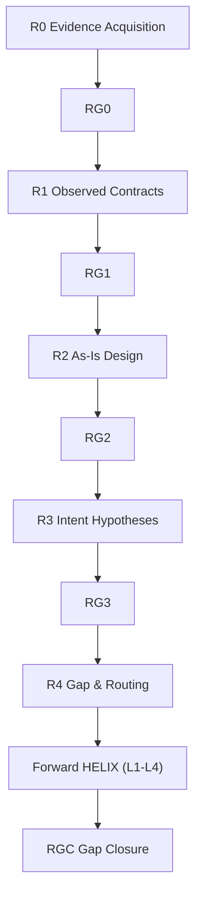

# Reverse Analysis Router

Reverse HELIX は「既存コードという観測事実」から設計と意図を逆方向に復元し、差分を Forward HELIX に安全に接続するための流れである。本スキルは全体像と入口を提供し、各フェーズの実行詳細は専用スキルへ委譲する。

## Reverse フロー全体図

## フェーズ別ルーティング

| フェーズ | 担当スキル | パス |
|---|---|---|
| R0 Evidence Acquisition | reverse-r0 | [skills/workflow/reverse-r0/SKILL.md](skills/workflow/reverse-r0/SKILL.md) |
| R1 Observed Contracts | reverse-r1 | [skills/workflow/reverse-r1/SKILL.md](skills/workflow/reverse-r1/SKILL.md) |
| R2 As-Is Design | reverse-r2 | [skills/workflow/reverse-r2/SKILL.md](skills/workflow/reverse-r2/SKILL.md) |
| R3 Intent Hypotheses | reverse-r3 | [skills/workflow/reverse-r3/SKILL.md](skills/workflow/reverse-r3/SKILL.md) |
| R4 Gap & Routing | reverse-r4 | [skills/workflow/reverse-r4/SKILL.md](skills/workflow/reverse-r4/SKILL.md) |
| RGC Gap Closure | reverse-rgc | [skills/workflow/reverse-rgc/SKILL.md](skills/workflow/reverse-rgc/SKILL.md) |

## 使い分けガイド

全体の進め方・フェーズ間の接続・実行順を把握したい場合は本スキルを読む。個別フェーズに着手する場合は必ず対応する `reverse-r*` スキルを読み、そこで定義された入出力・検証・ゲート条件に従う。

後方互換: 旧 `reverse-analysis` に含まれていた L1-L8 含む詳細記述は、各 `reverse-r*` / `reverse-rgc` スキルへ移設済み。
